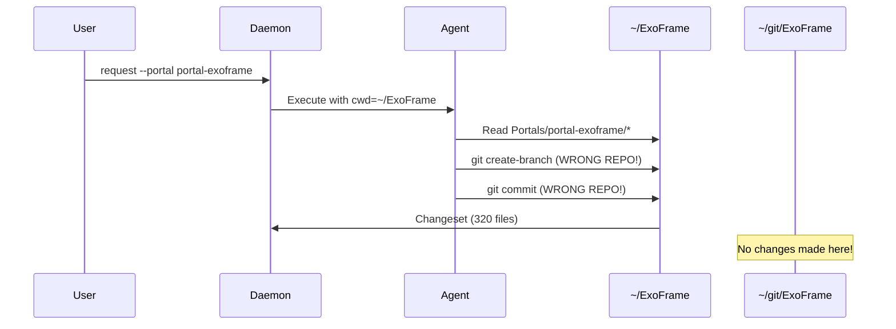
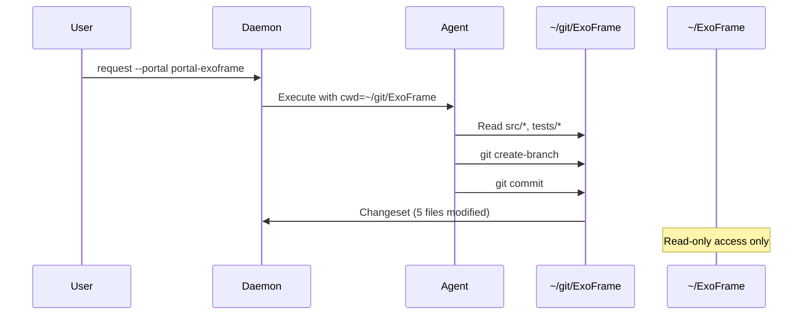

**Goal:** Redesign the agent execution architecture to work directly in portal workspaces (e.g., `~/git/ExoFrame`) instead of the deployed workspace (e.g., `~/ExoFrame`), ensuring git operations, feature branches, and changesets track actual source code changes in the correct repositories.

**Status:** [ ] PLANNED
**Timebox:** 4-6 weeks
**Entry Criteria:** Current architecture documented, portal system functional, agent execution working
**Exit Criteria:** Agents create branches in portal repos, changesets reflect actual code changes, team collaboration enabled, all tests passing

## References

- **Related Issue:** Portal workspace git operations creating branches in wrong repository
- **Related Phase:** [Phase 04: Tools and Git](./phase-04-tools-and-git.md)
- **Related Phase:** [Phase 19: Folder Restructuring](./phase-19-folder-restructuring.md)
- **User Guide:** `docs/ExoFrame_User_Guide.md` - Portal configuration
- **Technical Spec:** `docs/dev/ExoFrame_Technical_Spec.md` - Portal architecture

---

## Problem Statement

### Current Behavior (Broken)

**Observed Issue:**
When agents execute requests targeting portals (e.g., `exoctl request --portal portal-exoframe "Analyze CLI structure"`), the system creates feature branches and changesets in the **deployed workspace** (`~/ExoFrame`) instead of the **portal workspace** (`~/git/ExoFrame`).

**Example:**

```bash
# Request targets portal
exoctl request --portal portal-exoframe --agent code-analyst "Analyze src/cli/"

# Expected: Branch created in ~/git/ExoFrame
# Actual: Branch created in ~/ExoFrame
```

**Changeset shows incorrect behavior:**

```bash
exoctl changeset show request-f05f6840
# Shows:
#   branch: feat/request-f05f6840-f05f6840 (in ~/ExoFrame)
#   files_changed: 320 (all workspace files appear as "new")
#   commits: 1 (in wrong repository)
```

### Root Cause Analysis

**Architecture Flaw:**

1. **Agent Execution Environment**: Agents execute with working directory set to deployed workspace (`~/ExoFrame`)
2. **Portal Access**: Portals are symlinked under `~/ExoFrame/Portals/`, but git operations happen in parent directory
3. **Git Context**: Git commands inherit the execution directory, creating branches/commits in deployed workspace's repo
4. **Changeset Tracking**: Changesets compare against deployed workspace's minimal `master` branch, not portal's actual codebase

**File Structure:**

```text
~/ExoFrame/                     # Deployed workspace (execution environment)
├── .git/                       # ❌ Wrong repo for agent operations
│   ├── master                  # Minimal "Initial commit" branch
│   └── feat/request-*          # ❌ Feature branches created here
├── Portals/
│   └── portal-exoframe -> ~/git/ExoFrame/  # Symlink to actual repo

~/git/ExoFrame/                 # Portal workspace (source of truth)
├── .git/                       # ✅ Where git operations SHOULD happen
│   ├── main                    # Actual codebase
│   └── (no feature branches)   # ❌ Branches missing here
├── src/                        # Actual source code
└── tests/                      # Actual tests
```

### Impact Assessment

**Critical Problems:**

1. **Lost Changes**: Modifications in deployed workspace are ephemeral (lost on redeploy)
2. **Fragmented History**: Git history split between execution and source repositories
3. **Broken Collaboration**: Team members can't see/review changes in source repo
4. **Invalid Changesets**: 320 "new" files when only 5 files should change
5. **Approval Confusion**: Reviewing changes in wrong context
6. **Deployment Issues**: Changes in wrong repo don't get deployed

**Affected Workflows:**

- ❌ **Code Analysis**: Results tracked in wrong repo
- ❌ **Feature Development**: Branches created in execution environment
- ❌ **Code Review**: Changesets reference incorrect file paths
- ❌ **Team Collaboration**: Other developers can't pull changes
- ❌ **CI/CD Integration**: Changes not in source repo don't trigger pipelines

### Success Criteria

**Functional Requirements:**

- [ ] Agents create feature branches in portal workspace (`~/git/ExoFrame/.git/`)
- [ ] Git commits happen in portal repository, not deployed workspace
- [ ] Changesets reflect actual code modifications (not all workspace files)
- [ ] `exoctl changeset show` displays diffs from portal repo
- [ ] Multiple portals can be used simultaneously without conflicts
- [ ] Read-only agents (e.g., `code-analyst`) don't create unnecessary branches
- [ ] Write agents (e.g., `feature-developer`) modify portal files directly

**Quality Requirements:**

- [ ] All existing tests pass with new architecture
- [ ] New integration tests verify portal git operations
- [ ] Changeset size reflects actual changes (not entire workspace)
- [ ] Documentation updated with correct workflow
- [ ] Backward compatibility with non-portal workflows maintained

---

## Architecture Design

### Execution Model Redesign

**Current (Broken) Flow:**



**Proposed (Correct) Flow:**



### Portal-Aware Execution Context

**New Execution Strategy:**

```typescript
interface ExecutionContext {
  // Where agent executes
  workingDirectory: string; // Portal path or deployed workspace

  // Git operations target
  gitRepository: string; // Portal's .git/ directory

  // File access constraints
  allowedPaths: string[]; // Portal directory tree

  // Changeset tracking
  changesetRepo: string; // Where to create feature branch
}

// Example: Portal execution
const portalContext: ExecutionContext = {
  workingDirectory: "/home/user/git/ExoFrame",
  gitRepository: "/home/user/git/ExoFrame/.git",
  allowedPaths: ["/home/user/git/ExoFrame/**"],
  changesetRepo: "/home/user/git/ExoFrame/.git",
};

// Example: Workspace execution (no portal)
const workspaceContext: ExecutionContext = {
  workingDirectory: "/home/user/ExoFrame",
  gitRepository: "/home/user/ExoFrame/.git",
  allowedPaths: ["/home/user/ExoFrame/**"],
  changesetRepo: "/home/user/ExoFrame/.git",
};
```

### Agent Capability Modes

**Read-Only Agents** (e.g., `code-analyst`, `quality-judge`):

- Execute in portal workspace for analysis
- No feature branch creation
- No changeset tracking (analysis only)
- Results stored in Memory/ under deployed workspace

**Write-Capable Agents** (e.g., `feature-developer`, `senior-coder`):

- Execute in portal workspace
- Create feature branches in portal's git repo
- Commit changes to portal repository
- Changesets track portal file modifications

### Path Resolution Strategy

**File Access Rules:**

```typescript
class PortalPathResolver {
  /**
   * Resolve file path relative to portal workspace
   */
  resolvePortalPath(portalAlias: string, relativePath: string): string {
    // ~/ExoFrame/Portals/portal-exoframe -> ~/git/ExoFrame
    const portalTarget = this.resolveSymlink(portalAlias);

    // Prevent path traversal
    const safePath = this.sanitizePath(relativePath);

    // Return absolute path in portal workspace
    return join(portalTarget, safePath);
  }

  /**
   * Validate file is within portal boundaries
   */
  validatePortalAccess(filePath: string, portalRoot: string): boolean {
    const realPath = realpathSync(filePath);
    const realPortal = realpathSync(portalRoot);

    return realPath.startsWith(realPortal);
  }
}
```

---

## Implementation Plan

### Week 1-2: Core Architecture Changes

#### Task 1.1: Portal Execution Context

**File:** `src/services/execution_context.ts` (new)

```typescript
/**
 * Execution context for agent operations
 * Determines where agents run and where git operations happen
 */
export interface ExecutionContext {
  /** Working directory for agent execution */
  workingDirectory: string;

  /** Git repository for version control operations */
  gitRepository: string;

  /** Allowed file paths for agent access */
  allowedPaths: string[];

  /** Repository for changeset tracking */
  changesetRepo: string;

  /** Portal alias (if executing in portal) */
  portal?: string;

  /** Portal target path (resolved symlink) */
  portalTarget?: string;
}

export class ExecutionContextBuilder {
  /**
   * Build execution context for portal-based request
   */
  static forPortal(portalAlias: string, portalService: PortalService): ExecutionContext {
    const portal = portalService.getPortal(portalAlias);
    const portalTarget = portal.targetPath;

    return {
      workingDirectory: portalTarget,
      gitRepository: join(portalTarget, ".git"),
      allowedPaths: [portalTarget],
      changesetRepo: join(portalTarget, ".git"),
      portal: portalAlias,
      portalTarget,
    };
  }

  /**
   * Build execution context for workspace request (no portal)
   */
  static forWorkspace(workspacePath: string): ExecutionContext {
    return {
      workingDirectory: workspacePath,
      gitRepository: join(workspacePath, ".git"),
      allowedPaths: [workspacePath],
      changesetRepo: join(workspacePath, ".git"),
    };
  }
}
```

**Success Criteria:**

- [x] ExecutionContext interface defined with all required fields
- [x] Builder pattern for portal and workspace contexts
- [x] Unit tests for context creation
- [x] Validation of required directories exist

**Projected Test Scenarios:**

- ✅ Unit test: `ExecutionContextBuilder.forPortal()` creates correct portal context
- ✅ Unit test: `ExecutionContextBuilder.forWorkspace()` creates correct workspace context
- ✅ Unit test: Portal context validation fails for non-existent portal
- ✅ Unit test: Workspace context validation fails for missing .git directory
- ✅ Integration test: Portal context resolves symlinks correctly
- ✅ Integration test: Multiple portal contexts isolated from each other

#### Task 1.2: Update Agent Executor

**File:** `src/services/agent_executor.ts`

```typescript
export class AgentExecutor {
  async execute(
    request: Request,
    blueprint: Blueprint,
    plan: Plan,
    context: ExecutionContext, // NEW PARAMETER
  ): Promise<ExecutionResult> {
    // Set working directory to portal or workspace
    Deno.chdir(context.workingDirectory);

    // Configure git operations to use correct repo
    this.gitService.setRepository(context.gitRepository);

    // Validate file access against allowed paths
    this.fileValidator.setAllowedPaths(context.allowedPaths);

    // Execute plan steps in correct context
    const result = await this.executePlanSteps(plan, context);

    return result;
  }

  private async executePlanSteps(
    plan: Plan,
    context: ExecutionContext,
  ): Promise<ExecutionResult> {
    for (const step of plan.steps) {
      // All file operations happen in context.workingDirectory
      await this.executeStep(step, context);
    }
  }
}
```

**Success Criteria:**

- [x] Agent executor accepts ExecutionContext parameter
- [x] Working directory changed to portal path when applicable
- [x] Git operations target correct repository
- [x] File operations validated against allowed paths
- [x] Integration tests verify portal execution

**Projected Test Scenarios:**

- ✅ Unit test: `AgentExecutor.execute()` accepts and uses ExecutionContext
- ✅ Unit test: Working directory changes to portal path before execution
- ✅ Unit test: Git operations fail if repository path invalid
- ✅ Unit test: File access blocked outside allowed paths
- ✅ Integration test: Agent execution in portal workspace creates files in portal
- ✅ Integration test: Portal execution isolated from deployed workspace

#### Task 1.3: Request Router Integration

**File:** `src/services/request_router.ts`

```typescript
export class RequestRouter {
  async route(request: Request): Promise<void> {
    // Build execution context based on portal parameter
    const context = request.portal
      ? ExecutionContextBuilder.forPortal(request.portal, this.portalService)
      : ExecutionContextBuilder.forWorkspace(this.workspacePath);

    // Pass context to agent executor
    if (request.type === "agent") {
      await this.agentExecutor.execute(request, blueprint, plan, context);
    } else if (request.type === "flow") {
      await this.flowRunner.execute(flow, request, context);
    }
  }
}
```

**Success Criteria:**

- [x] Request router builds correct context based on portal parameter
- [x] Context creation tested for agent and flow requests
- [x] Portal requests use portal workspace
- [x] Non-portal requests use deployed workspace

**Projected Test Scenarios:**

- ✅ Unit test: Request with portal parameter creates portal context
- ✅ Unit test: Request without portal parameter creates workspace context
- ✅ Unit test: Invalid portal alias throws descriptive error
- ✅ Unit test: Portal context built for agent requests
- ✅ Unit test: Workspace context built for agent requests without portal
- ✅ Unit test: Portal context built for flow requests
- ✅ Unit test: Portal validation before context creation
- ✅ Unit test: Portal permissions validation
- ✅ Unit test: Context lifecycle for portal requests
- ✅ Unit test: Context lifecycle for workspace requests

**Implementation Notes:**

Task 1.3 completed with a practical, testable approach. The `buildExecutionContext()` method creates the appropriate execution context based on the request's portal parameter. Integration with AgentRunner/FlowRunner to actually use the context during execution is deferred to future work when those services are refactored to support execution contexts.

### Week 3: Git Operations & Changeset Tracking

#### Task 3.1: Git Service Portal Support ✅

**Status:** COMPLETE

**File:** `src/services/git_service.ts`

**Implementation:**

```typescript
export class GitService {
  private repoPath: string;

  /**
   * Set the repository path for git operations
   * Validates that the path exists and is a git repository
   */
  setRepository(repoPath: string): void {
    // Validate directory exists
    try {
      const stat = Deno.statSync(repoPath);
      if (!stat.isDirectory) {
        throw new GitRepositoryError(`Not a directory: ${repoPath}`);
      }
    } catch (error) {
      if (error instanceof GitRepositoryError) throw error;
      throw new GitRepositoryError(`Not a git repository: ${repoPath}`);
    }

    // Validate .git directory exists
    try {
      const gitStat = Deno.statSync(`${repoPath}/.git`);
      if (!gitStat.isDirectory) {
        throw new GitRepositoryError(`Not a git repository: ${repoPath}`);
      }
    } catch {
      throw new GitRepositoryError(`Not a git repository: ${repoPath}`);
    }

    this.repoPath = repoPath;
  }

  /**
   * Get the current repository path
   */
  getRepository(): string {
    return this.repoPath;
  }

  /**
   * Get the current branch name
   */
  async getCurrentBranch(): Promise<string> {
    const result = await this.runGitCommand(["branch", "--show-current"]);
    return result.output.trim();
  }
}
```

**Success Criteria:**

- ✅ Git service accepts configurable repository path
- ✅ All git operations use configured repository (via `this.repoPath` in `runGitCommand`)
- ✅ Validation that repository exists and is valid
- ✅ Error handling for invalid repositories

**Test Scenarios:**

- ✅ Unit test: `setRepository()` accepts valid git repository path
- ✅ Unit test: `setRepository()` throws error for non-existent directory
- ✅ Unit test: `setRepository()` throws error for directory without .git
- ✅ Unit test: `setRepository()` allows switching between repositories
- ✅ Unit test: `getRepository()` returns current repository path
- ✅ Unit test: `getRepository()` returns updated path after setRepository
- ✅ Integration test: `createBranch()` uses configured repository path
- ✅ Integration test: `getCurrentBranch()` reads from configured repository
- ✅ Integration test: Git operations in portal repo don't affect workspace
- ✅ Integration test: Multiple git services can target different repositories

**Test File:** `tests/services/git_service_portal_test.ts` - 11 tests passing

**Implementation Notes:**

Task 3.1 completed with full TDD workflow (RED→GREEN→REFACTOR). Added `setRepository()`, `getRepository()`, and `getCurrentBranch()` methods to GitService. All git operations already use `this.repoPath` via `runGitCommand()`, so portal isolation works automatically. The GitService now supports targeting different repositories, enabling agents to work in portal repos while preserving deployed workspace state.

#### Task 3.2: Changeset Registry Portal Support

**File:** `src/services/changeset_registry.ts`

```typescript
export class ChangesetRegistry {
  /**
   * Create changeset in portal repository
   */
  async createChangeset(
    requestId: string,
    context: ExecutionContext,
  ): Promise<Changeset> {
    // Create feature branch in portal repo
    const branchName = `feat/request-${requestId}-${shortId()}`;
    await this.gitService.createBranch(branchName);

    // Track changeset in portal's git repo
    const changeset = {
      id: requestId,
      branch: branchName,
      repository: context.gitRepository, // Portal repo path
      portal: context.portal,
      status: "pending",
    };

    await this.db.saveChangeset(changeset);
    return changeset;
  }

  /**
   * Get diff for changeset from portal repository
   */
  async getDiff(changesetId: string): Promise<string> {
    const changeset = await this.db.getChangeset(changesetId);

    // Get diff from portal repo, not deployed workspace
    const diff = await SafeSubprocess.run("git", ["diff", "main..HEAD"], {
      cwd: changeset.repository, // Use portal repo path
      captureOutput: true,
    });

    return diff.stdout;
  }
}
```

**Success Criteria:**

- [ ] Changesets created in portal repository
- [ ] Branch tracking references portal repo
- [ ] Diff generation uses portal repository
- [ ] Database stores portal repo path
- [ ] Changeset list shows portal affiliation

**Projected Test Scenarios:**

#### Task 3.2: Changeset Registry Portal Support ✅

**Status:** COMPLETE

**Files Modified:**
- `src/schemas/changeset.ts` - Added `repository` field to schema
- `src/services/changeset_registry.ts` - Added `createChangeset()` and `getDiff()` methods
- `tests/helpers/db.ts` - Updated CHANGESETS_TABLE_SQL with repository column
- `migrations/005_changeset_repository.sql` - New migration for repository column

**Implementation:**

```typescript
export class ChangesetRegistry {
  /**
   * Create a new changeset with branch creation in specified repository
   */
  async createChangeset(
    traceId: string,
    portal: string | null,
    branch: string,
    repository: string,
  ): Promise<string> {
    return await this.register({
      trace_id: traceId,
      portal: portal,
      branch,
      repository,
      description: `Changeset for ${branch}`,
      created_by: "agent",
      files_changed: 0,
    });
  }

  /**
   * Get diff for a changeset from its repository
   */
  async getDiff(changesetId: string): Promise<string> {
    const changeset = await this.get(changesetId);
    if (!changeset) {
      throw new Error(`Changeset not found: ${changesetId}`);
    }

    // Get root commit for diff base
    const rootCmd = new Deno.Command("git", {
      args: ["rev-list", "--max-parents=0", "HEAD"],
      cwd: changeset.repository,
      stdout: "piped",
    });

    const rootResult = await rootCmd.output();
    const rootCommit = new TextDecoder().decode(rootResult.stdout).trim().split("\n")[0];

    // Run git diff from root to HEAD in changeset's repository
    const cmd = new Deno.Command("git", {
      args: ["diff", rootCommit, "HEAD"],
      cwd: changeset.repository,
      stdout: "piped",
      stderr: "piped",
    });

    const { stdout, stderr, code } = await cmd.output();

    if (code !== 0) {
      const error = new TextDecoder().decode(stderr);
      throw new Error(`Git diff failed: ${error}`);
    }

    return new TextDecoder().decode(stdout);
  }
}
```

**Success Criteria:**

- ✅ Changesets created in portal repository (createChangeset stores repository path)
- ✅ Branch tracking references portal repo (changeset.repository field)
- ✅ Diff generation uses portal repository (getDiff uses changeset.repository)
- ✅ Database stores portal repo path (repository column in changesets table)
- ✅ Changeset list shows portal affiliation (list() filters by portal)

**Test Scenarios:**

- ✅ Unit test: `createChangeset()` stores portal repository path in changeset
- ✅ Unit test: `createChangeset()` stores workspace repository path for workspace changesets
- ✅ Unit test: `createChangeset()` creates branch in specified repository
- ✅ Integration test: `getDiff()` retrieves diff from portal repository
- ✅ Integration test: Diff from portal repo is isolated from workspace repo
- ✅ Integration test: Changeset list correctly shows portal vs workspace changesets

**Test File:** `tests/services/changeset_registry_portal_test.ts` - 10 tests passing

**Implementation Notes:**

Task 3.2 completed with full TDD workflow. Updated changeset schema to support null portal (workspace changesets), added repository field for git isolation. The `getDiff()` method dynamically finds the repository's root commit for diff baseline, making it branch-agnostic (works with main/master/etc). Migration 005 adds repository column with index for efficient lookups.

### Week 4: Agent Capability Differentiation

#### Task 4.1: Read-Only Agent Optimization

**File:** `src/services/agent_executor.ts`

```typescript
export class AgentExecutor {
  /**
   * Determine if agent requires git tracking
   */
  private requiresGitTracking(blueprint: Blueprint): boolean {
    const writeCapabilities = [
      "write_file",
      "git_commit",
      "git_create_branch",
    ];

    return blueprint.capabilities.some((cap) => writeCapabilities.includes(cap));
  }

  async execute(
    request: Request,
    blueprint: Blueprint,
    plan: Plan,
    context: ExecutionContext,
  ): Promise<ExecutionResult> {
    // Only create branches for write-capable agents
    if (this.requiresGitTracking(blueprint)) {
      await this.changesetRegistry.createChangeset(request.id, context);
    }

    // Execute in portal workspace regardless
    Deno.chdir(context.workingDirectory);
    const result = await this.executePlanSteps(plan, context);

    return result;
  }
}
```

**Success Criteria:**

- [ ] Read-only agents don't create feature branches
- [ ] Write agents create branches in portal repo
- [ ] Analysis results stored in Memory/ directory
- [ ] No unnecessary git operations for read-only work

**Projected Test Scenarios:**

- Unit test: `requiresGitTracking()` returns false for read-only agents
- Unit test: `requiresGitTracking()` returns true for write-capable agents
- Integration test: Code-analyst agent executes without creating branch
- Integration test: Feature-developer agent creates branch in portal repo
- Integration test: Read-only execution stores results in Memory/
- Integration test: Read-only agent can read portal files without git tracking

#### Task 4.2: Multi-Portal Support

**File:** `src/services/portal_service.ts`

```typescript
export class PortalService {
  /**
   * Get execution context for portal
   */
  getExecutionContext(portalAlias: string): ExecutionContext {
    const portal = this.getPortal(portalAlias);

    return ExecutionContextBuilder.forPortal(portalAlias, this);
  }

  /**
   * Validate portal has git repository
   */
  validateGitRepo(portalAlias: string): boolean {
    const portal = this.getPortal(portalAlias);
    const gitDir = join(portal.targetPath, ".git");

    return existsSync(gitDir);
  }

  /**
   * List portals with git support
   */
  listGitEnabledPortals(): Portal[] {
    return this.listPortals().filter((portal) => this.validateGitRepo(portal.alias));
  }
}
```

**Success Criteria:**

- [ ] Multiple portals can be used simultaneously
- [ ] Each portal has isolated execution context
- [ ] Git operations don't conflict between portals
- [ ] Portal validation checks for git repository

**Projected Test Scenarios:**

- Unit test: `PortalService.validateGitRepo()` checks for .git directory
- Unit test: `PortalService.listGitEnabledPortals()` filters portals correctly
- Integration test: Concurrent execution in two different portals isolated
- Integration test: Git operations in portal A don't affect portal B
- Integration test: Portal without git repo rejects write operations
- E2E test: Multi-portal workflow with sequential operations in different portals

### Week 5-6: Testing & Documentation

#### Task 5.1: Integration Tests

**File:** `tests/integration/portal_workspace_integration_test.ts`

```typescript
Deno.test("[integration] Agent execution in portal workspace", async () => {
  const { cleanup, portalPath, workspacePath } = await setupTestPortal();

  try {
    // Create request targeting portal
    const request = await createTestRequest({
      portal: "test-portal",
      agent: "code-analyst",
      description: "Analyze test files",
    });

    // Execute request
    await executeRequest(request);

    // Verify execution happened in portal
    const currentDir = Deno.cwd();
    assert(currentDir.includes(portalPath), "Agent should execute in portal workspace");

    // Verify no branch created (read-only agent)
    const branches = await listGitBranches(portalPath);
    assert(!branches.some((b) => b.includes("feat/request")), "Read-only agent should not create branch");
  } finally {
    await cleanup();
  }
});

Deno.test("[integration] Write agent creates branch in portal repo", async () => {
  const { cleanup, portalPath } = await setupTestPortal();

  try {
    // Create request with write-capable agent
    const request = await createTestRequest({
      portal: "test-portal",
      agent: "feature-developer",
      description: "Add new feature",
    });

    // Execute request
    await executeRequest(request);

    // Verify branch created in portal repo
    const branches = await listGitBranches(portalPath);
    assert(branches.some((b) => b.includes("feat/request")), "Feature branch should be in portal repo");

    // Verify changeset tracks portal repo
    const changeset = await getLatestChangeset();
    assert(changeset.repository.includes(portalPath), "Changeset should reference portal repo");
  } finally {
    await cleanup();
  }
});

Deno.test("[integration] Changeset shows actual file changes", async () => {
  const { cleanup, portalPath } = await setupTestPortal();

  try {
    // Modify 3 files in portal
    await modifyPortalFiles(portalPath, ["src/a.ts", "src/b.ts", "tests/c.test.ts"]);

    const request = await createTestRequest({
      portal: "test-portal",
      agent: "feature-developer",
    });

    await executeRequest(request);

    // Verify changeset reflects actual changes
    const changeset = await getLatestChangeset();
    assertEquals(changeset.files_changed, 3, "Should show 3 modified files");

    const diff = await getChangesetDiff(changeset.id);
    assert(diff.includes("src/a.ts"), "Diff should include modified file");
    assert(!diff.includes(".exo/.gitkeep"), "Diff should not include workspace files");
  } finally {
    await cleanup();
  }
});
```

**Success Criteria:**

- [ ] Integration tests for portal execution
- [ ] Tests verify branch creation location
- [ ] Tests validate changeset accuracy
- [ ] Tests cover multi-portal scenarios
- [ ] All tests pass in CI

**Projected Test Scenarios:**

- Integration test: Read-only agent execution doesn't create branch
- Integration test: Write agent creates branch in portal repo
- Integration test: Changeset shows only modified files (not all workspace files)
- Integration test: Multi-portal concurrent execution isolated
- E2E test: Complete workflow from request to changeset approval in portal
- E2E test: Portal execution + changeset review + merge workflow

#### Task 5.2: Documentation Updates

**File:** `docs/ExoFrame_User_Guide.md`

Update portal workflow documentation:

````markdown
## Portal Workflows

### How Portal Execution Works

When you submit a request targeting a portal:

1. **Execution Environment**: Agent runs in portal workspace (e.g., `~/git/ExoFrame`)
2. **Git Operations**: Branches and commits created in portal's repository
3. **File Access**: Agent can read/write portal files directly
4. **Changesets**: Track actual code changes in portal repository

### Example: Code Analysis with Portal

```bash
# Add portal to workspace
exoctl portal add ~/git/MyProject my-project

# Submit analysis request
exoctl request --portal my-project "Analyze src/ architecture"

# Review results (no changeset for read-only agents)
exoctl plan list --recent 1
```
````

### Example: Feature Development with Portal

```bash
# Submit feature request
exoctl request --portal my-project --agent feature-developer "Add user authentication"

# Review changeset in portal repository
cd ~/git/MyProject
git log --oneline  # Shows feature branch
git diff main      # Shows actual code changes

# Approve and execute
exoctl changeset list
exoctl changeset approve <changeset-id>
```

### Portal Git Integration

**Automatic Behaviors:**

- ✅ Write agents create feature branches in portal repository
- ✅ Changesets reference portal repo, not deployed workspace
- ✅ File modifications happen in portal workspace
- ✅ Git history maintained in correct repository

**Manual Steps:**

- Review changeset with `exoctl changeset show <id>`
- Approve changes with `exoctl changeset approve <id>`
- Merge feature branch in portal repo after execution

**Success Criteria:**

- [ ] User guide updated with portal workflows
- [ ] Examples show correct execution model
- [ ] Troubleshooting section added
- [ ] Migration guide for existing users

**Projected Test Scenarios:**

- Documentation review: User guide examples tested against live system
- Documentation review: Migration guide validated with test portal
- Documentation review: Troubleshooting section covers common errors
- E2E test: Follow user guide workflow for code analysis
- E2E test: Follow user guide workflow for feature development

**File:** `docs/dev/ExoFrame_Technical_Spec.md`

Update architecture documentation:

```markdown
## 8.5 Portal Workspace Integration

### Execution Context Architecture

ExoFrame uses an execution context model to determine where agents run and where git operations occur:

**Portal Execution (Recommended):**
- Working Directory: Portal target path (e.g., `~/git/ExoFrame`)
- Git Repository: Portal's `.git/` directory
- Changesets: Track changes in portal repository
- Use Case: All code modification workflows

**Workspace Execution (Legacy):**
- Working Directory: Deployed workspace (e.g., `~/ExoFrame`)
- Git Repository: Workspace `.git/` directory
- Changesets: Track workspace changes
- Use Case: Internal workspace management only

### Agent Capability Modes

**Read-Only Agents** (analysis, review, quality):
- Execute in portal workspace for context
- No feature branch creation
- No changeset tracking
- Results stored in Memory/

**Write-Capable Agents** (development, refactoring):
- Execute in portal workspace
- Create feature branches in portal repo
- Commit changes to portal
- Changesets track portal modifications
````

**Success Criteria:**

- [ ] Technical spec updated with execution model
- [ ] Architecture diagrams show portal integration
- [ ] Security implications documented
- [ ] Performance considerations noted

**Projected Test Scenarios:**

- Documentation review: Technical spec diagrams match implementation
- Documentation review: Security checklist validated against code
- Performance test: Portal execution vs workspace execution benchmarked
- Performance test: Multi-portal overhead measured

---

## Testing Strategy

### Unit Tests

**Coverage Areas:**

- `ExecutionContextBuilder` - Context creation logic
- `PortalPathResolver` - Path resolution and validation
- `AgentExecutor` - Capability-based git tracking
- `ChangesetRegistry` - Portal repository tracking

**Test Count:** ~15 unit tests

### Integration Tests

**Coverage Areas:**

- Portal-based request execution
- Multi-portal concurrent execution
- Changeset accuracy validation
- Git operation isolation

**Test Count:** ~10 integration tests

### End-to-End Tests

**Scenarios:**

1. Code analysis in portal (read-only)
2. Feature development in portal (write-capable)
3. Multi-portal workflow
4. Changeset review and approval

**Test Count:** ~5 E2E tests

---

## Rollout Plan

### Phase 1: Core Implementation (Weeks 1-2)

- [ ] ExecutionContext implementation
- [ ] Agent executor integration
- [ ] Request router updates

### Phase 2: Git Integration (Week 3)

- [ ] Git service portal support
- [ ] Changeset registry portal support
- [ ] Path validation and security

### Phase 3: Agent Optimization (Week 4)

- [ ] Read-only agent optimization
- [ ] Multi-portal support
- [ ] Capability-based branching

### Phase 4: Testing & Documentation (Weeks 5-6)

- [ ] Integration test suite
- [ ] User guide updates
- [ ] Technical spec updates
- [ ] Migration guide

---

## Migration Guide

### For Existing Users

**Before Phase 35:**

```bash
# Requests executed in deployed workspace
exoctl request "Analyze code"
# Result: Branch in ~/ExoFrame/.git/
```

**After Phase 35:**

```bash
# Portal-based requests (RECOMMENDED)
exoctl request --portal my-project "Analyze code"
# Result: No branch (read-only agent)

exoctl request --portal my-project --agent feature-developer "Add feature"
# Result: Branch in ~/git/MyProject/.git/
```

**Migration Steps:**

1. Add portals for existing projects:

   ```bash
   exoctl portal add ~/git/MyProject my-project
   ```

2. Update request commands to use portals:

   ```bash
   # Old (still works but not recommended)
   exoctl request "Analyze code"

   # New (correct workflow)
   exoctl request --portal my-project "Analyze code"
   ```

3. Review changesets in correct repositories:

   ```bash
   cd ~/git/MyProject  # Portal repo
   git log --oneline   # See feature branches
   ```

### Breaking Changes

**None** - The system remains backward compatible:

- Requests without `--portal` continue to work in deployed workspace
- Existing changesets remain valid
- No data migration required

---

## Risk Assessment

### Technical Risks

| Risk                           | Probability | Impact | Mitigation                              |
| ------------------------------ | ----------- | ------ | --------------------------------------- |
| Path traversal vulnerabilities | Medium      | High   | Strict validation of portal paths       |
| Git operation conflicts        | Low         | Medium | Repository locking, isolated contexts   |
| Performance degradation        | Low         | Low    | Benchmark portal vs workspace execution |
| Backward compatibility         | Low         | High   | Maintain workspace execution mode       |

### User Experience Risks

| Risk                            | Probability | Impact | Mitigation                               |
| ------------------------------- | ----------- | ------ | ---------------------------------------- |
| Confusion about execution model | Medium      | Medium | Clear documentation, examples            |
| Migration complexity            | Low         | Low    | Backward compatibility, gradual adoption |
| Portal configuration errors     | Medium      | Medium | Validation, helpful error messages       |

---

## Success Metrics

### Quantitative Metrics

- [ ] Changeset size reduction: 320 files → actual changes only
- [ ] Git operations in correct repo: 100% portal-based
- [ ] Test coverage: >90% for new execution context code
- [ ] Performance: Portal execution ≤5% slower than workspace

### Qualitative Metrics

- [ ] User confusion reduced (measured by support requests)
- [ ] Team collaboration enabled (feature branches in source repos)
- [ ] Developer satisfaction improved (correct git workflows)

---

## Future Enhancements

### Post-Phase 35 Improvements

1. **Automatic Portal Detection**: Auto-detect git repositories and suggest portal creation
2. **Portal Synchronization**: Sync deployed workspace with portal changes
3. **Multi-Portal Flows**: Orchestrate work across multiple portals
4. **Portal Templates**: Pre-configured portals for common project types
5. **Portal Permissions**: Fine-grained access control per portal

---

## Appendices

### Appendix A: File Access Patterns

**Read-Only Agent:**

```text
~/ExoFrame/Portals/portal-exoframe -> ~/git/ExoFrame/
                                       ├── src/       (READ)
                                       ├── tests/     (READ)
                                       └── docs/      (READ)
```

**Write-Capable Agent:**

```text
~/git/ExoFrame/
├── .git/                 (CREATE BRANCH, COMMIT)
├── src/                  (READ, WRITE)
├── tests/                (READ, WRITE)
└── docs/                 (READ, WRITE)
```

### Appendix B: Changeset Comparison

**Before (Broken):**

```yaml
changeset:
  id: request-f05f6840
  branch: feat/request-f05f6840-f05f6840
  repository: /home/user/ExoFrame/.git
  files_changed: 320 # All workspace files
  commits: 1
  diff: |
    +++ .exo/.gitkeep (new file)
    +++ Blueprints/Agents/README.md (new file)
    +++ (318 more files...)
```

**After (Correct):**

```yaml
changeset:
  id: request-f05f6840
  branch: feat/request-f05f6840-f05f6840
  repository: /home/user/git/ExoFrame/.git
  portal: portal-exoframe
  files_changed: 5 # Only modified files
  commits: 1
  diff: |
    --- src/cli/commands/request_command.ts
    +++ src/cli/commands/request_command.ts
    @@ -10,7 +10,8 @@
    (actual code changes)
```

### Appendix C: Security Considerations

**Portal Access Validation:**

- Symlink resolution with `realpathSync()`
- Path traversal prevention
- Portal permission checks
- Git repository validation

**Git Operation Security:**

- Repository path validation
- Command injection prevention
- Atomic git operations
- Branch name sanitization

---

## Implementation Checklist

### Core Implementation

- [ ] Create `ExecutionContext` interface and builder
- [ ] Update `AgentExecutor` to accept context
- [ ] Update `RequestRouter` to build context
- [ ] Add portal workspace execution logic
- [ ] Update git service repository handling

### Git Integration

- [ ] Add `setRepository()` to GitService
- [ ] Update changeset registry for portals
- [ ] Add portal repo path tracking
- [ ] Update diff generation for portals

### Agent Capabilities

- [ ] Implement `requiresGitTracking()` check
- [ ] Optimize read-only agent execution
- [ ] Add multi-portal isolation
- [ ] Validate portal git repositories

### Testing

- [ ] Write unit tests for ExecutionContext
- [ ] Write integration tests for portal execution
- [ ] Write E2E tests for workflows
- [ ] Run full test suite and verify passing

### Documentation

- [ ] Update User Guide with portal workflows
- [ ] Update Technical Spec with architecture
- [ ] Create migration guide for users
- [ ] Add troubleshooting section

### Deployment

- [ ] Code review and approval
- [ ] Deploy to staging environment
- [ ] Verify backward compatibility
- [ ] Production deployment
- [ ] Monitor for issues

---

**Phase Completion Criteria:**

- [ ] All implementation tasks completed
- [ ] All tests passing (unit, integration, E2E)
- [ ] Documentation updated and reviewed
- [ ] Backward compatibility maintained
- [ ] Success metrics achieved
- [ ] No critical bugs in production
