# ExoFrame Architecture

**Version:** 2.0.0\
**Date:** January 16, 2026

This document provides a comprehensive architectural overview of ExoFrame components using Mermaid diagrams. ExoFrame is available in **three editions** (Solo, Team, Enterprise) with components differentiated by availability.

> **Edition Legend:** Components marked with 🟢 are available in all editions. Components marked with 🔵 require **Team+** edition. Components marked with 🟣 require **Enterprise** edition.

---

## System Architecture Overview

````mermaid
graph TB
    subgraph Actors["👥 Actors"]
        User[👤 User/Developer]
        Agent[🤖 AI Agent]
    end

    subgraph CLI["🖥️ CLI Layer"]
        Exoctl[exoctl CLI Entry]
        ReqCmd[Request Commands]
        PlanCmd[Plan Commands]
        ChangeCmd[Review Commands]
        GitCmd[Git Commands]
        DaemonCmd[Daemon Commands]
        PortalCmd[Portal Commands]
        BlueprintCmd[Blueprint Commands]
        DashCmd[Dashboard Commands]
    end

    subgraph TUI["🧩 TUI Layer"]
        TuiDash[TUI Dashboard]
        TuiViews[Views: portals / plans / requests / logs / daemon / agents]
    end

    subgraph Core["⚙️ Core System"]
        Main[main.ts - Daemon]
        ReqWatch[Request Watcher<br/>Workspace/Requests]
        PlanWatch[Plan Watcher<br/>Workspace/Active]
        ReqProc[Request Processor]
        ReqRouter[Request Router]
        PlanExec[Plan Executor]
        AgentRun[Agent Runner]
        FlowEng[Flow Engine]
        FlowRun[Flow Runner]
        ExecLoop[Execution Loop]
    end

    subgraph Services["🔧 Services"]
        ConfigSvc[Config Service]
        DBSvc[Database Service]
        GitSvc[Git Service]
        EventLog[Event Logger]
        ContextLoad[Context Loader]
        PlanWriter[Plan Writer]
        PlanAdapter[Plan Adapter]
        MissionRpt[Mission Reporter]
        PathRes[Path Resolver]
        ToolReg[Tool Registry]
        CtxCard[Context Card Generator]
        OutputVal[Output Validator]
        RetryPol[Retry Policy]
        ReflexAgt[Reflexive Agent]
        ConfScore[Confidence Scorer]
        SessMem[Session Memory]
        ToolRefl[Tool Reflector]
        CostTrack[Cost Tracker]
        HealthSvc[Health Check Svc]
        ShutDown[Graceful Shutdown]
        InputVal[Input Validator]
        DBPool[DB Conn Pool]
    end

    subgraph Storage["💾 Storage"]
        DB[(SQLite DB<br/>.exo/journal.db)]
        FS[/File System<br/>~/ExoFrame/]
        Workspace[Workspace/<br/>Requests & Plans/]
        Blueprint[Blueprints/<br/>Agents & Flows/]
        Memory[Memory/<br/>Memory Banks/]
        Portals[Portals/<br/>External Projects/]
        Runtime[/.exo/<br/>Active & Archive/]
    end

    subgraph AI["🤖 AI Providers"]
        Selector[Provider Selector]
        Breaker[Circuit Breaker]
        Factory[Provider Factory]
        Ollama[Ollama<br/>Local]
        Claude[Claude API<br/>Anthropic]
        GPT[OpenAI GPT<br/>Remote]
        Gemini[Google Gemini<br/>Remote]
        Mock[Mock Provider<br/>Testing]
    end

    %% User interactions
    User -->|CLI Commands| Exoctl
    User -->|Drop .md files| Requests
    Agent -->|Read/Write| Portals

    %% CLI routing
    Exoctl --> ReqCmd
    Exoctl --> PlanCmd
    Exoctl --> ChangeCmd
    Exoctl --> GitCmd
    Exoctl --> DaemonCmd
    Exoctl --> PortalCmd
    Exoctl --> BlueprintCmd
    Exoctl --> DashCmd

    %% CLI to Services
    ReqCmd --> Requests
    PlanCmd --> Plans
    ChangeCmd --> GitSvc
    GitCmd --> GitSvc
    DaemonCmd --> Main
    PortalCmd --> ConfigSvc
    PortalCmd --> CtxCard
    BlueprintCmd --> Blueprint
    DashCmd --> TuiDash
    TuiDash --> TuiViews

    %% Core daemon flow
    Main --> ConfigSvc
    Main --> DBSvc
    Main --> ShutDown
    Main --> HealthSvc
    Main --> Factory
    Main --> ReqWatch
    Main --> PlanWatch
    Main --> ReqProc
    Main --> ReqRouter
    Main --> PlanExec
    ReqWatch --> Requests
    PlanWatch --> System
    ReqProc --> InputVal
    ReqProc --> ReqRouter
    ReqRouter --> AgentRun
    ReqRouter --> FlowRun
    PlanExec --> AgentRun
    AgentRun --> ExecLoop
    ExecLoop --> FlowEng
    FlowRun --> FlowEng

    %% Services integration
    AgentRun --> ContextLoad
    AgentRun --> PlanWriter
    AgentRun --> MissionRpt
    AgentRun --> EventLog
    ExecLoop --> ToolReg
    ExecLoop --> GitSvc
    ContextLoad --> Memory
    ContextLoad --> Portals
    PlanWriter --> Plans
    PlanWriter --> PlanAdapter
    EventLog --> DB
    GitSvc --> FS
    PathRes --> FS
    DBSvc --> DBPool

    %% AI Provider routing
    AgentRun --> Selector
    Selector --> CostTrack
    Selector --> Breaker
    Breaker --> Factory
    Factory --> Ollama
    Factory --> Claude
    Factory --> GPT
    Factory --> Gemini
    Factory --> Mock

    %% Agent Orchestration (Phase 16)
    AgentRun --> OutputVal
    AgentRun --> RetryPol
    AgentRun --> ReflexAgt
    AgentRun --> ConfScore
    SessMem --> Memory
    AgentRun --> SessMem
    ExecLoop --> ToolRefl

    %% Storage access
    ConfigSvc --> FS
    DBSvc --> DB
    ReqProc --> Blueprint
    PlanWatch --> System

    %% Styling
    classDef actor fill:#e1f5ff,stroke:#01579b,stroke-width:2px
    classDef cli fill:#fff3e0,stroke:#e65100,stroke-width:2px
    classDef core fill:#f3e5f5,stroke:#4a148c,stroke-width:2px
    classDef service fill:#e8f5e9,stroke:#1b5e20,stroke-width:2px
    classDef storage fill:#fff9c4,stroke:#f57f17,stroke-width:2px
    classDef ai fill:#fce4ec,stroke:#880e4f,stroke-width:2px

    class User,Agent actor
    class Exoctl,ReqCmd,PlanCmd,ChangeCmd,GitCmd,DaemonCmd,PortalCmd,BlueprintCmd,DashCmd cli
    class Main,ReqWatch,PlanWatch,ReqProc,ReqRouter,PlanExec,AgentRun,FlowEng,FlowRun,ExecLoop core
    class ConfigSvc,DBSvc,GitSvc,EventLog,ContextLoad,PlanWriter,MissionRpt,PathRes,ToolReg,CtxCard,OutputVal,RetryPol,ReflexAgt,ConfScore,SessMem,ToolRefl service
    class DB,FS,Workspace,Blueprint,Memory,Portals,System storage
    class Factory,Ollama,Claude,GPT,Gemini,Mock ai

    class TuiDash,TuiViews cli
```

---

## Edition Model Overview

ExoFrame follows a **three-tier edition model** to serve different organizational needs:

| Edition        | Target Audience                         | Key Differentiation                                                   |
| -------------- | --------------------------------------- | --------------------------------------------------------------------- |
| **Solo** 🟢    | Individual developers, OSS contributors | CLI + TUI, SQLite audit, MCP client, local-first                      |
| **Team** 🔵    | Small teams, startups, consulting firms | + Web UI, PostgreSQL, MCP server mode, multi-user collaboration       |
| **Enterprise** 🟣 | Regulated industries, large enterprises | + Governance dashboard, compliance frameworks, immudb, SSO/SAML       |

### Component Availability by Edition

| Component Category         | Solo 🟢                    | Team 🔵                      | Enterprise 🟣                         |
| -------------------------- | -------------------------- | ---------------------------- | ------------------------------------- |
| **Interface**              | CLI + TUI (7 views)        | + Web UI                     | + Enhanced TUI (9 views)              |
| **Audit Database**         | SQLite (embedded)          | PostgreSQL (append-only)     | PostgreSQL + immudb (WORM)            |
| **MCP Support**            | Client only                | + Server mode                | + Custom tool development             |
| **LLM Providers**          | Ollama, OpenAI, Anthropic, Google | + OpenRouter               | + Azure OpenAI, AWS Bedrock, GCP Vertex |
| **Memory Banks**           | Basic (file-based)         | + Full-text search           | + Vector search, knowledge graphs     |
| **Collaboration**          | Single user                | Multi-user (unlimited)       | + RBAC, department isolation          |
| **Compliance**             | ❌                         | ❌                           | ✅ EU AI Act, HIPAA, SOX, ISO 27001   |
| **Cost Management**        | Basic logs                 | Per-user budgets, alerts     | Forecasting, anomaly detection        |

---

## Request Processing Flow

```mermaid
sequenceDiagram
    participant U as User
    participant CLI as exoctl CLI
    participant I as Workspace/Requests
    participant W as File Watcher
    participant RP as Request Processor
    participant RR as Request Router
    participant FV as Flow Validator
    participant AR as Agent Runner
    participant FR as Flow Runner
    participant AI as AI Provider
    participant PA as Plan Adapter
    participant PS as Plan Schema
    participant P as Workspace/Plans
    participant DB as Activity Journal

    U->>CLI: exoctl request "Fix bug"
    CLI->>I: Create request-{uuid}.md
    CLI->>DB: Log request.created
    CLI-->>U: Request created ✓

    W->>I: Detect new file
    W->>RP: Trigger processing
    RP->>I: Read request.md
    RP->>RR: Route request (flow vs agent)

    alt Flow Request
        RR->>FV: Validate flow exists
        FV->>FV: Check flow schema & dependencies
        FV-->>RR: Flow valid ✓
        RR->>FR: Generate flow execution plan
        FR->>AI: Generate plan (JSON)
        FR->>PA: Parse & Validate
        PA->>PS: Validate against Zod Schema
    else Agent Request
        RR->>AR: Load agent blueprint
        AR->>AI: Generate plan
        AI-->>AR: Plan response (JSON)
        AR->>PA: Parse & Validate
        PA->>PS: Validate against Zod Schema
    end

    alt Validation Success
        PS-->>PA: Valid Plan Object
        PA->>PA: Convert to Markdown
        PA-->>RP: Markdown Content
        RP->>P: Write plan-{uuid}.md
        RP->>DB: Log plan.generated
        P-->>U: Ready for review
    else Validation Failed
        PS-->>PA: Zod Validation Error
        PA-->>RP: PlanValidationError
        RP->>DB: Log plan.validation_failed
    end

    U->>CLI: exoctl plan list
    CLI->>P: Read plans
    CLI-->>U: Show pending plans

    U->>CLI: exoctl plan approve {uuid}
    CLI->>P: Update plan status
    CLI->>DB: Log plan.approved
    CLI-->>U: Approved ✓
````

---

## Flow-Aware Request Routing

The **Request Router** service enables intelligent routing of requests based on their frontmatter configuration. It supports both single-agent execution (legacy) and multi-agent flow execution (Phase 7).

### Routing Decision Flow

```mermaid
graph TD
    A[Request Detected] --> B[Parse Frontmatter]
    B --> C{Has 'flow' field?}
    B --> D{Has 'agent' field?}
    B --> E{No routing fields?}

    C -->|Yes| F[Validate Flow]
    F -->|Valid| G[Route to FlowRunner]
    F -->|Invalid| H[Log Error & Fail]

    D -->|Yes| I[Validate Agent]
    I -->|Valid| J[Route to AgentRunner]
    I -->|Invalid| K[Log Error & Fail]

    E -->|Yes| L[Use Default Agent]
    L --> M[Route to AgentRunner]

    G --> N[Generate Flow Plan]
    J --> O[Generate Agent Plan]
    M --> O

    N --> P[Write Plan to Workspace/Plans]
    O --> P
```

### Request Types

**Flow Request (Multi-Agent):**

```yaml
---
trace_id: "550e8400-e29b-41d4-a716-446655440000"
flow: code-review
tags: [review, security]
---
Please perform a comprehensive code review of this pull request.
```

**Agent Request (Single-Agent):**

```yaml
---
trace_id: "550e8400-e29b-41d4-a716-446655440001"
agent: senior-coder
tags: [implementation]
---
Implement the new authentication feature.
```

**Default Agent Request:**

```yaml
---
trace_id: "550e8400-e29b-41d4-a716-446655440002"
tags: [general]
---
Help me understand this codebase.
```

### Flow Validation

Before routing to FlowRunner, the Request Router validates:

- **Flow Existence:** Flow blueprint exists in `/Workspace/Blueprints/Flows/`
- **Schema Validity:** Flow conforms to expected structure
- **Dependencies:** All referenced agents and transforms exist
- **No Cycles:** Flow doesn't contain circular dependencies

---

## Parsing & Schema Layer

ExoFrame centralizes file-format parsing and validation into two layers:

- **Parsers** (`src/parsers/`): extract structure from Markdown files (YAML frontmatter + body).
- **Schemas** (`src/schemas/`): validate structured objects using Zod (requests, plans, flows, portals, MCP).

Key modules:

- `src/parsers/markdown.ts` (`FrontmatterParser`)
  - Extracts YAML frontmatter delimited by `--- ... ---`.
  - Validates frontmatter using `src/schemas/request.ts`.
  - Optionally logs validation events to the Activity Journal via `DatabaseService`.
- `src/schemas/plan_schema.ts`
  - Defines the JSON schema for LLM plan output (title/description + numbered steps + optional metadata).
- `src/schemas/mcp.ts`
  - Defines MCP tool argument schemas and MCP server configuration schema.

This layer is what keeps file-driven workflows safe and deterministic: request/plan files may come from humans or LLMs, but the runtime only proceeds when schemas validate.

---

## Plan Execution Flow

The **Plan Executor** service orchestrates the step-by-step execution of approved plans. It uses a ReAct-style loop to prompt the LLM for actions, executes them via the **Tool Registry**, and commits changes to Git after each step.

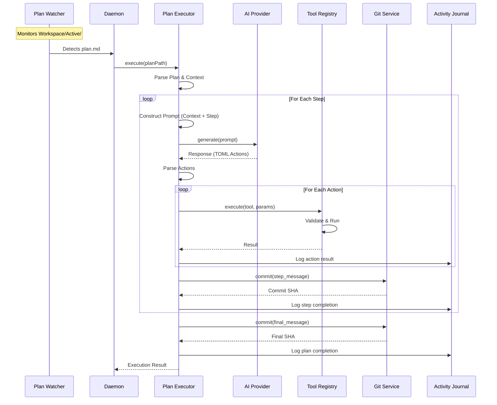

### Plan Execution Components

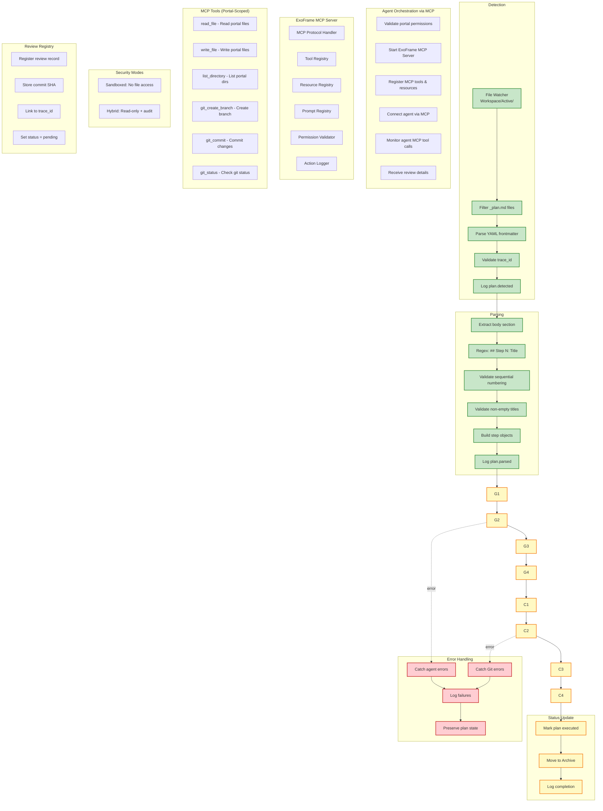

### MCP Server Implementation Notes

> **Edition Note:** MCP Client functionality is available in **all editions** 🟢. MCP Server mode is available in **Team+** editions only 🔵.

The MCP server lives under `src/mcp/` and supports both **stdio** (JSON-RPC 2.0) and **HTTP/SSE** transports.

- `src/mcp/server.ts`
  - Routes: `initialize`, `tools/list`, `tools/call`, `resources/list`, `resources/read`, `prompts/list`, `prompts/get`.
  - **Security:** Implements comprehensive CSP and Security Headers for HTTP transport.
  - Logs lifecycle events (e.g., `mcp.server.started`) to the Activity Journal.
- `src/mcp/tools.ts` & `src/mcp/domain_tools.ts`
  - **Foundation Tools:** `read_file`, `write_file`, `list_directory`, `git_*`
  - **Domain Tools:** `exoframe_create_request`, `exoframe_list_plans`, `exoframe_approve_plan`, `exoframe_query_journal`
  - Validates tool input using `src/schemas/mcp.ts` and enforces portal access via `PortalPermissionsService`.
- `src/mcp/resources.ts`
  - Implements `portal://<PortalAlias>/<path>` resource discovery and reading.

### Plan File Structure

```mermaid
graph TB
    subgraph PlanFile["_plan.md Structure"]
        FM[YAML Frontmatter<br/>---<br/>trace_id: uuid<br/>request_id: uuid<br/>agent: string<br/>status: approved<br/>---]
        Body[Markdown Body<br/># Plan Title<br/>Description]
        Step1[## Step 1: Title<br/>Content and tasks]
        Step2[## Step 2: Title<br/>Content and tasks]
        StepN[## Step N: Title<br/>Content and tasks]
    end

    subgraph Parsed["Parsed Structure"]
        Context[Context Object<br/>{trace_id, request_id,<br/>agent, status}]
        Steps[Steps Array<br/>[{number, title, content}]]
    end

    FM --> Context
    Body --> Context
    Step1 --> Steps
    Step2 --> Steps
    StepN --> Steps

    Context --> Execution[Plan Executor]
    Steps --> Execution

    classDef file fill:#e1f5ff,stroke:#01579b,stroke-width:2px
    classDef parsed fill:#c8e6c9,stroke:#388e3c,stroke-width:2px
    classDef exec fill:#f3e5f5,stroke:#4a148c,stroke-width:2px

    class FM,Body,Step1,Step2,StepN file
    class Context,Steps parsed
    class Execution exec
```

### Activity Logging Events

**Detection Events:**

- `plan.detected` - Plan file found in Workspace/Active
- `plan.ready_for_execution` - Valid plan parsed, ready for execution
- `plan.invalid_frontmatter` - YAML parsing failed
- `plan.missing_trace_id` - Required trace_id field not found
- `plan.detection_failed` - Unexpected error during detection

**Parsing Events:**

- `plan.parsed` - Plan successfully parsed with step count
- `plan.parsing_failed` - Missing body, no steps, or empty titles
- `plan.non_sequential_steps` - Warning for gaps in step numbering

---

## CLI Commands Architecture

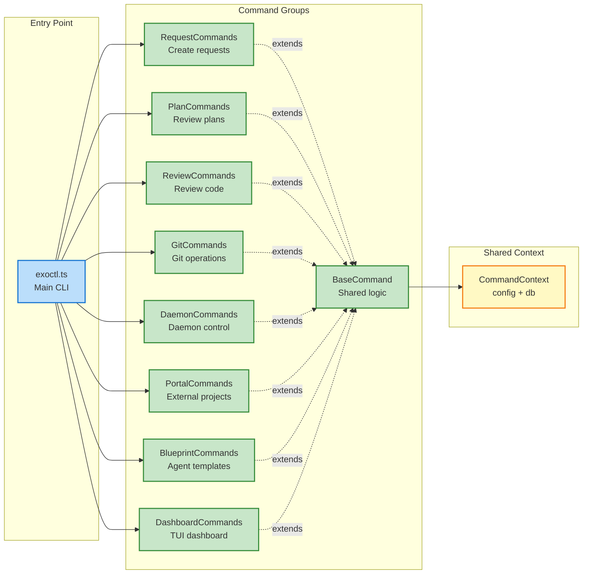

---

## TUI Dashboard Architecture

The dashboard is an interactive terminal UI launched from the CLI, providing a unified cockpit for ExoFrame operations.

### Overview

- **Entry point:** `exoctl dashboard` → `src/cli/dashboard_commands.ts` → `src/tui/tui_dashboard.ts`
- **Multi-pane support:** Split views with independent focus management
- **7 integrated views:** Portal Manager, Plan Reviewer, Monitor, Daemon Control, Agent Status, Request Manager, Memory View
- **Test stability:** Mock services enable comprehensive testing (see `src/tui/tui_dashboard_mocks.ts`)

### Component Architecture

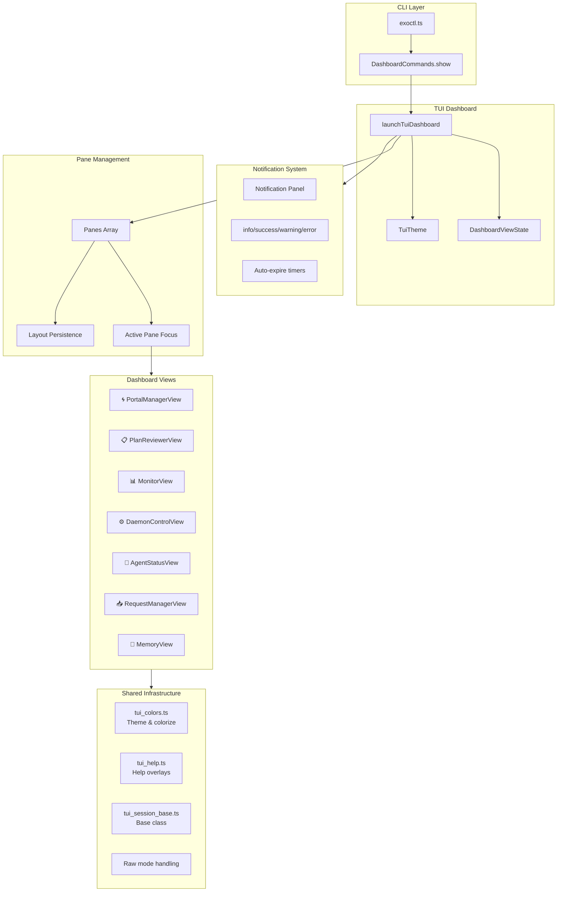

### Dashboard State

The `DashboardViewState` manages global UI state:

```typescript
interface DashboardViewState {
  showHelp: boolean; // Help overlay visible
  showNotifications: boolean; // Notification panel visible
  showViewPicker: boolean; // View picker dialog visible
  isLoading: boolean; // Loading indicator
  loadingMessage: string; // Loading message text
  error: string | null; // Error message
  notifications: Notification[]; // Active notifications
  currentTheme: string; // "dark" | "light"
  highContrast: boolean; // Accessibility mode
  screenReader: boolean; // Screen reader support
}
```

### Pane Structure

Each pane manages a view instance with layout information:

```typescript
interface Pane {
  id: string;           // Unique pane identifier
  view: View;           // View instance (PortalManagerView, etc.)
  x: number;            // X position in grid
  y: number;            // Y position in grid
  width: number;        // Pane width (columns)
  height: number;       // Pane height (rows)
  focused: boolean;     // Currently focused
  maximized?: boolean;  // Zoom state
  previousBounds?: {...}; // For restore after maximize
}
```

### Key Bindings

Dashboard uses a declarative key binding system:

| Category        | Keys                      | Actions                           |
| --------------- | ------------------------- | --------------------------------- |
| **Navigation**  | `Tab`, `Shift+Tab`, `1-7` | Pane switching                    |
| **Layout**      | `v`, `h`, `c`, `z`        | Split, close, maximize            |
| **Persistence** | `s`, `r`, `d`             | Save, restore, default            |
| **Dialogs**     | `?`, `n`, `p`, `Esc/q`    | Help, notifications, picker, quit |

### Layout Persistence

Layouts are saved to `~/.exoframe/tui_layout.json`:

```json
{
  "panes": [
    { "id": "main", "viewName": "PortalManagerView", "x": 0, "y": 0, "width": 40, "height": 24 },
    { "id": "pane-1", "viewName": "MonitorView", "x": 40, "y": 0, "width": 40, "height": 24 }
  ],
  "activePaneId": "main",
  "version": "1.1"
}
```

### View Integration

Each view extends `TuiSessionBase` and implements:

- `render()`: View-specific rendering
- `handleKey(key: string)`: Keyboard input handling
- `getFocusableElements()`: List of focusable UI elements
- Service injection for data access

### Raw Mode Handling

Terminal raw mode enables immediate key response:

```typescript
tryEnableRawMode(); // Enable for interactive mode
tryDisableRawMode(); // Restore on exit
```

Falls back to line-based input when raw mode unavailable.

### Testing Strategy

- **Unit tests:** Mock services for isolated view testing
- **Integration tests:** Full dashboard lifecycle with test mode
- **Sanitizer safety:** Test mode skips timers to prevent leaks
- **Coverage:** 591+ TUI tests across all components

For keyboard shortcuts, see [TUI Keyboard Reference](./TUI_Keyboard_Reference.md).

---

## AI Provider Architecture

ExoFrame supports multiple LLM providers with **edition-based availability**:

| Provider Category      | Solo 🟢                      | Team 🔵 | Enterprise 🟣                            |
| ---------------------- | ---------------------------- | ------- | ---------------------------------------- |
| **Local**              | ✅ Ollama                    | ✅ All  | ✅ All                                   |
| **Cloud (Basic)**      | ✅ OpenAI, Anthropic, Google | ✅ All  | ✅ All                                   |
| **Cloud (Enterprise)** | ❌                           | ❌      | ✅ Azure OpenAI, AWS Bedrock, GCP Vertex |
| **Cost Management**    | Basic logs                   | Budgets | Forecasting, anomaly detection           |

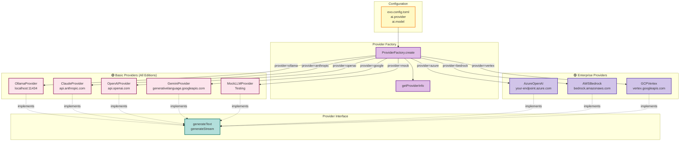

---

## Storage & Data Flow

ExoFrame uses a **tiered database architecture** aligned with edition requirements:

| Edition           | Audit Database           | Compliance Level                               |
| ----------------- | ------------------------ | ---------------------------------------------- |
| **Solo** 🟢       | SQLite (embedded)        | Basic audit logging                            |
| **Team** 🔵       | PostgreSQL (append-only) | Multi-user with database-enforced immutability |
| **Enterprise** 🟣 | PostgreSQL + immudb      | WORM-compliant, cryptographically verified     |

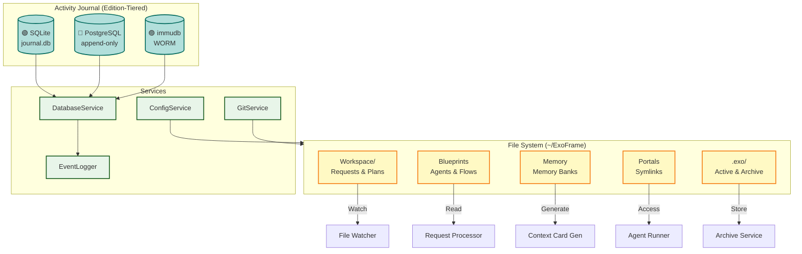

---

## Memory Banks Architecture

The Memory Banks system provides persistent knowledge storage for project context, execution history, and cross-project learnings.

> **Enhanced Architecture:** See [.copilot/planning/phase-12.5-memory-bank-enhanced.md](../.copilot/planning/phase-12.5-memory-bank-enhanced.md) for the full v2 architecture with Global Memory, Agent Memory Updates, and Simple RAG.

### Directory Structure

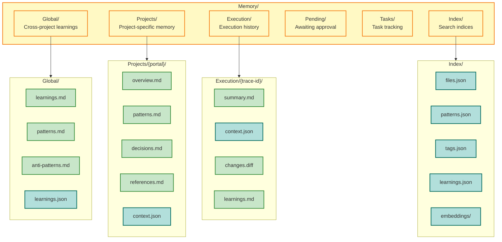

### Memory Update Workflow

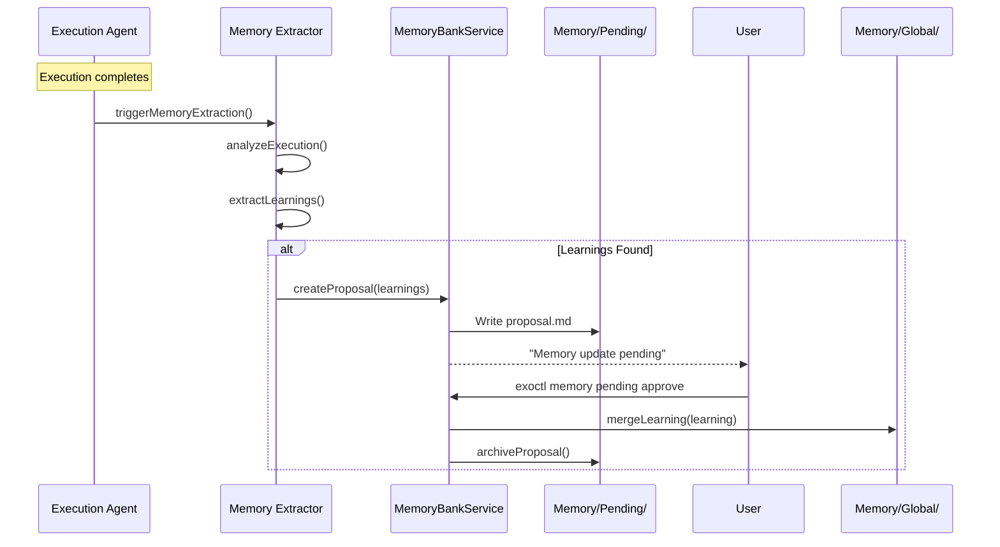

### CLI Command Tree

```text
exoctl memory
├── list                    # List all memory banks
├── search <query>          # Search across memory
├── project list|show       # Project memory ops
├── execution list|show     # Execution history
├── global show|stats       # Global memory
├── pending list|approve    # Pending updates
├── promote|demote          # Move learnings
└── rebuild-index           # Regenerate indices
```

### Key Components

| Component         | Location                                       | Purpose                      | Status      |
| ----------------- | ---------------------------------------------- | ---------------------------- | ----------- |
| MemoryBankService | `src/services/memory_bank.ts`                  | Core CRUD operations         | ✅ Complete |
| Memory Schemas    | `src/schemas/memory_bank.ts`                   | Zod validation schemas       | ✅ Complete |
| Memory Extractor  | `src/services/memory_extractor.ts`             | Learning extraction          | ✅ Complete |
| Memory Embedding  | `src/services/memory_embedding.ts`             | Vector embeddings for search | ✅ Complete |
| Memory CLI        | `src/cli/memory_commands.ts`                   | CLI interface                | ✅ Complete |
| Integration Tests | `tests/integration/memory_integration_test.ts` | End-to-end tests             | ✅ Complete |

---

## Portal System Architecture

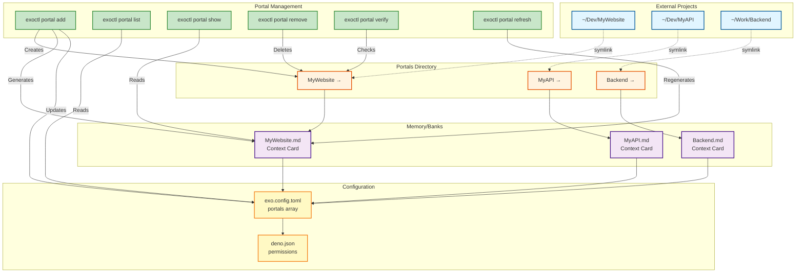

### Portal review cleanup semantics

Portal execution supports two related concepts that affect how reviews are created and later approved:

- **Target/base branch selection:** ExoFrame resolves the base branch for portal work by preferring `target_branch` from request/plan frontmatter (set via `exoctl request --target-branch ...`), then portal `default_branch` from `exo.config.toml`, and finally repository default branch auto-detection.
- **Execution strategy:** The portal config may set `execution_strategy` to `branch` (default: execute in the portal repo checkout on a feature branch) or `worktree` (execute in an isolated worktree checkout, record `worktree_path`, and write a discoverability pointer at `Memory/Execution/{trace-id}/worktree`).

When portal execution creates a code review, ExoFrame records `base_branch` (merge target) and (for worktree runs) `worktree_path` on the review. Approval merges the feature branch into the recorded `base_branch`.

The review record is durable (audit/history), but ExoFrame applies cleanup to avoid accumulating working directories and stale branches:

- **Reject:** Deletes the feature branch (with best-effort handling if the branch is checked out in a worktree).
- **Approve:** Merges the feature branch into the review’s recorded base branch. If the review was executed in an **isolated worktree** (review has `worktree_path`), ExoFrame removes the worktree checkout, removes the execution pointer at `Memory/Execution/{trace-id}/worktree`, and deletes the feature branch. If the review was executed on a normal branch checkout, ExoFrame merges but keeps the feature branch.
- **Merge conflict (worktree reviews):** ExoFrame attempts to abort the merge and removes the worktree checkout + pointer, but keeps the feature branch for human conflict resolution.

Operational note: if you need to inspect or clean up worktrees manually, use `exoctl git worktrees list --portal <alias>` and `exoctl git worktrees prune --portal <alias>`.

---

## Blueprint Management System

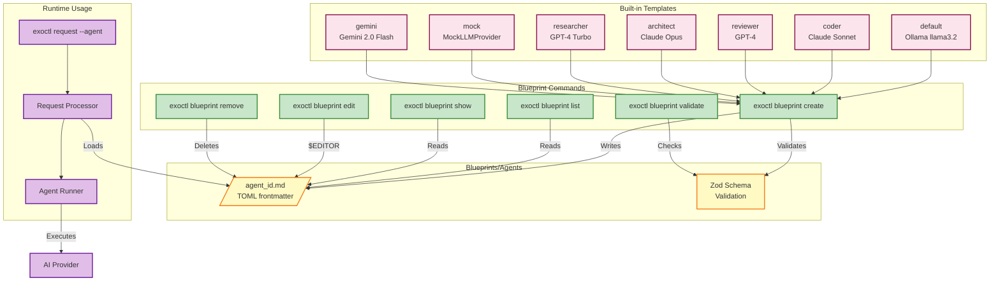

---

## Daemon Lifecycle

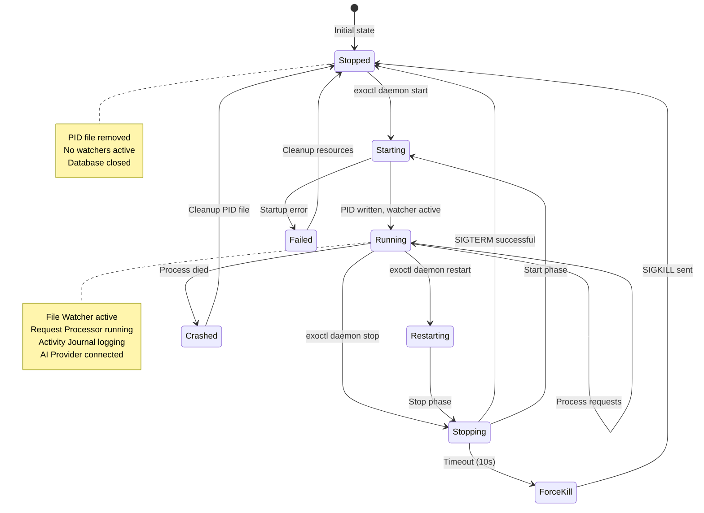

---

## Activity Journal Flow

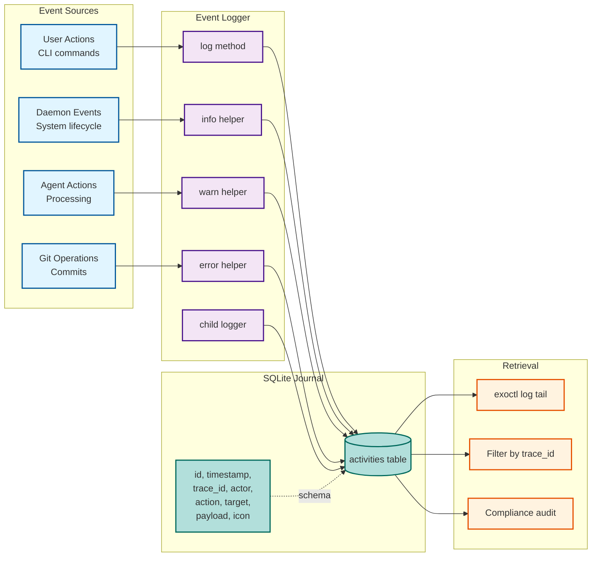

---

## Key Design Principles

### 1. **Files as API**

- Request input: Markdown files in `Workspace/Requests`
- Plan output: Markdown files in `Workspace/Plans`
- Configuration: TOML with Zod validation
- Context: File system is source of truth

### 2. **Separation of Concerns**

- **CLI Layer**: Human interface (exoctl)
- **Core Layer**: Daemon orchestration (main.ts, watcher)
- **Service Layer**: Business logic (processors, runners)
- **Storage Layer**: Edition-tiered databases + file system

### 3. **Auditability & Governance**

- Every action logged to Activity Journal (tiered by edition)
- Trace ID links: request → plan → review → commit
- Git commit footers with `Exo-Trace` metadata
- Immutable event stream for compliance (🟣 Enterprise: WORM storage)
- Explicit approval gates: plans and reviews require human authorization

### 4. **Multi-Provider Support**

- Local-first: Ollama (no cloud required)
- Cloud options: Claude, GPT, Gemini (🟢 all editions)
- Enterprise providers: Azure OpenAI, AWS Bedrock, GCP Vertex (🟣 Enterprise)
- Provider factory pattern for extensibility
- Cost management with edition-tiered capabilities

### 5. **Portal System**

- Symlink-based external project access
- Context cards for agent understanding
- Scoped permissions (Deno security model)
- Multi-project refactoring support

### 6. **Edition-Aware Architecture**

- Core components available in all editions (🟢 Solo)
- Collaboration features in Team+ (🔵 Team)
- Governance and compliance features in Enterprise (🟣 Enterprise)
- Transparent feature tiering with upgrade path

---

## Component Responsibilities

| Component                | Responsibility                            | Key Files                           | Edition  |
| ------------------------ | ----------------------------------------- | ----------------------------------- | -------- |
| **CLI Layer**            | Human interface for system control        | `src/cli/*.ts`                      | 🟢 All   |
| **Daemon**               | Background orchestration engine           | `src/main.ts`                       | 🟢 All   |
| **Request Watcher**      | Detect new requests in Workspace/Requests | `src/services/watcher.ts`           | 🟢 All   |
| **Plan Watcher**         | Detect approved plans                     | `src/services/watcher.ts`           | 🟢 All   |
| **Request Processor**    | Parse requests, generate plans            | `src/services/request_processor.ts` | 🟢 All   |
| **Request Router**       | Route requests to Agent/Flow runners      | `src/services/request_router.ts`    | 🟢 All   |
| **Plan Executor**        | Execute approved plans                    | `src/services/plan_executor.ts`     | 🟢 All   |
| **Agent Runner**         | Execute agent logic with LLM              | `src/services/agent_runner.ts`      | 🟢 All   |
| **Flow Runner**          | Execute multi-agent flows                 | `src/flows/flow_runner.ts`          | 🟢 All   |
| **Event Logger**         | Write to Activity Journal                 | `src/services/event_logger.ts`      | 🟢 All   |
| **Config Service**       | Load and validate exo.config.toml         | `src/config/service.ts`             | 🟢 All   |
| **Workspace Execution**  | Agent environment and path resolution      | `src/services/workspace_execution_context.ts` | 🟢 All   |
| **Database Service**     | Edition-tiered journal operations         | `src/services/db.ts`                | 🟢 All   |
| **Git Service**          | Git operations with trace metadata        | `src/services/git_service.ts`       | 🟢 All   |
| **Provider Factory**     | Create LLM provider instances             | `src/ai/provider_factory.ts`        | 🟢 All   |
| **Context Loader**       | Load context for agent execution          | `src/services/context_loader.ts`    | 🟢 All   |
| **Portal Commands**      | Manage external project access            | `src/cli/portal_commands.ts`        | 🟢 All   |
| **Blueprint Commands**   | Manage agent templates                    | `src/cli/blueprint_commands.ts`     | 🟢 All   |
| **Dashboard Commands**   | Launch terminal dashboard                 | `src/cli/dashboard_commands.ts`     | 🟢 All   |
| **TUI Dashboard**        | Multi-view terminal UI (7-9 views)        | `src/tui/*.ts`                      | 🟢 All   |
| **Web UI**               | Browser-based approval interface          | `src/web/*`                         | 🔵 Team+ |
| **Parsers**              | Parse markdown + frontmatter              | `src/parsers/*.ts`                  | 🟢 All   |
| **Plan Parser**          | Shared structured plan parsing utility    | `src/services/structured_plan_parser.ts` | 🟢 All   |
| **Schemas**              | Zod validation layer                      | `src/schemas/*.ts`                  | 🟢 All   |
| **MCP Client**           | Connect to external MCP servers           | `src/mcp/client.ts`                 | 🟢 All   |
| **MCP Server**           | JSON-RPC server for tool execution        | `src/mcp/server.ts`                 | 🔵 Team+ |
| **Blueprint Loader**     | Unified blueprint parsing                 | `src/services/blueprint_loader.ts`  | 🟢 All   |
| **Output Validator**     | Schema validation with JSON repair        | `src/services/output_validator.ts`  | 🟢 All   |
| **Retry Policy**         | Exponential backoff with jitter           | `src/services/retry_policy.ts`      | 🟢 All   |
| **Plan Adapter**         | JSON validation and markdown conversion   | `src/services/plan_adapter.ts`      | 🟢 All   |
| **Plan Writer**          | Format results into structured plans      | `src/services/plan_writer.ts`       | 🟢 All   |
| **Request Common**       | Blueprints and request building utilities | `src/services/request_common.ts`    | 🟢 All   |
| **Review Registry**      | Agent-created review management           | `src/services/review_registry.ts`   | 🟢 All   |
| **Path Resolver**        | Portal alias and security path resolution  | `src/services/path_resolver.ts`     | 🟢 All   |
| **Skills Service**       | Procedural memory (skills) management     | `src/services/skills.ts`            | 🟢 All   |
| **Mission Reporter**     | Execution reports and memory updates      | `src/services/mission_reporter.ts`  | 🟢 All   |
| **Prompt Context**       | Structured prompt building utilities      | `src/services/prompt_context.ts`    | 🟢 All   |
| **Reflexive Agent**      | Self-critique improvement loop            | `src/services/reflexive_agent.ts`   | 🟢 All   |
| **Tool Reflector**       | Tool result evaluation and retry          | `src/services/tool_reflector.ts`    | 🟢 All   |
| **Session Memory**       | Memory context injection                  | `src/services/session_memory.ts`    | 🟢 All   |
| **Confidence Scorer**    | Output confidence assessment              | `src/services/confidence_scorer.ts` | 🟢 All   |
| **Condition Evaluator**  | Flow condition expression eval            | `src/flows/condition_evaluator.ts`  | 🟢 All   |
| **Gate Evaluator**       | Quality gate checkpoint validation        | `src/flows/gate_evaluator.ts`       | 🟢 All   |
| **Judge Evaluator**      | LLM-as-a-Judge assessment                 | `src/flows/judge_evaluator.ts`      | 🟢 All   |
| **Feedback Loop**        | Iterative refinement control              | `src/flows/feedback_loop.ts`        | 🟢 All   |
| **Evaluation Criteria**  | Quality standards validation              | `src/flows/evaluation_criteria.ts`  | 🟢 All   |
| **Notification Service** | Memory update and system notifications     | `src/services/notification.ts`      | 🟢 All   |
| **Health Check Service** | System health and resource monitoring     | `src/services/health_check_service.ts` | 🟢 All   |
| **Graceful Shutdown**    | Process termination and cleanup management | `src/services/graceful_shutdown.ts` | 🟢 All   |
| **Governance Dashboard** | Compliance monitoring and risk scoring    | `src/web/governance/*`              | 🟣 Ent   |
| **Compliance Reporter**  | Regulatory compliance exports             | `src/services/compliance.ts`        | 🟣 Ent   |

---

## Agent Orchestration Architecture

Phase 16 introduced advanced agent orchestration capabilities for improved output quality, reliability, and context awareness.

### Orchestration Components

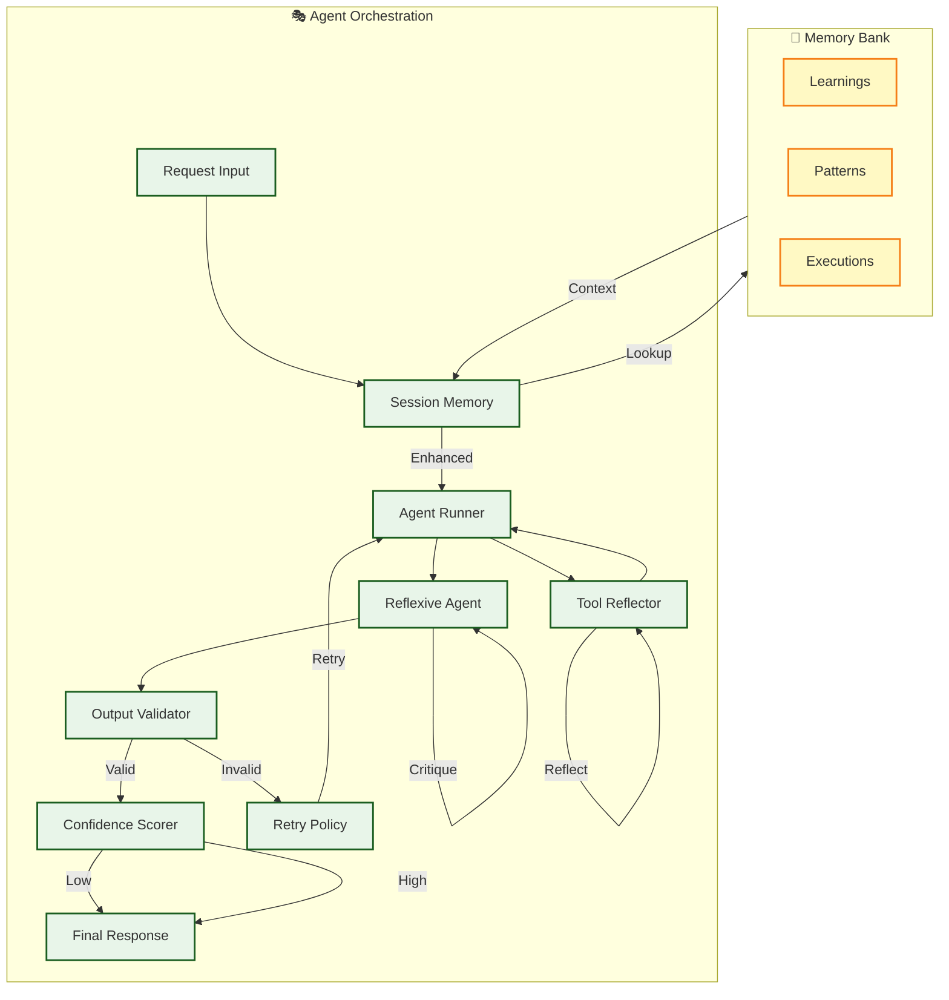

### Service Responsibilities

| Service               | Purpose             | Key Features                                                  |
| --------------------- | ------------------- | ------------------------------------------------------------- |
| **Session Memory**    | Context injection   | Semantic search, memory lookup, insight saving                |
| **Reflexive Agent**   | Quality improvement | Self-critique, iterative refinement, confidence threshold     |
| **Output Validator**  | Schema validation   | JSON repair, Zod validation, error reporting                  |
| **Retry Policy**      | Failure recovery    | Exponential backoff, jitter, circuit breaker                  |
| **Confidence Scorer** | Quality assessment  | LLM-based scoring, human review flags                         |
| **Tool Reflector**    | Tool execution      | Result evaluation, alternative parameters, parallel execution |

### Data Flow

1. **Request Enhancement**: Session Memory injects relevant context from past interactions
2. **Agent Execution**: Agent Runner processes request with enhanced context
3. **Self-Critique** (optional): Reflexive Agent refines output iteratively
4. **Validation**: Output Validator checks against schema, repairs if needed
5. **Retry** (on failure): Retry Policy handles transient errors with backoff
6. **Confidence**: Confidence Scorer assesses output quality
7. **Human Review**: Low-confidence outputs flagged for review

### Configuration

Agent orchestration is configured in `exo.config.toml`:

```toml
[agents]
confidence_threshold = 70  # Flag outputs below this score

[agents.memory]
enabled = true
topK = 5
threshold = 0.3

[agents.retry]
maxAttempts = 5
initialDelay = 1000
backoffMultiplier = 2.0
jitterFactor = 0.5
```

See User Guide Section 6 for detailed configuration reference.

---

## Flow Orchestration Architecture

Phase 15 introduced advanced flow orchestration capabilities for conditional logic, quality gates, and intelligent feedback loops.

### Flow Evaluation Components

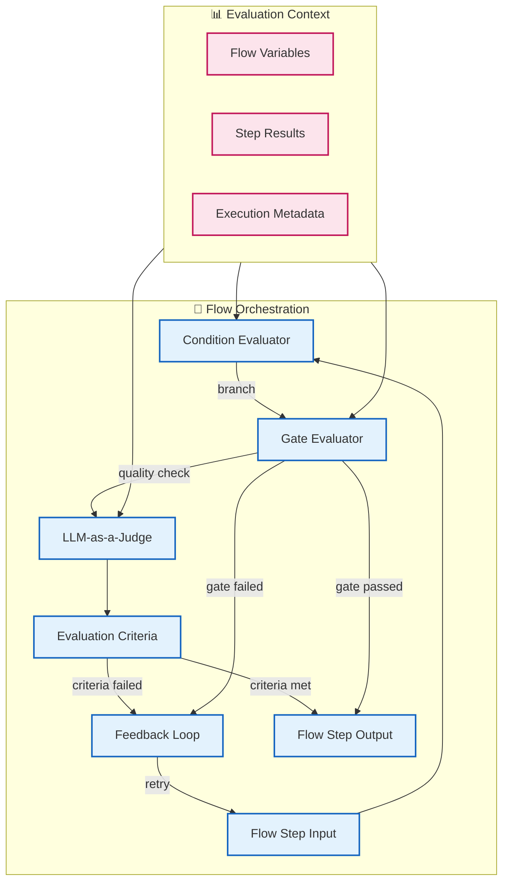

### Evaluation Component Responsibilities

| Component               | Purpose               | Key Features                                               |
| ----------------------- | --------------------- | ---------------------------------------------------------- |
| **Condition Evaluator** | Expression evaluation | Safe expression parsing, variable interpolation, operators |
| **Gate Evaluator**      | Quality checkpoints   | Pass/fail criteria, threshold validation, gate actions     |
| **LLM-as-a-Judge**      | AI-powered assessment | Structured rubrics, multi-criteria scoring, explanations   |
| **Feedback Loop**       | Iterative refinement  | Max iterations, convergence detection, state tracking      |
| **Evaluation Criteria** | Quality standards     | Built-in criteria, custom criteria, weighted scoring       |

### Built-in Evaluation Criteria

| Criteria           | Description                           | Use Case                  |
| ------------------ | ------------------------------------- | ------------------------- |
| `CODE_CORRECTNESS` | Validates syntax and semantics        | Code generation steps     |
| `HAS_TESTS`        | Ensures test coverage exists          | TDD workflows             |
| `FOLLOWS_SPEC`     | Matches specification requirements    | Implementation validation |
| `IS_SECURE`        | Checks security best practices        | Security-critical flows   |
| `PERFORMANCE_OK`   | Validates performance characteristics | Optimization workflows    |

### Condition Expression Syntax

Flow conditions support a safe expression language:

```typescript
// Variable access
"status == 'success'";
"count > 10";

// Logical operators
"status == 'success' && confidence >= 80";
"isComplete || hasTimeout";

// Step result access
"steps.validation.passed == true";
"steps.analysis.score >= threshold";
```

### Quality Gate Configuration

```yaml
step:
  type: gate
  name: code_quality_gate
  condition: "score >= 80"
  onPass: continue
  onFail:
    action: feedback
    maxRetries: 3
  criteria:
    - CODE_CORRECTNESS
    - HAS_TESTS
```

### Flow Control Data Flow

1. **Step Input**: Flow step receives input with current context
2. **Condition Evaluation**: ConditionEvaluator checks branch/gate conditions
3. **Gate Assessment**: GateEvaluator validates quality criteria
4. **LLM Judgment** (optional): JudgeEvaluator provides AI-based assessment
5. **Criteria Check**: EvaluationCriteria validates against standards
6. **Feedback Loop** (on failure): Iterates with feedback until criteria met
7. **Step Output**: Produces output for next flow step

---

## Developer Tooling Architecture

ExoFrame includes repository tooling under `scripts/` to keep development workflows deterministic.

### .copilot/ Knowledge Base Index & Embeddings

ExoFrame includes a developer-facing knowledge base under `.copilot/` used to keep AI assistants consistent and repository-aware.

Artifacts:

- `.copilot/manifest.json`: index of agent docs with metadata and chunk references
- `.copilot/chunks/*`: chunked doc text used for retrieval
- `.copilot/embeddings/*`: embedding vectors (often mocked in CI) used for semantic search

Build/validation scripts:

- `scripts/build_agents_index.ts`: rebuilds `.copilot/manifest.json` and chunks
- `scripts/build_agents_embeddings.ts`: regenerates embeddings (`--mode mock` for deterministic CI)
- `scripts/verify_manifest_fresh.ts`: checks manifest/chunks are up to date
- `scripts/validate_agents_docs.ts`: validates agent-doc frontmatter/schema

### CI, Scaffolding, and Database Tooling

- `scripts/ci.ts`: orchestrates repository checks and tests in CI-like environments
- `scripts/scaffold.sh`: scaffolds a new ExoFrame workspace folder structure and templates
- `scripts/setup_db.ts`: initializes `journal.db` schema
- `scripts/migrate_db.ts` + `migrations/*.sql`: applies incremental database migrations

---

## Viewing This Document

### VS Code

- Built-in Mermaid preview (Markdown Preview Enhanced extension recommended)
- Right-click → "Open Preview" or press `Ctrl+Shift+V`

### GitHub/GitLab

- Native Mermaid rendering in markdown files

### Mermaid Live Editor

- `https://mermaid.live/`
- Copy/paste diagram code for editing

### Export Options

- PNG/SVG export via Mermaid Live Editor
- PDF export via VS Code extensions
- HTML with mermaid.js for web viewing

---

## Module Grounding Index

This section provides explicit grounding for core infrastructure modules and helpers to ensure they are reachable during architecture validation.

### Core Infrastructure
- `src/*.ts` (Global enums, constants, and app entry points)
- `src/helpers/*.ts` (Shared utilities)
- `src/mcp/*.ts` (MCP Server implementation and prompts)
- `src/mcp/handlers/*.ts` (MCP Tool implementations)
- `src/schemas/*.ts` (Data validation schemas)
- `src/errors/*.ts` (Shared error classes)
- `src/flows/*.ts` (Flow engine internals)
- `src/memory/*.ts` (Memory management types)
- `src/plans/*.ts` (Execution plan types)
- `src/ai/*.ts` (AI Provider selector and types)
- `src/ai/providers/*.ts` (Concrete LLM providers)
- `src/ai/factories/*.ts` (LLM provider factories)
- `src/config/*.ts` (Configuration schemas and paths)
- `src/cli/*.ts` (CLI command entry points)
- `src/services/*.ts` (Core service implementations)
- `src/services/common/*.ts` (Shared service errors)
- `src/services/decorators/*.ts` (Log and retry decorators)

---

## Related Documentation

- **[Implementation Plan](ExoFrame_Implementation_Plan.md)** - Detailed development roadmap
- **[User Guide](ExoFrame_User_Guide.md)** - End-user documentation
- **[Technical Spec](ExoFrame_Technical_Spec.md)** - Deep technical details
- **[White Paper](ExoFrame_White_paper.md)** - Vision and philosophy
- **[Building with AI Agents](Building_with_AI_Agents.md)** - Development patterns
