# Exaix TUI Redesign Concept

## Overview

The new Exaix TUI provides a high-efficiency transition from a simple CLI to a powerful command center. Inspired by classic file managers (**Midnight Commander**, **FAR Manager**), it features a **tab-based** interface where each view occupies the full main area, with optional **split-view** for master-detail exploration of entities.

## Core Design Principles

1. **Tab-Based Layout**: Each view opens as a full-screen tab occupying the entire main area. A Tab Switch Bar provides instant access to all open views.

1.
1.
1.
1.
1.

---

## Layout Structure

### 1. Top Menu Bar (Global Navigation)

A horizontal bar at the top of the terminal.

- **Activation**: Use **`F2`** to shift focus to the menu bar.
- **Core Components**:
  - **Menu Items**: `[File]`, `[Views]`, `[Commands]`, `[Settings]`, `[Help]`. Opening a menu item displays a vertical dropdown list.
  - **Global Status**: Displays current Agent status, active Workspace name, token cost summary, and a real-time clock.
  - **Notification Badge**: A `🔔 N` indicator showing the count of unread notifications. Clicking or pressing **`Alt+N`** opens the Notification Panel.
  - **Breadcrumbs**: Shows the logical path within the active view (e.g., `Workspace > Plans > fix-bug-123`).
- **Responsiveness**: If terminal width is insufficient, categories wrap into mandatory next lines.

### 2. Main Workspace (Tabs)

The central area displays one view at a time. Each view occupies **100%** of the main area (no vertical frame borders). Multiple views are managed as **tabs**.

#### Tab Switch Bar

A horizontal bar on **line 3** (below breadcrumbs) showing all open tabs:

`````text
[File] [Views] [Commands] [Settings] [Help]  |  Agent: Active  🔔 2  💰 $1.24  |  17:30
Workspace > Requests > REQ-1024
[ Requests ][ Plans ][ Reviews ][ Agents ][ + Create Request ]
──────────────────────────────────────────────────────────────────────────────────
(main content area — current tab occupies full width, no left/right borders)
```text

- **Tab bar background**: The entire Tab Switch Bar row uses a **distinct background color** — darker than the main content area and different from the top menu bar (e.g., `\e[48;5;235m` on dark theme). This creates a clear three-layer visual hierarchy: top bar → tab bar → content.
- **Active tab**: **Cyan background** + White Bold text.
- **Inactive tabs**: Separated by **alternating background shading** (similar to column banding) — odd tabs use the tab bar base color, even tabs use a slightly lighter variant (~5% brightness shift). No vertical separators between tabs.
- **Closeable tabs**: Tabs opened dynamically (e.g., Create Request, Detail Viewer) show a `[×]` suffix and can be closed with `Ctrl+W`.
- **Pinned tabs**: Core views (Requests, Plans, Reviews, etc.) opened from `[Views]` menu are pinned and cannot be closed.
- **Switching**: `Alt+1`..`Alt+9` by position, or `Alt+Left`/`Alt+Right` to cycle adjacent tabs.
- **New tab**: `Ctrl+T` opens a tab picker listing available views.
- **Tab overflow**: When tabs exceed terminal width, `◄` and/or `►` angle indicators appear on the left/right edge to show hidden tabs exist in that direction. Scroll with `Alt+Left`/`Alt+Right` or `Alt+1`..`Alt+9` to jump directly.

#### Split-View Detail (Master-Detail)

For entities supporting a `show` command, the current tab can split into two sections:

- **Operation**: Pressing **`F3`** (View) or **`F11`** (Toggle Split) splits the current tab in half to show the **Entity List** (Master) and **Entity Details** (Detail) side by side.
- **Split Direction**: **`Alt+V`** cycles through: **Horizontal split** (Master top, Detail bottom) → **Vertical split** (Master left, Detail right) → **Off** (close detail, return to full-screen list).
- **Separator**: A dotted line (`┈` horizontal) or thin solid line (`│` vertical) separates the two sections.
- **Update Logic**: Moving the cursor in the Master list automatically refreshes the Detail section content.
- **Focus**:
  - **`Tab`** toggles focus between the Master and Detail sections.
  - When the Detail section has focus, **Arrow/Page Up/Down** keys scroll the detail content independently.
- **Detail in Separate Tab**: Alternatively, pressing **`Ctrl+Enter`** on an entity opens its detail view in a **new tab** instead of splitting the current one.

#### Linked Entity Navigation (Traceability)

The TUI provides a "Lifecycle Explorer" for traversing connected entities:

- **Operation**: Pressing **`Alt+L`** (Links) opens a contextual overlay listing all entities sharing the same **Trace ID**.
- **Drill-down**: Selecting a linked item (e.g., a Review related to a Plan) and pressing **`Enter`** navigates the current tab to that entity's view.
- **Breadcrumb Navigation**: The top-bar breadcrumbs track this "Jump History" (e.g., `Request > Plan > Review`).
- **Backwards Navigation**: Pressing **`Backspace`** returns to the previous entity in the trace stack.

#### Correlated Log Viewing

Jump directly from any business entity to its execution logs:

- **Operation**: Pressing **`Alt+G`** (Go to Logs) while focusing an entity opens a **Correlated Log View** in a new tab.
- **Filtering**: The log view is automatically filtered by the entity's **Trace ID**.
- **Deep Inspection**: The log view uses the **Split-View Detail**:
  - **Master**: A scrollable list of log events (Timestamp/Level/Message).
  - **Detail**: A full breakdown of **all metadata fields** (structured JSON/Table) for the selected log entry.
- **Context Return**: Pressing **`ESC`** or closing the log tab returns focus to the original entity view.

### 3. Confirmation Bar (Inline Dialogs)

A narrow area (1–2 rows) between the main content area and the Bottom Control Bar. Used for quick confirm/cancel prompts without obscuring the content.

- **Size**: 1 row for simple confirmations, 2 rows when additional context is needed.
- **Visibility**: Hidden by default — appears only when an action requires confirmation, pushing the content area up by 1–2 rows.
- **Background**: **Yellow/Amber background** (`\e[43m`) to draw attention — visually distinct from both the content area and the control bar.
- **Text**: **Black Bold** on the amber background for maximum contrast.
- **Layout**: Prompt text on the left, action buttons on the right.

```text
Delete REQ-1024 "Implement dark mode"?                          [Y] Yes  [N] No
```text

Two-row example (with context):

```text
Approve plan plan-87a3 for execution? This will start the agent workflow.
Estimated cost: ~$0.45                                          [Y] Yes  [N] No
```text

- **Keyboard**: `Y` or `Enter` confirms, `N` or `ESC` cancels. No mouse interaction needed.
- **Auto-dismiss**: The bar disappears immediately after the user responds.
- **Scope**: Used for destructive actions (`F8 Delete`), state changes (`F6 Approve/Reject`), and execution triggers (`F7 Execute`). Non-destructive actions (view, filter, sort) do not require confirmation.

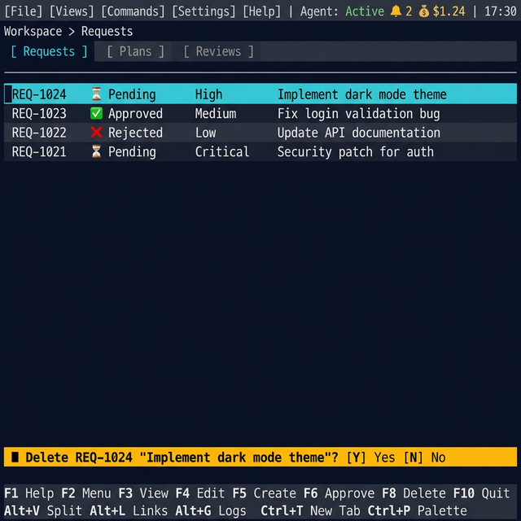

### 4. Bottom Control Bar (Contextual Actions)

A functional bar mapped to F-keys and common actions.

- **Dynamic Adaptability**: Labels and functions **change dynamically** based on which tab currently has focus.
- **Two-Line Layout**:
  - **Line 1 (F-Keys)**: Primary F-key commands for the active view.
  - **Line 2 (Alt-Keys)**: Contextual `Alt+...` shortcuts available in the current mode (e.g., `Alt+S Detail`, `Alt+L Links`, `Alt+G Logs`).
- **Standard Mapping**:
  - **Global**: `F1 Help`, `F2 Menu`, `F10 Quit`.
  - **Request Manager**: `F3 View`, `F4 Edit`, `F5 Create`, `F6 Approve`, `F8 Delete`.
  - **Plan Reviewer**: `F3 Diff`, `F5 Approve`, `F6 Reject`, `F7 Execute`, `F4 Revise`.
  - **Review Manager**: `F3 Diff`, `F5 Approve`, `F6 Reject`, `F9 Filter Type`.
  - **Portal Manager**: `F3 View`, `F5 Add`, `F6 Edit`, `F7 Verify`, `F8 Remove`, `F4 Refresh`.
  - **Blueprint Manager**: `F3 View TOML`, `F4 Edit`, `F5 Create`, `F7 Validate`, `F8 Remove`.
  - **Flow Orchestration**: `F3 View Graph`, `F5 Run Flow`, `F7 Validate`, `F9 Filter`.
  - **Agent Status**: `F3 View Details`, `F5 Refresh`, `F9 Filter`.
  - **Monitor View**: `F5 Pause/Resume`, `F7 Filter`, `F9 Log Levels`.
  - **Memory View**: `F5 Approve`, `F6 Reject`, `F7 Search`, `F9 Sub-View Tab`.
  - **Daemon Control**: `F3 View Logs`, `F5 Start`, `F6 Stop`, `F7 Restart`.
  - **Settings**: `F3 View Value`, `F4 Edit`, `F5 Save`, `F7 Validate`, `F8 Reset Default`.
  - **Archive Explorer**: `F3 View`, `F7 Search`, `F9 Filter`.
  - **Git Browser**: `F3 View Diff`, `F5 Checkout`, `F7 Log by Trace`, `F9 Filter`.
  - **Activity Journal**: `F3 View Payload`, `F7 Filter`, `F9 Format Toggle`.
- **Responsiveness**: Wraps into multiple lines if the terminal window is narrow.
- **Rendering**:
  - **Bar background**: The bottom bar uses a **distinct background color** — matching the Tab Switch Bar tone (e.g., `\e[48;5;235m`), creating a visual "bookend" frame around the main content area: tab bar on top, control bar on bottom.
  - **F-key buttons**: Each button uses **alternating background shading** (consistent with tab bar and column banding). Odd buttons use the bar base color, even buttons use a slightly lighter variant. The active/pressed button flashes **Cyan background** briefly.
  - **F-key label format**: Key name in **Bold** + label in Normal, separated by a space: **`F5`** `Create`.
  - **Disabled actions**: Actions not available in the current context render in **Dark Grey** (`\e[90m`) — visible but not interactive.

```text
F1 Help  F2 Menu  F3 View  F4 Edit  F5 Create  F6 Approve       F8 Delete  F10 Quit
Alt+V Split  Alt+L Links  Alt+G Logs  Ctrl+T New Tab  Ctrl+P Palette  Ctrl+R Refresh
```text

---

## View Examples by Component

Each view is shown in its most common layout configuration. Views with Master-Detail support include both full-screen and split-view examples.

> **Validity Note**: The mockups below have been regenerated to match the current design spec (correct F-key labels, two-line bottom bar, `[Settings]` menu, notification badge, cost indicator). Earlier mockups from the legacy gallery have been superseded.

### Request Manager

```carousel
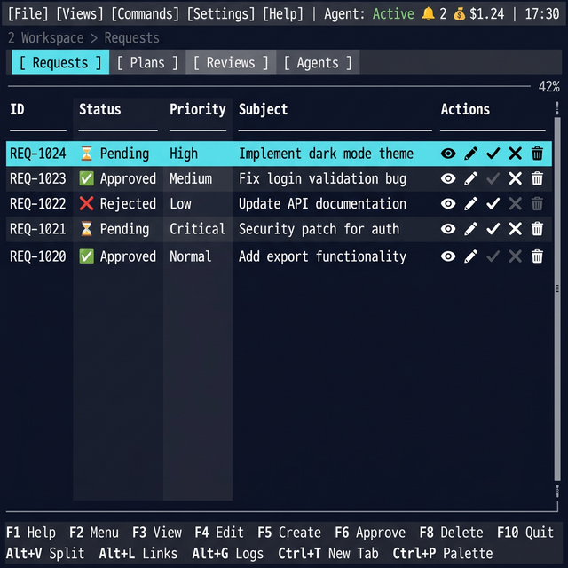
<!-- slide -->
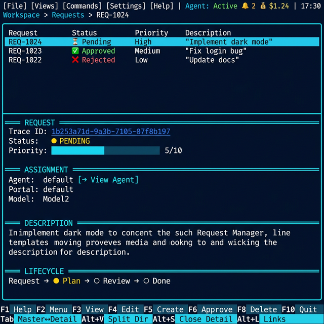
```text

### Plan Reviewer

```carousel
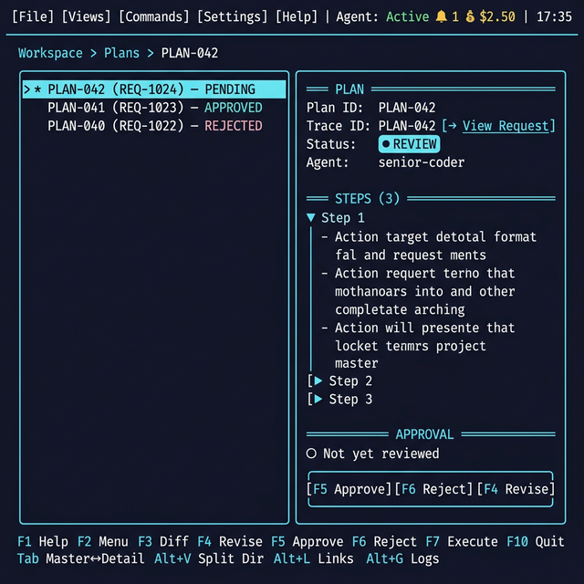
```text

### Review Manager

```carousel
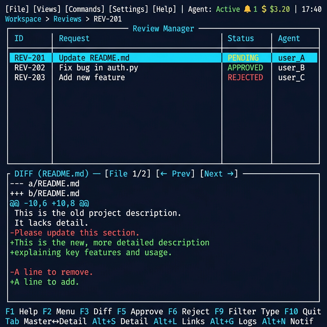
```text

### Flow Orchestration

```carousel
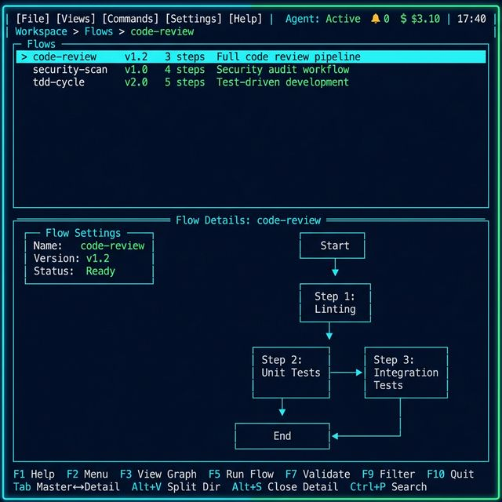
```text

### Blueprint Manager

```carousel
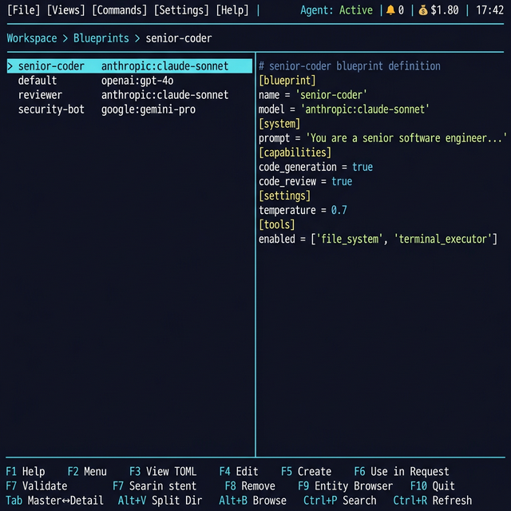
```text

#### Blueprint Entity Browser

The Blueprint Manager includes an integrated **Entity Browser** (`F9`) with three tabs:

| Tab        | Content                              | Columns                             | Detail Section Shows                              |
| ---------- | ------------------------------------ | ----------------------------------- | ------------------------------------------------- |
| **Agents** | All registered agent blueprints      | Agent ID, Name, Model, Capabilities | Full TOML definition, system prompt preview       |
| **Skills** | Core, project, and learned skills    | Skill ID, Name, Category, Triggers  | Full description, instructions, matched learnings |
| **Tools**  | Available tools from MCP + built-ins | Tool Name, Source, Status           | Parameters, description, usage examples           |

**Interaction**:

- **Arrow keys** navigate the list, **`Enter`** or **`F3`** shows details in the Detail section.
- **`Space`** toggles selection (multi-select supported). Selected items show a `[✓]` checkmark.
- **`F6` Use in Request**: Opens the **Create Request** tab pre-filled with the selected agent and any selected skills/tools attached. If multiple agents are selected, the first is set as the agent and a flow is suggested.
- **`Alt+B`** is a global shortcut to open the Entity Browser as a modal overlay from any view, including from within the Request create tab.

#### Request Creation Integration

When creating a request via **`F5`** in Request Manager, a **new tab** opens with the create form:

```text
Description: [________________________]
Agent:       [senior-coder   ▼ Browse]
Priority:    [normal ▼]
Portal:      [— ▼]
Model:       [— ▼]
Flow:        [— ▼]

Skills:      [+ Add from Browser]
             • error_handling (core)
             • testing (project)    [×]

Tools:       [+ Add from Browser]

             [F5 Submit]   [ESC Cancel]
```text

- **Agent field**: Type-ahead with `▼` dropdown listing all blueprints. `Browse` button opens the Entity Browser Agents tab.
- **Skills field**: Accumulated list. `+ Add` opens the Entity Browser Skills tab. `[×]` removes.
- **Tools field**: Same pattern as Skills. `+ Add` opens Tools tab.
- **Dropdowns** (Priority, Portal, Model, Flow): Standard single-select menus with all valid choices.

### Agent Status

```carousel
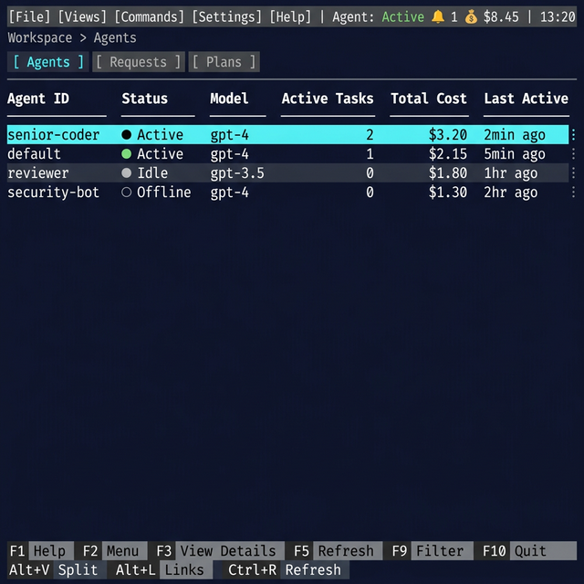
```text

### Daemon Control

```carousel
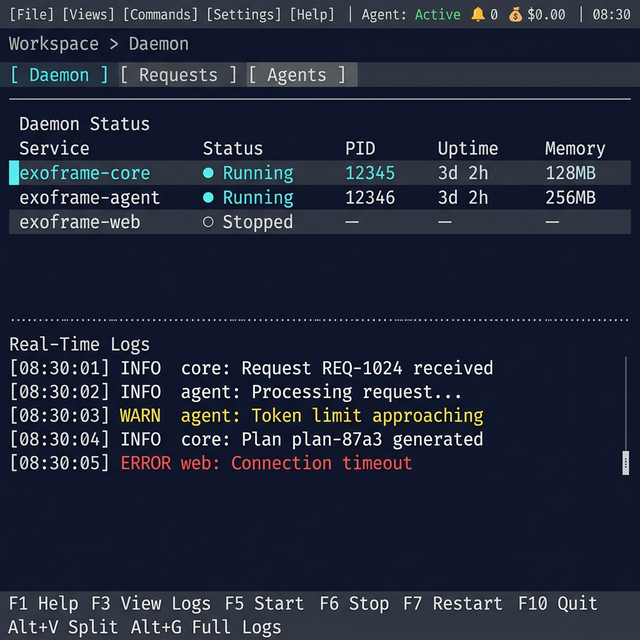
```text

### Interaction Features

````carousel
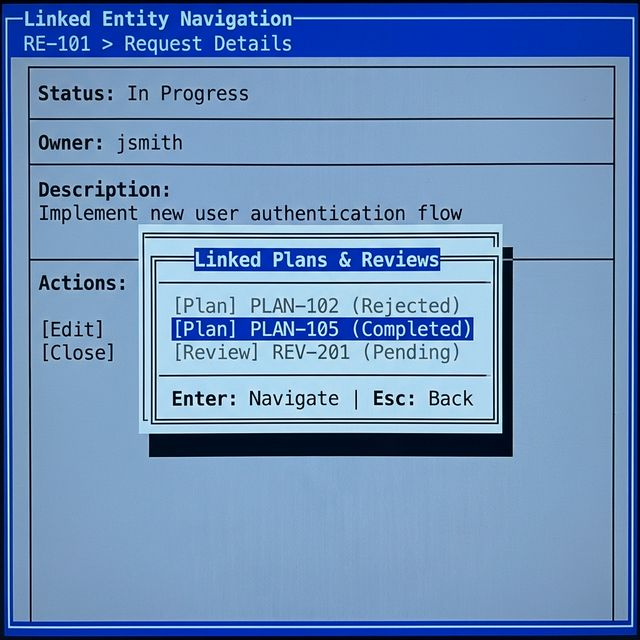
<!-- slide -->
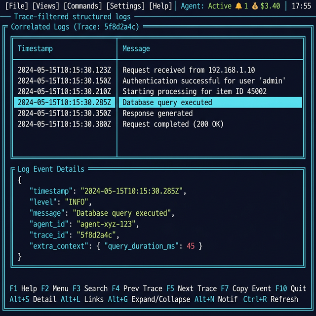
<!-- slide -->


### Management & Configuration

```carousel

<!-- slide -->

````text

### History & Audit

```carousel

<!-- slide -->

<!-- slide -->

```text

### Intelligence & Observability

```carousel

<!-- slide -->

```text

```text
---

## Specialized Detail Viewers

When `F3` (View) or `F11` (Toggle Split) is pressed on an entity, the Detail section renders a **structured viewer** — not raw text. Each viewer uses consistent color-coded sections, collapsible regions, and contextual inline actions.

### Color Coding Convention

| Element           | Color                                     | Usage                               |
| ----------------- | ----------------------------------------- | ----------------------------------- |
| Section headers   | **Bright Cyan**                           | `═══ METADATA ═══`, `═══ STEPS ═══` |
| Labels / keys     | **White (bold)**                          | `Status:`, `Agent:`, `Priority:`    |
| Values            | **Light Grey**                            | Data values                         |
| Status badges     | **Green** ✅ / **Yellow** ⚠️ / **Red** ❌ | Entity state                        |
| Links / trace IDs | **Blue (underlined)**                     | Clickable, `Enter` to navigate      |
| Timestamps        | **Dim Grey**                              | Dates, durations                    |
| Code / diffs      | **Syntax highlighted**                    | Green (+), Red (-), Grey (context)  |
| Warnings / errors | **Yellow / Red background**               | Alert banners                       |

### Request Detail Viewer

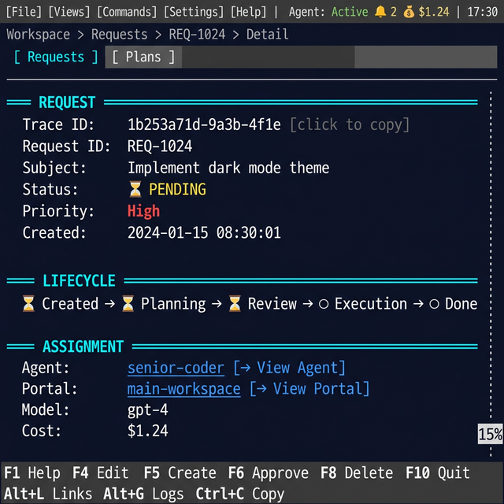

Displayed in the Detail section when viewing a request from Request Manager.
```text

═══ REQUEST ══════════════════════════════════════
Trace ID: 3f8a1c2d-7e4b-... [click to copy]
Status: ● PENDING (yellow badge)
Priority: ▮▮▮▮▮▯▯▯▯▯ 5/10
Created: 2026-02-26 17:30 (2h ago)
Created By: human (cli)

═══ ASSIGNMENT ═══════════════════════════════════
Agent: senior-coder [→ View Agent]
Portal: my-project [→ View Portal]
Model: anthropic:claude-sonnet
Flow: code-review-flow [→ View Flow]

═══ SKILLS ═══════════════════════════════════════
✓ error_handling (core)
✓ testing (project)
✗ Skip: legacy_compat

═══ DESCRIPTION ══════════════════════════════════
Implement dark mode toggle for the dashboard.
Should support system preference detection and
manual override with persistent user choice.

═══ COST & TOKENS ════════════════════════════════
Provider: anthropic Model: claude-sonnet
Input: 3,200 tokens
Output: 1,450 tokens
Total: 4,650 tokens 💰 $0.45

═══ LIFECYCLE ════════════════════════════════════
Request → ● Plan (PLAN-042) → ○ Review → ○ Done
[→ View Plan]

```text
**Inline actions**: Bracketed `[→ View ...]` links are clickable / navigable with `Enter`. The lifecycle bar shows the request's position in the Request → Plan → Review pipeline.

### Plan Detail Viewer

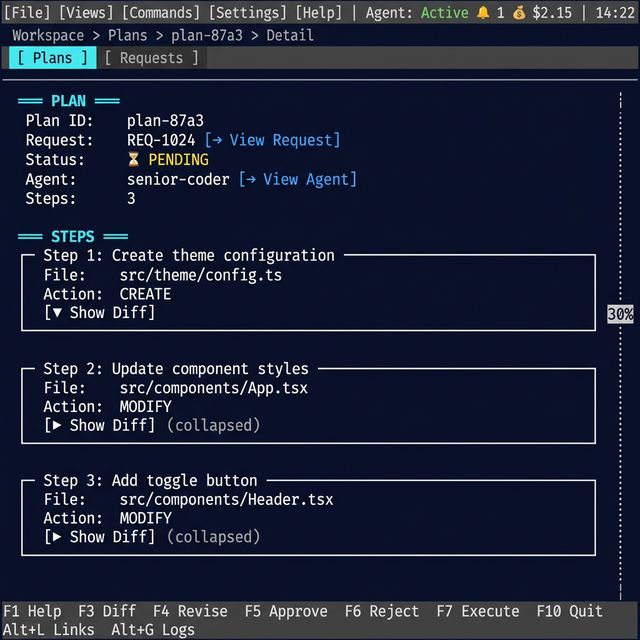

Displayed when viewing a plan from Plan Reviewer. Supports both execution plans (with steps) and specialized analysis reports.
```text

═══ PLAN ═════════════════════════════════════════
Plan ID: PLAN-042
Trace ID: 3f8a1c2d-7e4b-... [→ View Request]
Status: ● REVIEW (cyan badge)
Agent: senior-coder
Created: 2026-02-26 17:35

═══ SUBJECT ══════════════════════════════════════
Implement dark mode with system preference detection

═══ STEPS (3) ════════════════════════════════════
[▼] Step 1: Create theme configuration
Dependencies: none
Actions:

1. write_file src/config/theme.ts

   Rollback: Delete created files

[▶] Step 2: Implement toggle component
[▶] Step 3: Add persistence layer

═══ REVISION HISTORY ═════════════════════════════
(none — first submission)

═══ APPROVAL ═════════════════════════════════════
○ Not yet reviewed
Actions: [F5 Approve] [F6 Reject] [F4 Revise]

```text
**Specialized Reports** — When the plan contains `analysis`, `security`, `qa`, or `performance` fields, additional sections render:
```text

═══ SECURITY ANALYSIS ════════════════════════════
Executive Summary: No critical vulnerabilities found.

Findings (2):
● HIGH: SQL Injection in user_service.ts
Location: line 42
Recommendation: Use parameterized queries

● LOW: Missing rate limiting
Location: api/auth.ts
Recommendation: Add express-rate-limit

Compliance: ✓ OWASP Top 10 ✓ Input Validation

═══ QA SUMMARY ═══════════════════════════════════
Category Planned Executed Passed Failed
────────── ─────── ──────── ────── ──────
Unit 12 12 11 1
Integration 4 4 4 0
Coverage: ████████░░ 82%

```text
### Review Detail Viewer

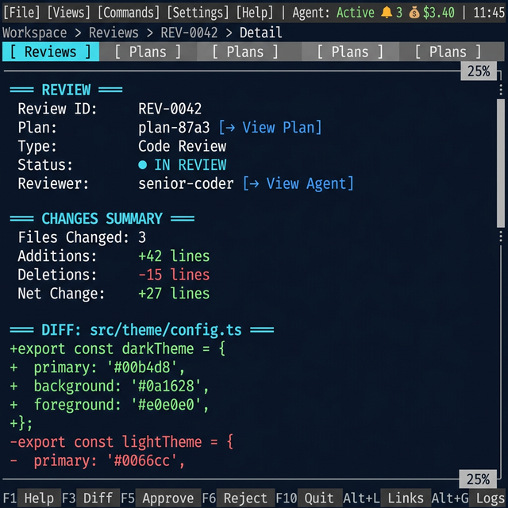

Displayed when viewing a review from Review Manager. Shows structured diff with syntax highlighting.
```text

═══ REVIEW ═══════════════════════════════════════
Branch: feat/dark-mode-3f8a1c2d
Base: main
Trace ID: 3f8a1c2d-7e4b-... [→ View Request]
Status: ● PENDING (yellow badge)
Agent: senior-coder
Portal: my-project
Created: 2026-02-26 17:40

═══ CHANGES SUMMARY ══════════════════════════════
Files Changed: 4 (+120 / −15)

File + −
──────────────────────────────────────────
src/config/theme.ts +45 −0
src/components/toggle.tsx +38 −2
src/hooks/useTheme.ts +32 −0
src/index.css +5 −13

═══ DIFF (src/config/theme.ts) ═══════════════════
[File 1/4] [← Prev] [Next →]

    1  + import { createContext } from 'react';
    2  +
    3  + export const ThemeContext = createContext({
    4  +   mode: 'system',
    5  +   toggle: () => {},
    6  + });

═══ COMMITS (2) ══════════════════════════════════
a3b8d1b Add theme configuration 17:36
c5dae3d Implement toggle component 17:39

═══ ACTIONS ══════════════════════════════════════
[F5 Approve (Merge)] [F6 Reject (Delete Branch)]

```text
**Diff navigation**: `[← Prev] [Next →]` buttons (or `Alt+←` / `Alt+→`) cycle through changed files. Syntax highlighting uses language-aware coloring (TypeScript, CSS, etc.).

### Agent Detail Viewer

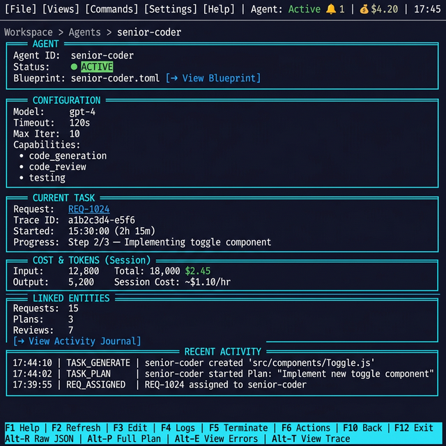

Displayed when viewing an agent from Agent Status.
```text

═══ AGENT ════════════════════════════════════════
Agent ID: senior-coder
Status: ● ACTIVE (green badge)
Blueprint: senior-coder.toml [→ View Blueprint]

═══ CONFIGURATION ════════════════════════════════
Model: anthropic:claude-sonnet
Timeout: 120s
Max Iter: 10
Capabilities:
• code_generation
• code_review
• testing

═══ CURRENT TASK ═════════════════════════════════
Request: REQ-1024 [→ View Request]
Trace ID: 3f8a1c2d-7e4b-...
Started: 2026-02-26 17:30 (2h 15m elapsed)
Progress: Step 2/3 — Implementing toggle component

═══ COST & TOKENS (Session) ══════════════════════
Input: 12,800 tokens
Output: 5,200 tokens
Total: 18,000 tokens 💰 $2.45
  Rate:       ~$1.10/hr

═══ LINKED ENTITIES ══════════════════════════════
Requests: 3 (2 completed, 1 active)
Plans: 3 (2 executed, 1 in review)
Reviews: 2 (2 approved)
[→ View Activity Journal for senior-coder]

═══ RECENT ACTIVITY ══════════════════════════════
17:40 plan.step.completed Step 1 of PLAN-042
17:35 plan.created PLAN-042
17:30 request.assigned REQ-1024

```text
### Viewer Features (All Types)

- **Collapsible Sections**: Click `[▼]` / `[▶]` or press `Enter` on a section header to expand/collapse. All sections default to expanded except long lists (>5 items).
- **Clipboard**: `Ctrl+C` copies the focused value (trace ID, branch name, etc.). `[click to copy]` indicators show copyable fields.
- **Navigation Links**: `[→ View ...]` badges are tab-navigable. `Enter` opens the linked entity in a new Detail section or tab.
- **Scroll**: Arrow keys scroll within the viewer. `Home` / `End` jump to top/bottom.
- **Search**: `Ctrl+F` opens a text search within the viewer content.

---

## Color Themes

While Blue/Cyan and Blue/White are available, they are not default. Users can choose from curated aesthetic themes:

| Theme Name           | Background       | Primary Text | Accent Colors      | Best For                  |
| :------------------- | :--------------- | :----------- | :----------------- | :------------------------ |
| **Midnight Classic** | `#000080` (Navy) | `#FFFFFF`    | `#00FFFF` (Cyan)   | Legibility & Nostalgia    |
| **Monokai Dark**     | `#272822`        | `#F8F8F2`    | `#A6E22E` (Green)  | Modern coding feel        |
| **Cyber Matrix**     | `#000000`        | `#00FF00`    | `#FFFF00` (Yellow) | Contrast & Retro-Futurism |

---

## Visual Rendering Style Guide

This section defines the consistent rendering rules for all TUI elements. Every view and component **must** follow these conventions to ensure visual coherence.

### Box-Drawing Characters

The TUI uses a minimal set of box-drawing characters. **No vertical lines** are used in the main content area except the dotted scroll indicator.

| Context                               | Characters                        | Example                  |
| ------------------------------------- | --------------------------------- | ------------------------ |
| **Tab Switch Bar separator**          | Thin dash: `─`                    | `──────────────────────` |
| **Split-view separator (horizontal)** | Dotted: `┈`                       | `┈┈┈┈┈┈┈┈┈┈┈┈┈┈┈┈┈┈`     |
| **Split-view separator (vertical)**   | Thin solid: `│`                   | Vertical solid line      |
| **Scroll indicator (vertical)**       | Dotted: `┊`                       | Right edge of content    |
| **Horizontal overflow indicators**    | Angle signs: `◄` `►`              | `◄` left / `►` right     |
| **Section headers (detail viewer)**   | Double-line fill: `═══ LABEL ═══` | `═══ ASSIGNMENT ═══`     |
| **Table header underline**            | Thin dash: `─`                    | `──────────────────────` |
| **Dividers (horizontal rule)**        | Thin dash repeated: `────`        | Section separators       |
| **Modal borders**                     | Single-line: `┌ ─ ┐ │ └ ┘`        | `┌── Title ──┐`          |

> **Key rules**:
>
> - **No vertical frame borders** around the main content area. Content fills the full terminal width.
> - **No vertical pipe separators** (`│`) for table columns — use spacing (2+ chars) between columns instead.
> - **No boxes for content grouping**: Avoid using box-drawing characters (`┌`, `┐`, `└`, `┘`, `│`) to frame steps, findings, or other repeating content blocks. Use headers, 1-level indentation, and horizontal dividers (`─` or `═`) instead.
> - The **only vertical lines** in content are: thin solid `│` for vertical split-view separators, and dotted `┊` for scroll indicators.

### Tab & Content Rendering

The main content area has **no surrounding frame**. Content spans edge-to-edge.

#### Full-Screen Tab (Default)
```text

[ Requests ][ Plans ][ Reviews ][ Agents ]
──────────────────────────────────────────
ID Status Subject
────────────────────────────────────────
REQ-1024 ⏳ Pending Implement dark...
REQ-1023 ✅ Approved Fix login bug
REQ-1022 ❌ Rejected Update docs
42% ┊

```text

- **No left/right borders**: Content extends to terminal edges with 1-char padding.
- **Top separator**: A thin `─` line separates the Tab Switch Bar from content.
- **Scroll indicator**: Dotted `┊` on the right edge when content overflows vertically, with `NN%` badge in the top-right.
- **Horizontal overflow**: When content is wider than the visible area, `◄` appears at the left edge and/or `►` at the right edge to indicate hidden content in that direction. Scroll with `Ctrl+Left`/`Ctrl+Right`.

#### Split-View (Horizontal)

When Master-Detail is active with horizontal split:
```text

[ Requests ][ Plans ][ Reviews ]
──────────────────────────────────────────
REQ-1024 ⏳ Pending Implement dark...
REQ-1023 ✅ Approved Fix login bug
REQ-1022 ❌ Rejected Update docs
┈┈┈┈┈┈┈┈┈┈┈┈┈┈┈┈┈┈┈┈┈┈┈┈┈┈┈┈┈┈┈┈┈┈┈┈┈┈
═══ REQUEST ═══
Trace ID: 1b253a71d-9a3b...
Status: ● PENDING
═══ ASSIGNMENT ═══
Agent: default [→ View Agent]

```text

- **Separator**: Dotted `┈` line spanning full width.
- **Active section**: The section with focus shows its header/content at normal brightness.
- **Inactive section**: Slightly dimmed (~20% less brightness).

#### Split-View (Vertical)

When Master-Detail is active with vertical split:
```text

[ Requests ][ Plans ][ Reviews ]
──────────────────────────────────────────
REQ-1024 ⏳ Pending │ ═══ REQUEST ═══
REQ-1023 ✅ Approved│ Trace ID: 1b25..
REQ-1022 ❌ Rejected│ Status: ● PEND
│ ═══ ASSIGNMENT
│ Agent: default

```text

- **Separator**: Thin solid `│` vertical line (distinct from dotted `┊` scroll indicator).
- **Width split**: 50/50 ratio.
- **Focus indicator**: Same dimming rules as horizontal split.

### Selection & Highlighting

Consistent highlighting rules for all list/table views:

| State                                         | Visual Treatment                                | ANSI Attributes |
| --------------------------------------------- | ----------------------------------------------- | --------------- |
| **Cursor row** (keyboard focus)               | Full-width **Cyan background**, White Bold text | `\e[1;37;46m`   |
| **Selected item** (multi-select with `Space`) | **Checkmark `[✓]`** prefix, **Green** text      | `\e[32m`        |
| **Cursor + Selected**                         | Cyan background + Green Bold text + `[✓]`       | `\e[1;32;46m`   |
| **Hover row** (mouse)                         | **Underline**, no background change             | `\e[4m`         |
| **Disabled/greyed out**                       | **Dark Grey** text, no interactions             | `\e[90m`        |
| **Error row**                                 | **Red** text, `⚠` prefix                        | `\e[31m`        |
| **New/unread**                                | **Bold** text + `●` prefix (bright dot)         | `\e[1m`         |

#### Table Header Row

- **Background**: Slightly lighter than content area (e.g., `#001a33` on navy).
- **Text**: **Bold White**, all-caps optional.
- **Separator**: Thin `─` underline spanning full width.
- **Sticky**: Header row does not scroll; it stays pinned at the top of the list.

#### Column Banding

Since no vertical pipe separators (`│`) are used, columns are visually separated by **alternating background shading**:

- **Odd columns** (1st, 3rd, …): Standard content background.
- **Even columns** (2nd, 4th, …): Slightly lighter background (e.g., `\e[48;5;234m` on dark theme — a subtle 5–8% brightness shift).
- **Cursor row**: Column banding is suppressed; the entire row uses the Cyan cursor background.
- **Spacing**: At least 2 characters of padding between columns to reinforce separation.

#### Column Alignment

| Data Type                        | Alignment                       |
| -------------------------------- | ------------------------------- |
| ID / Name / Text                 | Left-aligned                    |
| Status                           | Left-aligned (with icon prefix) |
| Numbers (tokens, cost, priority) | Right-aligned                   |
| Dates / Timestamps               | Right-aligned                   |
| Actions (rightmost column)       | Right-aligned                   |

#### Inline Actions Column

Every entity list table includes a **rightmost Actions column** displaying compact icon buttons for context-sensitive operations. Each icon corresponds to an F-key action. Icons are **colored when valid** and **Dark Grey (`\e[90m`) when not applicable** for the item's current state.
```text

ID Status Priority Subject Actions
────────────────────────────────────────────────────────────────────────
REQ-1024 ⏳ Pending High Implement dark mode 👁 ✏ ✓ ✗ 🗑
REQ-1023 ✅ Approved Medium Fix login bug 👁 ✏ ✓ ✗ 🗑
REQ-1022 ❌ Rejected Low Update docs 👁 ✏ ✓ ✗ 🗑

```text
In the example above, for `REQ-1023` (Approved): `✓` (Approve) would be grayed out since already approved, while `👁` (View), `✏` (Edit), `✗` (Reject), and `🗑` (Delete) remain active.

##### Action Icons by View

| View                  | Icons (left to right) | Mapping                                               |
| --------------------- | --------------------- | ----------------------------------------------------- |
| **Request Manager**   | `👁 ✏ ✓ ✗ 🗑`           | F3 View, F4 Edit, F6 Approve, F6 Reject, F8 Delete    |
| **Plan Reviewer**     | `👁 📝 ✓ ✗ ▶`          | F3 Diff, F4 Revise, F5 Approve, F6 Reject, F7 Execute |
| **Review Manager**    | `👁 ✓ ✗`               | F3 Diff, F5 Approve, F6 Reject                        |
| **Portal Manager**    | `👁 ✏ ✔ 🗑`             | F3 View, F6 Edit, F7 Verify, F8 Remove                |
| **Blueprint Manager** | `👁 ✏ ✔ 🗑`             | F3 View TOML, F4 Edit, F7 Validate, F8 Remove         |
| **Archive Explorer**  | `👁`                   | F3 View                                               |

##### Rendering Rules

- **Available action**: Rendered in its standard color (see Status Badge Palette).
- **Unavailable action**: Rendered in **Dark Grey** (`\e[90m`) — visible but non-interactive.
- **Cursor row**: Action icons inherit the Cyan cursor background; available icons become **White Bold**, unavailable remain **Dark Grey**.
- **Click/Enter**: Clicking an action icon or pressing its F-key triggers the action on the row's entity.
- **Column width**: Fixed width based on the number of actions for the view (typically 5–10 characters).
- **Visibility**: The Actions column is shown only in **full-width tab** and **horizontal split** views. In **vertical split** view, the column is **hidden** to conserve horizontal space — users rely on F-keys and the bottom bar instead.

### Status Badge Palette

All status indicators use a consistent color + icon vocabulary:

| Status               | Icon | Color        | ANSI     |
| -------------------- | ---- | ------------ | -------- |
| Active / Running     | `●`  | Bright Green | `\e[92m` |
| Pending / Queued     | `⏳` | Yellow       | `\e[33m` |
| Approved / Completed | `✅` | Green        | `\e[32m` |
| Rejected / Failed    | `❌` | Red          | `\e[31m` |
| In Review            | `●`  | Cyan         | `\e[36m` |
| Draft                | `○`  | Grey         | `\e[90m` |
| Blocked / Error      | `⚠`  | Bright Red   | `\e[91m` |
| Idle                 | `●`  | Dark Grey    | `\e[90m` |

Status text is always rendered **inline** after the icon with a single space: `● Active`, `⏳ Pending`.

### Interactive Element Styling

#### Buttons & Action Labels

Buttons in the bottom bar, detail viewer, and modals follow this format:

| Context                      | Style                             | Example           |
| ---------------------------- | --------------------------------- | ----------------- |
| **Bottom bar F-key**         | `F-key` in Bold + Label in Normal | **`F5`** `Create` |
| **Inline action**            | Bracketed, Blue underlined        | `[→ View Agent]`  |
| **Modal button (focused)**   | Cyan background, White Bold       | `[ Submit ]`      |
| **Modal button (unfocused)** | Grey border, Normal text          | `[ Cancel ]`      |
| **Destructive action**       | Red text                          | `[ Delete ]`      |

#### Text Input Fields
```text

Label: [value________________] (unfocused)
Label: [value________________] (focused: cyan border + cursor)

```text

- **Unfocused**: Single-line border, grey.
- **Focused**: Single-line border, **Bright Cyan** + blinking cursor `▌`.
- **Invalid/Error**: **Red** border + error text below in Red Italic.
- **Placeholder**: Dim Grey italic text when empty.

#### Dropdown Menus
```text

Agent: [senior-coder ▼]
┌─────────────────┐
│ ● senior-coder │ ← highlighted
│ default │
│ reviewer │
│ security-bot │
└─────────────────┘

```text

- **Closed**: Value + `▼` chevron in single-line box.
- **Open**: Single-line dropdown overlaid below, selected item has **Cyan background**.
- **Max visible items**: 8 (scrollbar appears if more).

### Modal & Overlay Rendering

Modals and overlays float above the main content.
```text

┌──────────── Title ────────────┐
│ │ ← 1-char padding inside
│ Content │
│ │
│ [Action 1] [Action 2] │ ← buttons right-aligned
└───────────────────────────────┘

```text

- **Border**: Single-line box, **White** foreground.
- **Background**: Solid fill, slightly lighter than main background (e.g., `#001133` on navy).
- **Dimming**: Content behind the modal is rendered at **50% brightness**.
- **Z-order**: Modal > Active Tab content.
- **Close**: `ESC` always closes the topmost modal.

### Scroll Indicators

#### Vertical Scroll — Right-Edge Indicator + Percentage

When a tab or section has vertically overflowing content, a dashed line (`┊`) appears on the right edge to signal scrollability. A percentage badge shows position:
```text

[ Requests ][ Plans ][ Reviews ] 42%
──────────────────────────────────────────────────────────────────────────
REQ-1024 ⏳ Pending High ┊
REQ-1023 ✅ Approved Medium ┊
REQ-1022 ❌ Rejected Low ┊
REQ-1021 ⏳ Pending Critical ┊

```text

- **Right edge indicator**: A dashed `┊` appears on the rightmost column when content overflows vertically. Hidden when all content fits.
- **Indicator color**: **Cyan** when the section has focus, **Grey** otherwise.
- **Percentage badge**: `NN%` shown in the top-right corner of the content area (0% = top, 100% = bottom).
- **Badge color**: **Dim Grey** when unfocused, **Cyan** when focused.
- **Keyboard**: Arrow keys scroll line-by-line; `PgUp`/`PgDn` scroll page-by-page; `Home`/`End` jump to 0%/100%.

#### Horizontal Overflow — Angle Indicators

When content is wider than the visible area (e.g., wide diffs, long table rows), angle indicators signal hidden content:
```text

◄ REQ-1024 ⏳ Pending Implement dark mode with full theme support... ►

```text

- **`◄` (left edge)**: Shown when content extends beyond the left side (user has scrolled right).
- **`►` (right edge)**: Shown when content extends beyond the right side.
- **Both**: When content overflows in both directions, both indicators appear.
- **Neither**: When all content fits, no indicators are shown.
- **Indicator color**: **Cyan** when focused, **Grey** otherwise.
- **Keyboard**: `Ctrl+Left`/`Ctrl+Right` scroll horizontally; `Home`/`End` jump to start/end of line.

### Spacing & Padding Rules

| Element                          | Padding                            |
| -------------------------------- | ---------------------------------- |
| Content ↔ terminal edge          | 1 character horizontal, 0 vertical |
| Table cell ↔ column separator    | 1 character each side              |
| Section header ↔ section content | 1 empty line above header, 0 below |
| Modal content ↔ modal border     | 1 character all sides              |
| Bottom bar ↔ content area        | 0 gap (bottom bar is flush)        |
| Top bar ↔ Tab Switch Bar         | 0 gap (flush)                      |
| Tab Switch Bar ↔ content         | 1 `─` separator line               |
| Split-view sections ↔ separator  | 0 gap (content touches `┈`/`┊`)    |

### Typography Hierarchy

| Level                           | ANSI Attribute      | Usage                      |
| ------------------------------- | ------------------- | -------------------------- |
| **H1** — View title             | Bold + Underline    | Active tab label           |
| **H2** — Section header         | Bold Cyan           | `═══ SECTION ═══`          |
| **H3** — Sub-header / label     | Bold White          | `Status:`, `Agent:`        |
| **Body** — Values, content      | Normal (Light Grey) | Data values, descriptions  |
| **Muted** — Timestamps, hints   | Dim Grey            | Dates, help text           |
| **Emphasis** — Important values | Bold + Color        | Active status, cost totals |
| **Link** — Navigable reference  | Blue Underline      | `[→ View Agent]`           |
| **Code** — Inline code / paths  | Green (no bold)     | File paths, branch names   |

---

## Interaction Model (F-Key Centric)

The new TUI prioritizes **F-keys** and **Menus** for a streamlined, professional experience. Legacy single-letter shortcuts are retired in favor of a more structured and discoverable command system.

### Keyboard (Primary Commands)

| Key       | Global Action    | Notes                                                                                                         |
| :-------- | :--------------- | :------------------------------------------------------------------------------------------------------------ |
| **`F1`**  | Help / Manual    | Context-aware shortcut reference for the active view (categorized overlay). Includes "Export to File" option. |
| **`F2`**  | Main Menu        | Focus the top global menu bar. **Sole menu activation key.**                                                  |
| **`F3`**  | Primary View     | View/Expand details of selected item.                                                                         |
| **`F4`**  | Primary Edit     | Edit/Modify selected item.                                                                                    |
| **`F5`**  | Primary Action   | Approve / Copy / Create / Refresh (Context-dependent).                                                        |
| **`F6`**  | Secondary Action | Reject / Move / Rename (Context-dependent).                                                                   |
| **`F7`**  | Auxiliary Action | Context-dependent label shown in bottom bar (Execute / MkDir / Filter).                                       |
| **`F8`**  | Delete / Remove  | Destructive actions (always requires F-key + Confirm).                                                        |
| **`F9`**  | View Options     | Open local view settings/sort/filter. **Not used for menu activation.**                                       |
| **`F10`** | Quit             | Exit the TUI immediately.                                                                                     |
| **`F11`** | Toggle Split     | Open/close the Detail split in the current tab.                                                               |
| **`F12`** | Split Direction  | Cycle split direction: Horizontal → Vertical → Off.                                                           |

> **Note on F7**: The label in the Bottom Control Bar changes dynamically per view. For example, it reads "Execute" in Plan Reviewer, "MkDir" in Portal Tree, and "Filter" in Monitor View. This is context-sensitive behavior, not a conflict.

#### Navigation & Focus

- **`TAB`** / **`Shift+TAB`**: Switch focus between Master and Detail sections within a split view.
- **`Alt+1`..`Alt+9`**: Switch to tab by position. **`Alt+Left`** / **`Alt+Right`**: Cycle adjacent tabs.
- **`Ctrl+T`**: Open tab picker to create a new tab.
- **`Ctrl+W`**: Close the current closeable tab.
- **`Ctrl+P`**: Open **Command Palette** for fuzzy search across all entities.
- **`Ctrl+R`**: Manual refresh of current view data.
- **`Arrow Keys`**: Navigate lists and tree nodes.
- **`Enter`**: Primary confirmation / Selection.
- **`ESC`**: Cancel / Close modal / Back one level.

#### View-Specific Mappings

- **Request Manager**: `F3` (View Details), `F4` (Edit), `F5` (Create New — opens form with agent, priority, portal, model, flow, skills fields; `Alt+B` opens Blueprint Browser to pick agent/skills), `F6` (Approve), `F8` (Delete).
- **Plan Reviewer**: `F3` (Diff View), `F4` (Revise — append review comments, set `needs_revision`), `F5` (Approve), `F6` (Reject), `F7` (Execute).
- **Review Manager**: `F3` (View Diff), `F5` (Approve — merge branch), `F6` (Reject — delete branch), `F9` (Filter: code / artifact / all).
- **Portal Manager**: `F3` (View Details), `F4` (Refresh Context Card), `F5` (Add New — with default branch & execution strategy), `F6` (Edit), `F7` (Verify Integrity), `F8` (Remove).
- **Blueprint Manager**: `F3` (View TOML), `F4` (Edit in $EDITOR), `F5` (Create New — template picker: default/coder/reviewer/researcher/mock), `F6` (Use in Request — pre-fills create request form with selected agent + skills), `F7` (Validate), `F8` (Remove), `F9` (Entity Browser: Agents | Skills | Tools).
- **Flow Orchestration**: `F3` (View Details / Dependency Graph), `F5` (Run Flow), `F7` (Validate), `F9` (Filter).
- **Agent Status**: `F3` (View Details), `F5` (Refresh), `F9` (Filter by Agent).
- **Monitor View**: `F5` (Pause/Resume), `F7` (Filter Logs), `F9` (Log Levels).
- **Memory View**: `F5` (Approve / Promote), `F6` (Reject / Demote), `F7` (Search — cross-bank with embeddings), `F9` (Switch Sub-View Tab: Pending | Projects | Executions | Global | Skills).
- **Daemon Control**: `F3` (View Logs — with follow mode), `F5` (Start), `F6` (Stop), `F7` (Restart).
- **Settings**: `F3` (View Value), `F4` (Edit Inline), `F5` (Save All), `F7` (Validate Config), `F8` (Reset to Default).
- **Archive Explorer**: `F3` (View Entry), `F7` (Search by agent/date), `F9` (Filter by status).
- **Git Browser**: `F3` (View Diff), `F5` (Checkout Branch), `F7` (Log by Trace ID), `F9` (Filter branches).
- **Activity Journal**: `F3` (View Full Payload), `F7` (Multi-Filter — trace_id, action_type, agent_id, actor, since), `F9` (Format: table/json/text).

### Mouse

- **Direct Interaction**: All controls, F-key labels at the bottom, and list items are clickable.
- **Menus**: Clickable headers and dropdown list items.
- **Selection**: Click to switch tabs or focus a split-view section.
- **Scrolling**: Mouse wheel support for vertical scrolling.
- **Back/Forward**: Mouse Side Buttons (if available) map to navigation history.

---

## Command Palette

A quick-access, fuzzy-search overlay for navigating across all entities:

- **Activation**: **`Ctrl+P`** opens the Command Palette overlay from any view.
- **Capabilities**:
  - Fuzzy search by name, Trace ID, or keyword across Requests, Plans, Reviews, Flows, Blueprints, and Portals.
  - Recent items shown by default when the palette is empty.
  - Type prefixes for scoping: `r:` (requests), `p:` (plans), `v:` (reviews), `f:` (flows), `b:` (blueprints), `@` (portals).
- **Navigation**: Arrow keys to select, **`Enter`** to jump to the selected entity, **`ESC`** to dismiss.

---

## Settings View

A dedicated, full TUI view for browsing and editing the `exa.config.toml` configuration. Accessible via `[Settings] > Open Settings View` from the top menu.

### Layout

The Settings View uses the **Master-Detail** layout:

- **Master (left/top)**: A **collapsible tree** of config sections and their keys:

▼ system
log_level: INFO
root: /home/user/Exaix
▼ ai
provider: google
model: gemini-2.5-pro
timeout_sec: 120
▶ database
▶ paths
▶ agents
▶ rate_limiting
▶ git
▶ tools

```text

- **Detail (right/bottom)**: Shows the selected option's full metadata — current value, default value, type, allowed range/choices, and description.

### Editing Options

| Field Type                                                        | Edit Behavior                                                                                                        |
| :---------------------------------------------------------------- | :------------------------------------------------------------------------------------------------------------------- |
| **Enum / Choice** (e.g., `log_level`, `provider`, `journal_mode`) | **`Enter`** or **`F4`** opens a **dropdown menu** with all valid choices. Arrow keys to navigate, `Enter` to select. |
| **String** (e.g., `root`, `model`)                                | **`F4`** activates inline text editing on the value. `Enter` to confirm, `ESC` to cancel.                            |
| **Number** (e.g., `timeout_sec`, `max_iterations`)                | **`F4`** activates inline numeric editing. Validates against min/max range on confirm.                               |
| **Boolean** (e.g., `rate_limiting.enabled`)                       | **`Enter`** or **`Space`** toggles between `true` / `false`.                                                         |
| **Array** (e.g., `exclude_dirs`, `allowed_domains`)               | **`F4`** opens a multi-line editor overlay. `F5` to add item, `F8` to remove selected.                               |

### Save & Reload Flow

1. **Modified Indicator**: Changed values show a `*` marker next to the key name. The title bar shows `[Modified]` when unsaved changes exist.

1.
1.
1.
1.

---

## Archive Explorer

A view for browsing completed and archived executions. Accessible via `[Views] > Archive`.

### Layout

**Master-Detail** with horizontal split:

- **Master (top)**: Table of archived entries: Trace ID, Agent, Status, Archived At.
- **Detail (bottom)**: Full archived metadata as formatted JSON with syntax highlighting.

### Operations

- **`F7` Search**: Opens search overlay — enter agent ID, date range, or keyword. Searches via `ArchiveService.searchByAgent()` and `searchByDateRange()`.
- **`F9` Filter**: Dropdown: All / Completed / Failed / Cancelled.
- **`F3` View**: Show full entry detail in the Detail section.
- **Stats**: A summary line at the bottom of the Master section: "Total: 42 | Completed: 38 | Failed: 4".
- **Traceability**: `Alt+L` jumps to the linked Request/Plan/Review for the selected trace_id.

---

## Git Browser

A view for repository-level git operations. Accessible via `[Views] > Git`.

### Layout

**Master-Detail** with vertical split:

- **Master (left)**: Branch list with columns: Name, Current (★), Last Commit, Date, Trace ID. The current branch is highlighted green. Branches with trace_ids show a clickable badge.
- **Detail (right)**: Commit history for the selected branch (last 10 commits) and/or diff output.

### Operations

- **`F3` View Diff**: Show diff between the selected branch and its base branch.
- **`F5` Checkout**: Checkout the selected branch (with confirmation dialog).
- **`F7` Log by Trace**: Enter a trace_id to find all commits referencing it across all branches.
- **`F9` Filter**: Filter branches by pattern (glob) — e.g., `feat/*`, `exa-*`.
- **Status Bar**: Shows current branch, modified/added/deleted/untracked file counts (from `git status`).
- **Traceability**: `Alt+L` jumps to the Request/Plan linked to the branch's trace_id.

---

## Activity Journal

A view for querying and filtering the Activity Journal (SQLite-backed audit log). Accessible via `[Views] > Journal`.

### Layout

**Master-Detail** with horizontal split:

- **Master (top)**: Scrollable event list with columns: Timestamp, Action Type, Actor, Agent, Target, Trace ID.
- **Detail (bottom)**: Full JSON payload for the selected event.

### Operations

- **`F7` Multi-Filter**: Opens a filter form with fields:
- `trace_id`: Filter by trace ID
- `action_type`: Filter by action (e.g., `request.created`, `plan.approved`)
- `agent_id`: Filter by agent
- `actor`: Filter by actor (human/agent/system)
- `since`: Filter by time (e.g., `1h`, `24h`, `7d`)
- `target`: Filter by target entity
- `payload`: Full-text search within payload JSON
- **`F9` Format Toggle**: Cycle display format: table → JSON → text.
- **`F3` View Payload**: Expand full event payload in the Detail section.
- **`F5` Refresh**: Re-query with current filters.
- **Tail Mode**: `Ctrl+F` enables live-tail mode (auto-refreshes newest N entries).
- **Counters**: Optional `--count` / `--distinct` display toggleable via `Alt+C`.

---

## Memory View (Expanded)

The Memory View supports 5 tabbed sub-domains, switchable via **`F9`**. Each sub-domain uses Master-Detail split within the same tab.

### Tab: Pending (Default)

- **Master**: List of pending proposals (ID, Type, Agent, Created).
- **Detail**: Proposal content and diff.
- **Actions**: `F5` Approve, `F6` Reject (with reason), `Ctrl+A` Approve All.

### Tab: Projects

- **Master**: List of portals with project memory (Portal, Learnings Count, Last Updated).
- **Detail**: Project memory details — decisions, patterns, and context.
- **Actions**: `F3` View Full, `F5` Promote to Global.

### Tab: Executions

- **Master**: Execution history (Trace ID, Agent, Portal, Status, Date). Filterable by portal.
- **Detail**: Full execution record.
- **Actions**: `F3` View, `F7` Search by portal, `F9` Limit results.

### Tab: Global

- **Master**: Global learnings list (ID, Subject, Category, Confidence, Tags).
- **Detail**: Full learning content.
- **Actions**: `F3` View, `F6` Demote to Project, `Alt+I` Show Stats.

### Tab: Skills

- **Master**: Skills list (ID, Name, Category: core/project/learned, Status).
- **Detail**: Skill definition — description, instructions, triggers.
- **Actions**: `F3` View, `F5` Create New, `F7` Match (enter request text → show matched skills with confidence), `F4` Derive from Learnings.

### Cross-Tab Features

- **`F7` Search**: Cross-bank search with optional embeddings (`--use-embeddings`).
- **`Alt+R` Rebuild Index**: Trigger a full index rebuild.

---

## Feature Integration

The new TUI modernizes all capabilities detailed in the [Exaix User Guide](../Exaix_User_Guide.md):

1. **Global View Management**: Replaces the old View Picker (`p`) with a structured `[Views]` top menu and Tab Switch Bar.

1.
1.
1.
1.

---

## Notification System

The TUI provides a multi-tiered notification system:

- **Passive Indicator**: A `🔔 N` badge on the Top Bar shows unread count. Clicking it or pressing **`Alt+N`** opens the Notification Panel.
- **Notification Panel**: A toggleable side overlay listing recent events (info, success, warning, error). Scrollable with Arrow keys. Press **`ESC`** to dismiss.
- **Toast Banners**: Critical notifications (e.g., daemon stopped, plan validation failed) appear as a transient colored banner at the bottom of the screen for **5 seconds** before auto-expiring.
- **Types**: `info` (blue), `success` (green), `warning` (yellow), `error` (red).

---

## View States

Every view implements three standard states for consistent UX:

| State       | Visual                                                               | User Action                                               |
| :---------- | :------------------------------------------------------------------- | :-------------------------------------------------------- |
| **Loading** | Spinner/progress bar in the tab's title area + "Loading..." message. | Wait for data. `ESC` to cancel.                           |
| **Error**   | Red banner at the top of the content area with error description.    | `F5` to retry. `ESC` to dismiss.                          |
| **Empty**   | Centered grey text with contextual suggestion.                       | e.g., "No pending plans. Press `F5` to create a request." |

---

## Data Refresh Model

| Mode             | Behavior                                                                                                                                                             | Views                                                                                                  |
| :--------------- | :------------------------------------------------------------------------------------------------------------------------------------------------------------------- | :----------------------------------------------------------------------------------------------------- |
| **Manual**       | `Ctrl+R` or `F5` (where not reassigned) triggers a one-time data fetch.                                                                                              | Request Manager, Plan Reviewer, Review Manager, Portal Manager, Blueprint Manager, Flow Orchestration. |
| **Auto-Refresh** | View polls the service at a configurable interval (default: 5s). Interval adjustable in `[Settings] > Refresh Rate`.                                                 | Monitor View, Daemon Control, Agent Status.                                                            |
| **Event-Driven** | Background data changes trigger a Notification toast. The affected view shows a `[↻ New data available]` indicator in its title bar. User presses `Ctrl+R` to apply. | All views (complementary to Manual/Auto).                                                              |

---

## Overlays and Modals

Specific complex actions (Edit Request, Plan Approval) use centered overlays.

- **Hierarchy**: Overlays visually "float" above the active tab content with dimmed background.
- **Control**: Modals capture all input (keyboard/mouse) until dismissed.
- **Breadcrumbs**: Integrated into the top of modals for context.

---

## Supported Entities for Master-Detail View

The following components support the Linked Detail Mode (Master top/left, Detail bottom/right):

- **Requests**: List and full Request metadata + description + token cost.
- **Plans**: List and detailed execution plan content.
- **Reviews**: List of pending reviews and their diff summary.
- **Portals**: List of aliases and their full configuration + health status.
- **Blueprints**: List of agent blueprints and their full TOML definition.
- **Flows**: List of multi-agent flows and their dependency graph + step details.
- **Memory** (tabbed): Pending proposals, Project memories, Executions, Global learnings, Skills.
- **Agent Status**: List of agents and their health, current task, cost, and linked Trace IDs.
- **Daemon**: Current status, MCP server indicator, and real-time logs (as details).
- **Settings**: Config section tree and selected option metadata + edit controls.
- **Archive**: Archived execution entries and their full metadata (JSON).
- **Git Branches**: Branch list (with trace_id) and commit history + diffs.
- **Activity Journal**: Event list (action_type, actor, target) and full event payload.

---

## Data Architecture

Each view receives data through **injected service interfaces**, maintaining separation between UI and business logic.

### Service Adapter Pattern
```text

┌─────────────┐ ┌──────────────────┐ ┌─────────────────┐
│ TUI View │────▶│ Service Interface │────▶│ CLI Commands / │
│ (Rendering) │ │ (IRequestService │ │ DatabaseService │
│ │◀────│ IPlanService) │◀────│ (SQLite/PG) │
└─────────────┘ └──────────────────┘ └─────────────────┘

````text

- Views never call CLI commands directly; they use **typed adapters** (e.g., `RequestCommandsServiceAdapter`).
- Adapters translate between the CLI layer and the view's expected `IRequest`, `IPlan`, `IReview` interfaces.

### Traceability Resolution

The **Lifecycle Explorer** (`Alt+L`) resolves linked entities by querying the **Activity Journal** (SQLite) using an indexed `trace_id` lookup:

1. Query `SELECT * FROM activity WHERE trace_id = ?` to find all events.

1.

### Log Correlation

The **Correlated Log View** (`Alt+G`) reuses the existing `StructuredLogService` with a `trace_id` filter parameter, reading structured JSON log entries from the `.exa/` directory.

### Cost Tracking

The **CostTracker** service provides per-request and per-agent token usage and cost data:

- **Top Bar**: Aggregated session cost displayed as `💰 $X.XX` in the Global Status area.
- **Request Details**: Shows `input_tokens`, `output_tokens`, `total_tokens`, `token_cost_usd` fields from plan frontmatter.
- **Agent Status Details**: Per-agent cost breakdown for the current session.
- **Cost Dashboard**: Accessible via `[Settings] > Cost Dashboard` — a dedicated overlay showing historical cost trends, per-model breakdown, and budget alerts.

---

## Technical Specifications

### 1. View Persistence (v2 Schema)

The TUI persists configuration to `~/.exaix/tui_layout.json`:

```json
{
  "version": "2.0",
  "panes": [
    {
      "id": "main",
      "viewName": "RequestManagerView",
      "x": 0,
      "y": 0,
      "width": 40,
      "height": 24,
      "masterDetailEnabled": true,
      "masterDetailOrientation": "horizontal"
    }
  ],
  "activePaneId": "main",
  "navigationStacks": {
    "main": ["trace-id-abc", "trace-id-def"]
  }
}
````text

- **Migration**: If `version` is missing or `"1.1"`, the loader adds default values for new fields and writes `"2.0"`.
- State is saved on exit and restored on launch.

### 2. Scroll Management

- **Vertical Progress**: Indicated by a **percentage label** (e.g., `[75%]`) in the top-right corner of the content area.
- **Horizontal Progress**: A **visual scrollbar indication** will be shown at the bottom of the content area.
- **Interaction**: Scrollbars are primarily for visual feedback; navigation is handled via arrow keys and Page Up/Down.

### 3. Terminal Size & Resize Behavior

#### Minimum Size

Minimum terminal size: **80 columns × 24 rows**.

#### Live Resize Rules (SIGWINCH)

The TUI listens for terminal resize events and adapts **immediately**:

| Event                            | Behavior                                                                            |
| -------------------------------- | ----------------------------------------------------------------------------------- |
| **Terminal grows**               | TUI stretches to fill the new size. Content area expands.                           |
| **Terminal shrinks but ≥ 80×24** | TUI shrinks proportionally. Split-view sections scale.                              |
| **Terminal shrinks below 80×24** | TUI renders **partially** (clipped). User must resize the terminal window manually. |

#### Startup Rules

| Terminal Size at Launch | Behavior                                                                         |
| ----------------------- | -------------------------------------------------------------------------------- |
| ≥ 80×24                 | Restore saved tab layout normally.                                               |
| < 80×24 (below minimum) | Render **partially** without scrolling. No layout adjustments. User must resize. |

### 4. Help & Shortcut Export

The **`F1`** help overlay provides a context-aware, categorized shortcut reference:

- **Sections**: Global, Navigation, Current View, Alt-Key Shortcuts.
- **Export**: Within the `F1` overlay, pressing **`E`** exports the full keyboard reference to `~/.exaix/keyboard_reference.md` for offline access or printing.
`````
