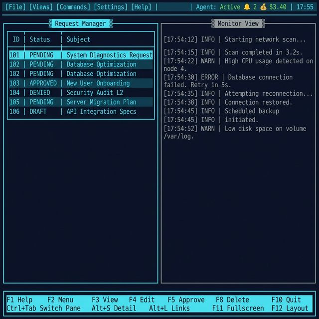
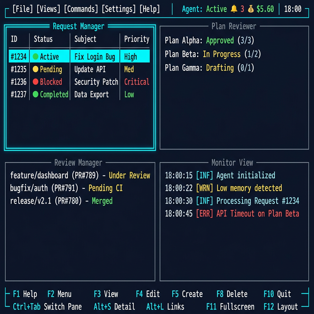

# ExoFrame TUI Redesign Concept

## Overview

The new ExoFrame TUI provides a high-efficiency transition from a simple CLI to a powerful command center. Inspired by classic file managers (**Midnight Commander**, **FAR Manager**), it features a tiled multi-pane interface for managing requests, plans, and executing agentic workflows simultaneously.

## Core Design Principles

1. **Grid-Based Multi-Pane Layout**: Support for 1 to 4 concurrent, non-overlapping views.
2. **Fixed Navigation Elements**: Consistent top-level menu and bottom-level control bars.
3. **Adaptive UI**: Graceful wrapping of menus and control bars for varying terminal widths. Minimum terminal size: **80×24** (single pane), **160×48** (quad pane).
4. **Modal Flexibility**: Switch between tiled views (Panes) and focused full-size (Tabbed) mode.
5. **No Overlap**: Panes are tiled, ensuring no information is hidden unless explicitly requested via overlays.
6. **Deep Traceability**: First-class support for navigating the lifecycle of a request (Request -> Plans -> Reviews).
7. **Functional Completeness**: Modernized implementation of all existing features from the legacy TUI, prioritized for efficiency and F-key interaction.

---

## Layout Structure

### 1. Top Menu Bar (Global Navigation)

A horizontal bar at the top of the terminal.

- **Activation**: Use **`F2`** to shift focus to the menu bar.
- **Core Components**:
  - **Menu Items**: `[File]`, `[Views]`, `[Commands]`, `[Settings]`, `[Help]`. Opening a menu item displays a vertical dropdown list.
  - **Global Status**: Displays current Agent status, active Workspace name, token cost summary, and a real-time clock.
  - **Notification Badge**: A `🔔 N` indicator showing the count of unread notifications. Clicking or pressing **`Alt+N`** opens the Notification Panel.
  - **Breadcrumbs**: Shows the logical path within the active view (e.g., `Workspace > Plans > fix-bug-123`).
- **Responsiveness**: If terminal width is insufficient, categories wrap into mandatory next lines.

### 2. Main Workspace (Panes vs. Tabs)

The central area manages component views.

#### Tiled Mode (Panes)

- **Single Pane**: Occupies 100% of the TUI window.
- **Multi-Pane**: Fixed **50/50 ratio** for vertical/horizontal splits (2 views) or quadrant splits (4 views).
- **Anchoring**: Panes are tiled and anchored to specific quadrants (Top-Left, Top-Right, etc.).
- **Focus Highlighting**: The **active view** is visually distinguished by a **colored border** (e.g., Bright Cyan or Yellow) to clearly indicate where keyboard input is directed. Inactive panes use standard grey borders.

#### Tabbed Mode (Tabs)

- All tiled panes can be converted to **Full-size tabs**.
- Switching between components is done via hotkeys (e.g., `Alt+1`, `Alt+2`) or a tab bar visible at the top of the workspace.

#### Linked Detail Mode (Master-Detail)

For entities supporting a `show` command, the TUI provides a linked split-view:

- **Operation**: The pane is split to show the **Entity List** (Master) in one tile and the **Focused Entity Details** (Detail) in the other.
- **Directionality**: Users can toggle between **Horizontal split** (Master top, Detail bottom) and **Vertical split** (Master left, Detail right) using **`Alt+V`**.
- **Update Logic**: Moving the cursor in the Master list automatically refreshes the Detail tile's content.
- **Focus & Scrolling**:
  - When in Master-Detail mode, **`Tab`** toggles focus **within the pane** between the Master list and the Detail tile. This takes priority over pane switching.
  - Use **`Ctrl+Tab`** / **`Ctrl+Shift+Tab`** to switch between **panes** when in Master-Detail mode.
  - When focus is in the Detail tile, its **border highlights** and standard **Arrow/Page Up/Down** keys scroll the detail content independently.
- **Toggle Mode**: Use **`Alt+S`** to toggle the entire Master-Detail mode on/off for the active view.

#### Linked Entity Navigation (Traceability)

The TUI provides a "Lifecycle Explorer" for traversing connected entities:

- **Operation**: Pressing **`Alt+L`** (Links) opens a contextual overlay listing all entities sharing the same **Trace ID**.
- **Drill-down**: Selecting a linked item (e.g., a Review related to a Plan) and pressing **`Enter`** navigates the current pane/tab to that entity's view.
- **Breadcrumb Navigation**: The top-bar breadcrumbs track this "Jump History" (e.g., `Request > Plan > Review`).
- **Backwards Navigation**: Pressing **`Backspace`** or **`Alt+Left`** returns to the previous entity in the trace stack.

#### Correlated Log Viewing

Jump directly from any business entity to its execution logs:

- **Operation**: Pressing **`Alt+G`** (Go to Logs) while focusing an entity (Request, Plan, or Review) opens a **Correlated Log View**.
- **Filtering**: The log view is automatically filtered by the entity's **Trace ID**.
- **Deep Inspection**: The log view itself utilizes the **Master-Detail split**:
  - **Master**: A scrollable list of log events (Timestamp/Level/Message).
  - **Detail**: A full breakdown of **all metadata fields** (structured JSON/Table) for the selected log entry.
- **Context Return**: Pressing **`ESC`** or **`Backspace`** returns focus to the original entity view.

### 3. Bottom Control Bar (Contextual Actions)

A functional bar mapped to F-keys and common actions.

- **Dynamic Adaptability**: Labels and functions **change dynamically** based on which pane/tab currently has focus.
- **Two-Line Layout**:
  - **Line 1 (F-Keys)**: Primary F-key commands for the active view.
  - **Line 2 (Alt-Keys)**: Contextual `Alt+...` shortcuts available in the current mode (e.g., `Alt+S Detail`, `Alt+L Links`, `Alt+G Logs`).
- **Standard Mapping**:
  - **Global**: `F1 Help`, `F2 Menu`, `F10 Quit`.
  - **Request Manager**: `F3 View`, `F4 Edit`, `F5 Create`, `F6 Approve`, `F8 Delete`.
  - **Plan Reviewer**: `F3 Diff`, `F5 Approve`, `F6 Reject`, `F7 Execute`, `F4 Revise`.
  - **Review Manager**: `F3 Diff`, `F5 Approve`, `F6 Reject`, `F9 Filter Type`.
  - **Portal Manager**: `F3 View`, `F5 Add`, `F6 Edit`, `F7 Verify`, `F8 Remove`, `F4 Refresh`.
  - **Blueprint Manager**: `F3 View TOML`, `F4 Edit`, `F5 Create`, `F7 Validate`, `F8 Remove`.
  - **Flow Orchestration**: `F3 View Graph`, `F5 Run Flow`, `F7 Validate`, `F9 Filter`.
  - **Agent Status**: `F3 View Details`, `F5 Refresh`, `F9 Filter`.
  - **Monitor View**: `F5 Pause/Resume`, `F7 Filter`, `F9 Log Levels`.
  - **Memory View**: `F5 Approve`, `F6 Reject`, `F7 Search`, `F9 Sub-View Tab`.
  - **Daemon Control**: `F3 View Logs`, `F5 Start`, `F6 Stop`, `F7 Restart`.
  - **Settings**: `F3 View Value`, `F4 Edit`, `F5 Save`, `F7 Validate`, `F8 Reset Default`.
  - **Archive Explorer**: `F3 View`, `F7 Search`, `F9 Filter`.
  - **Git Browser**: `F3 View Diff`, `F5 Checkout`, `F7 Log by Trace`, `F9 Filter`.
  - **Activity Journal**: `F3 View Payload`, `F7 Filter`, `F9 Format Toggle`.
- **Responsiveness**: Wraps into multiple lines if the terminal window is narrow.

---

## View Examples by Component

Each view is shown in its most common layout configuration. Views with Master-Detail support include both single-pane and detail-mode examples.

> **Validity Note**: The mockups below have been regenerated to match the current design spec (correct F-key labels, two-line bottom bar, `[Settings]` menu, notification badge, cost indicator). Earlier mockups from the legacy gallery have been superseded.

### Request Manager

```carousel

<!-- slide -->

```

### Plan Reviewer

```carousel

```

### Review Manager

```carousel

```

### Flow Orchestration

```carousel

```

### Blueprint Manager

```carousel

```

#### Blueprint Entity Browser

The Blueprint Manager includes an integrated **Entity Browser** (`F9`) with three tabs:

| Tab        | Content                              | Columns                             | Detail Pane Shows                                 |
| ---------- | ------------------------------------ | ----------------------------------- | ------------------------------------------------- |
| **Agents** | All registered agent blueprints      | Agent ID, Name, Model, Capabilities | Full TOML definition, system prompt preview       |
| **Skills** | Core, project, and learned skills    | Skill ID, Name, Category, Triggers  | Full description, instructions, matched learnings |
| **Tools**  | Available tools from MCP + built-ins | Tool Name, Source, Status           | Parameters, description, usage examples           |

**Interaction**:

- **Arrow keys** navigate the list, **`Enter`** or **`F3`** shows details in the Detail pane.
- **`Space`** toggles selection (multi-select supported). Selected items show a `[✓]` checkmark.
- **`F6` Use in Request**: Opens the **Create Request** form pre-filled with the selected agent and any selected skills/tools attached. If multiple agents are selected, the first is set as the agent and a flow is suggested.
- **`Alt+B`** is a global shortcut to open the Entity Browser as a modal overlay from any view, including from within the Request create form.

#### Request Creation Integration

When creating a request via **`F5`** in Request Manager, the create form includes:

```
┌─────────── Create New Request ───────────┐
│ Description: [________________________] │
│ Agent:       [default       ▼ Browse]   │
│ Priority:    [normal ▼]                 │
│ Portal:      [— ▼]                      │
│ Model:       [— ▼]                      │
│ Flow:        [— ▼]                      │
│ Skills:      [+ Add from Browser]       │
│              • error_handling (core)     │
│              • testing (project)    [×]  │
│ Tools:       [+ Add from Browser]       │
│──────────────────────────────────────────│
│         [F5 Submit]   [ESC Cancel]      │
└──────────────────────────────────────────┘
```

- **Agent field**: Type-ahead with `▼` dropdown listing all blueprints. `Browse` button opens the Entity Browser Agents tab.
- **Skills field**: Accumulated list. `+ Add` opens the Entity Browser Skills tab. `[×]` removes.
- **Tools field**: Same pattern as Skills. `+ Add` opens Tools tab.
- **Dropdowns** (Priority, Portal, Model, Flow): Standard single-select menus with all valid choices.

### Agent Status

```carousel

```

### Daemon Control

```carousel

```

### Multi-Pane Layouts

```carousel

<!-- slide -->

```

### Interaction Features

```carousel

<!-- slide -->

```

---

## Specialized Detail Viewers

When `F3` (View) or `Alt+S` (Detail) is pressed on an entity, the Detail pane renders a **structured viewer** — not raw text. Each viewer uses consistent color-coded sections, collapsible regions, and contextual inline actions.

### Color Coding Convention

| Element           | Color                                     | Usage                               |
| ----------------- | ----------------------------------------- | ----------------------------------- |
| Section headers   | **Bright Cyan**                           | `═══ METADATA ═══`, `═══ STEPS ═══` |
| Labels / keys     | **White (bold)**                          | `Status:`, `Agent:`, `Priority:`    |
| Values            | **Light Grey**                            | Data values                         |
| Status badges     | **Green** ✅ / **Yellow** ⚠️ / **Red** ❌ | Entity state                        |
| Links / trace IDs | **Blue (underlined)**                     | Clickable, `Enter` to navigate      |
| Timestamps        | **Dim Grey**                              | Dates, durations                    |
| Code / diffs      | **Syntax highlighted**                    | Green (+), Red (-), Grey (context)  |
| Warnings / errors | **Yellow / Red background**               | Alert banners                       |

### Request Detail Viewer


Displayed in the Detail pane when viewing a request from Request Manager.

```
═══ REQUEST ══════════════════════════════════════
  Trace ID:   3f8a1c2d-7e4b-...  [click to copy]
  Status:     ● PENDING           (yellow badge)
  Priority:   ▮▮▮▮▮▯▯▯▯▯  5/10
  Created:    2026-02-26 17:30    (2h ago)
  Created By: human (cli)

═══ ASSIGNMENT ═══════════════════════════════════
  Agent:      senior-coder        [→ View Agent]
  Portal:     my-project          [→ View Portal]
  Model:      anthropic:claude-sonnet
  Flow:       code-review-flow    [→ View Flow]

═══ SKILLS ═══════════════════════════════════════
  ✓ error_handling (core)
  ✓ testing (project)
  ✗ Skip: legacy_compat

═══ DESCRIPTION ══════════════════════════════════
  Implement dark mode toggle for the dashboard.
  Should support system preference detection and
  manual override with persistent user choice.

═══ COST & TOKENS ════════════════════════════════
  Provider:   anthropic    Model: claude-sonnet
  Input:      3,200 tokens
  Output:     1,450 tokens
  Total:      4,650 tokens   💰 $0.45

═══ LIFECYCLE ════════════════════════════════════
  Request → ● Plan (PLAN-042) → ○ Review → ○ Done
         [→ View Plan]
```

**Inline actions**: Bracketed `[→ View ...]` links are clickable / navigable with `Enter`. The lifecycle bar shows the request's position in the Request → Plan → Review pipeline.

### Plan Detail Viewer


Displayed when viewing a plan from Plan Reviewer. Supports both execution plans (with steps) and specialized analysis reports.

```
═══ PLAN ═════════════════════════════════════════
  Plan ID:    PLAN-042
  Trace ID:   3f8a1c2d-7e4b-...  [→ View Request]
  Status:     ● REVIEW            (cyan badge)
  Agent:      senior-coder
  Created:    2026-02-26 17:35

═══ TITLE ════════════════════════════════════════
  Implement dark mode with system preference detection

═══ STEPS (3) ════════════════════════════════════
  [▼ expanded]
  ┌─ Step 1: Create theme configuration ─────────
  │  Dependencies: none
  │  Actions:
  │    1. write_file  src/config/theme.ts
  │    2. write_file  src/config/colors.ts
  │  Rollback: Delete created files
  └──────────────────────────────────────────────

  [▶ collapsed] Step 2: Implement toggle component
  [▶ collapsed] Step 3: Add persistence layer

═══ REVISION HISTORY ═════════════════════════════
  (none — first submission)

═══ APPROVAL ═════════════════════════════════════
  ○ Not yet reviewed
  Actions: [F5 Approve] [F6 Reject] [F4 Revise]
```

**Specialized Reports** — When the plan contains `analysis`, `security`, `qa`, or `performance` fields, additional sections render:

```
═══ SECURITY ANALYSIS ════════════════════════════
  Executive Summary: No critical vulnerabilities found.

  Findings (2):
  ┌─ HIGH: SQL Injection in user_service.ts ──────
  │  Location: line 42
  │  Recommendation: Use parameterized queries
  └──────────────────────────────────────────────
  ┌─ LOW: Missing rate limiting ──────────────────
  │  Location: api/auth.ts
  │  Recommendation: Add express-rate-limit
  └──────────────────────────────────────────────

  Compliance: ✓ OWASP Top 10  ✓ Input Validation

═══ QA SUMMARY ═══════════════════════════════════
  Category     Planned  Executed  Passed  Failed
  ──────────   ───────  ────────  ──────  ──────
  Unit             12       12      11       1
  Integration       4        4       4       0
  Coverage: ████████░░ 82%
```

### Review Detail Viewer


Displayed when viewing a review from Review Manager. Shows structured diff with syntax highlighting.

```
═══ REVIEW ═══════════════════════════════════════
  Branch:     feat/dark-mode-3f8a1c2d
  Base:       main
  Trace ID:   3f8a1c2d-7e4b-...  [→ View Request]
  Status:     ● PENDING           (yellow badge)
  Agent:      senior-coder
  Portal:     my-project
  Created:    2026-02-26 17:40

═══ CHANGES SUMMARY ══════════════════════════════
  Files Changed: 4   (+120 / −15)
  ┌────────────────────────────┬───────┬───────┐
  │ File                       │  +    │  −    │
  ├────────────────────────────┼───────┼───────┤
  │ src/config/theme.ts        │  +45  │   −0  │
  │ src/components/toggle.tsx  │  +38  │   −2  │
  │ src/hooks/useTheme.ts      │  +32  │   −0  │
  │ src/index.css              │   +5  │  −13  │
  └────────────────────────────┴───────┴───────┘

═══ DIFF (src/config/theme.ts) ═══════════════════
  [File 1/4]  [← Prev] [Next →]

    1  + import { createContext } from 'react';
    2  +
    3  + export const ThemeContext = createContext({
    4  +   mode: 'system',
    5  +   toggle: () => {},
    6  + });

═══ COMMITS (2) ══════════════════════════════════
  a3b8d1b  Add theme configuration       17:36
  c5dae3d  Implement toggle component    17:39

═══ ACTIONS ══════════════════════════════════════
  [F5 Approve (Merge)] [F6 Reject (Delete Branch)]
```

**Diff navigation**: `[← Prev] [Next →]` buttons (or `Alt+←` / `Alt+→`) cycle through changed files. Syntax highlighting uses language-aware coloring (TypeScript, CSS, etc.).

### Agent Detail Viewer


Displayed when viewing an agent from Agent Status.

```
═══ AGENT ════════════════════════════════════════
  Agent ID:   senior-coder
  Status:     ● ACTIVE            (green badge)
  Blueprint:  senior-coder.toml   [→ View Blueprint]

═══ CONFIGURATION ════════════════════════════════
  Model:      anthropic:claude-sonnet
  Timeout:    120s
  Max Iter:   10
  Capabilities:
    • code_generation
    • code_review
    • testing

═══ CURRENT TASK ═════════════════════════════════
  Request:    REQ-1024             [→ View Request]
  Trace ID:   3f8a1c2d-7e4b-...
  Started:    2026-02-26 17:30     (2h 15m elapsed)
  Progress:   Step 2/3 — Implementing toggle component

═══ COST & TOKENS (Session) ══════════════════════
  Input:      12,800 tokens
  Output:      5,200 tokens
  Total:      18,000 tokens  💰 $2.45
  Rate:       ~$1.10/hr

═══ LINKED ENTITIES ══════════════════════════════
  Requests:   3 (2 completed, 1 active)
  Plans:      3 (2 executed, 1 in review)
  Reviews:    2 (2 approved)
  [→ View Activity Journal for senior-coder]

═══ RECENT ACTIVITY ══════════════════════════════
  17:40  plan.step.completed   Step 1 of PLAN-042
  17:35  plan.created          PLAN-042
  17:30  request.assigned      REQ-1024
```

### Viewer Features (All Types)

- **Collapsible Sections**: Click `[▼]` / `[▶]` or press `Enter` on a section header to expand/collapse. All sections default to expanded except long lists (>5 items).
- **Clipboard**: `Ctrl+C` copies the focused value (trace ID, branch name, etc.). `[click to copy]` indicators show copyable fields.
- **Navigation Links**: `[→ View ...]` badges are tab-navigable. `Enter` opens the linked entity in a new Detail pane or tab.
- **Scroll**: Arrow keys scroll within the viewer. `Home` / `End` jump to top/bottom.
- **Search**: `Ctrl+F` opens a text search within the viewer content.

---

## Color Themes

While Blue/Cyan and Blue/White are available, they are not default. Users can choose from curated aesthetic themes:

| Theme Name           | Background       | Primary Text | Accent Colors      | Best For                  |
| :------------------- | :--------------- | :----------- | :----------------- | :------------------------ |
| **Midnight Classic** | `#000080` (Navy) | `#FFFFFF`    | `#00FFFF` (Cyan)   | Legibility & Nostalgia    |
| **Monokai Dark**     | `#272822`        | `#F8F8F2`    | `#A6E22E` (Green)  | Modern coding feel        |
| **Cyber Matrix**     | `#000000`        | `#00FF00`    | `#FFFF00` (Yellow) | Contrast & Retro-Futurism |

---

## Interaction Model (F-Key Centric)

The new TUI prioritizes **F-keys** and **Menus** for a streamlined, professional experience. Legacy single-letter shortcuts are retired in favor of a more structured and discoverable command system.

### Keyboard (Primary Commands)

| Key       | Global Action    | Notes                                                                                                         |
| :-------- | :--------------- | :------------------------------------------------------------------------------------------------------------ |
| **`F1`**  | Help / Manual    | Context-aware shortcut reference for the active view (categorized overlay). Includes "Export to File" option. |
| **`F2`**  | Main Menu        | Focus the top global menu bar. **Sole menu activation key.**                                                  |
| **`F3`**  | Primary View     | View/Expand details of selected item.                                                                         |
| **`F4`**  | Primary Edit     | Edit/Modify selected item.                                                                                    |
| **`F5`**  | Primary Action   | Approve / Copy / Create / Refresh (Context-dependent).                                                        |
| **`F6`**  | Secondary Action | Reject / Move / Rename (Context-dependent).                                                                   |
| **`F7`**  | Auxiliary Action | Context-dependent label shown in bottom bar (Execute / MkDir / Filter).                                       |
| **`F8`**  | Delete / Remove  | Destructive actions (always requires F-key + Confirm).                                                        |
| **`F9`**  | View Options     | Open local view settings/sort/filter. **Not used for menu activation.**                                       |
| **`F10`** | Quit             | Exit the TUI immediately.                                                                                     |
| **`F11`** | Fullscreen Tab   | Toggle active pane between Tiled and Tabbed mode.                                                             |
| **`F12`** | Layout Picker    | Switch between preset tiled layouts.                                                                          |

> **Note on F7**: The label in the Bottom Control Bar changes dynamically per view. For example, it reads "Execute" in Plan Reviewer, "MkDir" in Portal Tree, and "Filter" in Monitor View. This is context-sensitive behavior, not a conflict.

#### Navigation & Focus

- **`TAB`** / **`Shift+TAB`**: Switch focus within a pane (e.g., Master↔Detail) or cycle panes when not in Master-Detail mode.
- **`Ctrl+TAB`** / **`Ctrl+Shift+TAB`**: Always switch between **panes** regardless of mode.
- **`Ctrl+P`**: Open **Command Palette** for fuzzy search across all entities.
- **`Ctrl+R`**: Manual refresh of current view data.
- **`Arrow Keys`**: Navigate lists and tree nodes.
- **`Enter`**: Primary confirmation / Selection.
- **`ESC`**: Cancel / Close modal / Back one level.

#### View-Specific Mappings

- **Request Manager**: `F3` (View Details), `F4` (Edit), `F5` (Create New — opens form with agent, priority, portal, model, flow, skills fields; `Alt+B` opens Blueprint Browser to pick agent/skills), `F6` (Approve), `F8` (Delete).
- **Plan Reviewer**: `F3` (Diff View), `F4` (Revise — append review comments, set `needs_revision`), `F5` (Approve), `F6` (Reject), `F7` (Execute).
- **Review Manager**: `F3` (View Diff), `F5` (Approve — merge branch), `F6` (Reject — delete branch), `F9` (Filter: code / artifact / all).
- **Portal Manager**: `F3` (View Details), `F4` (Refresh Context Card), `F5` (Add New — with default branch & execution strategy), `F6` (Edit), `F7` (Verify Integrity), `F8` (Remove).
- **Blueprint Manager**: `F3` (View TOML), `F4` (Edit in $EDITOR), `F5` (Create New — template picker: default/coder/reviewer/researcher/mock), `F6` (Use in Request — pre-fills create request form with selected agent + skills), `F7` (Validate), `F8` (Remove), `F9` (Entity Browser: Agents | Skills | Tools).
- **Flow Orchestration**: `F3` (View Details / Dependency Graph), `F5` (Run Flow), `F7` (Validate), `F9` (Filter).
- **Agent Status**: `F3` (View Details), `F5` (Refresh), `F9` (Filter by Agent).
- **Monitor View**: `F5` (Pause/Resume), `F7` (Filter Logs), `F9` (Log Levels).
- **Memory View**: `F5` (Approve / Promote), `F6` (Reject / Demote), `F7` (Search — cross-bank with embeddings), `F9` (Switch Sub-View Tab: Pending | Projects | Executions | Global | Skills).
- **Daemon Control**: `F3` (View Logs — with follow mode), `F5` (Start), `F6` (Stop), `F7` (Restart).
- **Settings**: `F3` (View Value), `F4` (Edit Inline), `F5` (Save All), `F7` (Validate Config), `F8` (Reset to Default).
- **Archive Explorer**: `F3` (View Entry), `F7` (Search by agent/date), `F9` (Filter by status).
- **Git Browser**: `F3` (View Diff), `F5` (Checkout Branch), `F7` (Log by Trace ID), `F9` (Filter branches).
- **Activity Journal**: `F3` (View Full Payload), `F7` (Multi-Filter — trace_id, action_type, agent_id, actor, since), `F9` (Format: table/json/text).

### Mouse

- **Direct Interaction**: All controls, F-key labels at the bottom, and list items are clickable.
- **Menus**: Clickable headers and dropdown list items.
- **Selection**: Click to focus a pane instantly.
- **Scrolling**: Mouse wheel support for vertical scrolling.
- **Back/Forward**: Mouse Side Buttons (if available) map to navigation history.

---

## Command Palette

A quick-access, fuzzy-search overlay for navigating across all entities:

- **Activation**: **`Ctrl+P`** opens the Command Palette overlay from any view.
- **Capabilities**:
  - Fuzzy search by name, Trace ID, or keyword across Requests, Plans, Reviews, Flows, Blueprints, and Portals.
  - Recent items shown by default when the palette is empty.
  - Type prefixes for scoping: `r:` (requests), `p:` (plans), `v:` (reviews), `f:` (flows), `b:` (blueprints), `@` (portals).
- **Navigation**: Arrow keys to select, **`Enter`** to jump to the selected entity, **`ESC`** to dismiss.

---

## Settings View

A dedicated, full TUI view for browsing and editing the `exo.config.toml` configuration. Accessible via `[Settings] > Open Settings View` from the top menu.

### Layout

The Settings View uses the **Master-Detail** layout:

- **Master (left/top)**: A **collapsible tree** of config sections and their keys:
  ```
  ▼ system
      log_level: INFO
      root: /home/user/ExoFrame
  ▼ ai
      provider: google
      model: gemini-2.5-pro
      timeout_sec: 120
  ▶ database
  ▶ paths
  ▶ agents
  ▶ rate_limiting
  ▶ git
  ▶ tools
  ```
- **Detail (right/bottom)**: Shows the selected option's full metadata — current value, default value, type, allowed range/choices, and description.

### Editing Options

| Field Type                                                        | Edit Behavior                                                                                                        |
| :---------------------------------------------------------------- | :------------------------------------------------------------------------------------------------------------------- |
| **Enum / Choice** (e.g., `log_level`, `provider`, `journal_mode`) | **`Enter`** or **`F4`** opens a **dropdown menu** with all valid choices. Arrow keys to navigate, `Enter` to select. |
| **String** (e.g., `root`, `model`)                                | **`F4`** activates inline text editing on the value. `Enter` to confirm, `ESC` to cancel.                            |
| **Number** (e.g., `timeout_sec`, `max_iterations`)                | **`F4`** activates inline numeric editing. Validates against min/max range on confirm.                               |
| **Boolean** (e.g., `rate_limiting.enabled`)                       | **`Enter`** or **`Space`** toggles between `true` / `false`.                                                         |
| **Array** (e.g., `exclude_dirs`, `allowed_domains`)               | **`F4`** opens a multi-line editor overlay. `F5` to add item, `F8` to remove selected.                               |

### Save & Reload Flow

1. **Modified Indicator**: Changed values show a `*` marker next to the key name. The title bar shows `[Modified]` when unsaved changes exist.
2. **Validate**: **`F7`** runs Zod schema validation on all current values. Displays ✅ or ❌ with per-field error messages.
3. **Save**: **`F5`** writes changes to `exo.config.toml`. If validation fails, the save is blocked with an error overlay listing invalid fields.
4. **Daemon Reload**: After a successful save, a confirmation dialog asks: _"Configuration saved. Reload daemon to apply changes? [Y/N]"_. Pressing **`Y`** sends a reload signal to the running daemon. Pressing **`N`** saves without reloading (changes apply on next daemon start).
5. **Discard**: **`ESC`** from the Settings View prompts _"Discard unsaved changes? [Y/N]"_ if modifications exist.
6. **Reset**: **`F8`** on a single option resets it to its schema default value.

---

## Archive Explorer

A view for browsing completed and archived executions. Accessible via `[Views] > Archive`.

### Layout

**Master-Detail** with horizontal split:

- **Master (top)**: Table of archived entries: Trace ID, Agent, Status, Archived At.
- **Detail (bottom)**: Full archived metadata as formatted JSON with syntax highlighting.

### Operations

- **`F7` Search**: Opens search overlay — enter agent ID, date range, or keyword. Searches via `ArchiveService.searchByAgent()` and `searchByDateRange()`.
- **`F9` Filter**: Dropdown: All / Completed / Failed / Cancelled.
- **`F3` View**: Show full entry detail in the Detail pane.
- **Stats**: A summary line at the bottom of the Master pane: "Total: 42 | Completed: 38 | Failed: 4".
- **Traceability**: `Alt+L` jumps to the linked Request/Plan/Review for the selected trace_id.

---

## Git Browser

A view for repository-level git operations. Accessible via `[Views] > Git`.

### Layout

**Master-Detail** with vertical split:

- **Master (left)**: Branch list with columns: Name, Current (★), Last Commit, Date, Trace ID. The current branch is highlighted green. Branches with trace_ids show a clickable badge.
- **Detail (right)**: Commit history for the selected branch (last 10 commits) and/or diff output.

### Operations

- **`F3` View Diff**: Show diff between the selected branch and its base branch.
- **`F5` Checkout**: Checkout the selected branch (with confirmation dialog).
- **`F7` Log by Trace**: Enter a trace_id to find all commits referencing it across all branches.
- **`F9` Filter**: Filter branches by pattern (glob) — e.g., `feat/*`, `exo-*`.
- **Status Bar**: Shows current branch, modified/added/deleted/untracked file counts (from `git status`).
- **Traceability**: `Alt+L` jumps to the Request/Plan linked to the branch's trace_id.

---

## Activity Journal

A view for querying and filtering the Activity Journal (SQLite-backed audit log). Accessible via `[Views] > Journal`.

### Layout

**Master-Detail** with horizontal split:

- **Master (top)**: Scrollable event list with columns: Timestamp, Action Type, Actor, Agent, Target, Trace ID.
- **Detail (bottom)**: Full JSON payload for the selected event.

### Operations

- **`F7` Multi-Filter**: Opens a filter form with fields:
  - `trace_id`: Filter by trace ID
  - `action_type`: Filter by action (e.g., `request.created`, `plan.approved`)
  - `agent_id`: Filter by agent
  - `actor`: Filter by actor (human/agent/system)
  - `since`: Filter by time (e.g., `1h`, `24h`, `7d`)
  - `target`: Filter by target entity
  - `payload`: Full-text search within payload JSON
- **`F9` Format Toggle**: Cycle display format: table → JSON → text.
- **`F3` View Payload**: Expand full event payload in the Detail pane.
- **`F5` Refresh**: Re-query with current filters.
- **Tail Mode**: `Ctrl+F` enables live-tail mode (auto-refreshes newest N entries).
- **Counters**: Optional `--count` / `--distinct` display toggleable via `Alt+C`.

---

## Memory View (Expanded)

The Memory View supports 5 tabbed sub-domains, switchable via **`F9`**. Each tab uses Master-Detail layout within the same pane.

### Tab: Pending (Default)

- **Master**: List of pending proposals (ID, Type, Agent, Created).
- **Detail**: Proposal content and diff.
- **Actions**: `F5` Approve, `F6` Reject (with reason), `Ctrl+A` Approve All.

### Tab: Projects

- **Master**: List of portals with project memory (Portal, Learnings Count, Last Updated).
- **Detail**: Project memory details — decisions, patterns, and context.
- **Actions**: `F3` View Full, `F5` Promote to Global.

### Tab: Executions

- **Master**: Execution history (Trace ID, Agent, Portal, Status, Date). Filterable by portal.
- **Detail**: Full execution record.
- **Actions**: `F3` View, `F7` Search by portal, `F9` Limit results.

### Tab: Global

- **Master**: Global learnings list (ID, Title, Category, Confidence, Tags).
- **Detail**: Full learning content.
- **Actions**: `F3` View, `F6` Demote to Project, `Alt+I` Show Stats.

### Tab: Skills

- **Master**: Skills list (ID, Name, Category: core/project/learned, Status).
- **Detail**: Skill definition — description, instructions, triggers.
- **Actions**: `F3` View, `F5` Create New, `F7` Match (enter request text → show matched skills with confidence), `F4` Derive from Learnings.

### Cross-Tab Features

- **`F7` Search**: Cross-bank search with optional embeddings (`--use-embeddings`).
- **`Alt+R` Rebuild Index**: Trigger a full index rebuild.

---

## Feature Integration

The new TUI modernizes all capabilities detailed in the [ExoFrame User Guide](../ExoFrame_User_Guide.md):

1. **Global View Management**: Replaces the old View Picker (`p`) with a structured `[Views]` top menu and `F12` layout management.
2. **Audit & Traceability**: Breadcrumbs and pane headers always display the active **Trace ID**, linking Requests, Plans, and Reviews visually.
3. **Advanced Filtering**: Monitor, Memory, Journal, and Archive views utilize context-aware `F7` and `F9` keys.
4. **Accessibility Core**: High Contrast and Screen Reader modes are core settings, managed via the `[Settings]` dropdown menu.
5. **Cost Visibility**: Token usage and cost tracking are surfaced in the Top Bar summary and within Request/Agent detail views.
6. **Full CLI Parity**: Every `exoctl` subcommand is accessible from the TUI — request creation, plan revision, portal verification, archive browsing, git browsing, journal querying, and memory management across all 5 sub-domains.

---

## Notification System

The TUI provides a multi-tiered notification system:

- **Passive Indicator**: A `🔔 N` badge on the Top Bar shows unread count. Clicking it or pressing **`Alt+N`** opens the Notification Panel.
- **Notification Panel**: A toggleable side overlay listing recent events (info, success, warning, error). Scrollable with Arrow keys. Press **`ESC`** to dismiss.
- **Toast Banners**: Critical notifications (e.g., daemon stopped, plan validation failed) appear as a transient colored banner at the bottom of the screen for **5 seconds** before auto-expiring.
- **Types**: `info` (blue), `success` (green), `warning` (yellow), `error` (red).

---

## View States

Every view implements three standard states for consistent UX:

| State       | Visual                                                                | User Action                                               |
| :---------- | :-------------------------------------------------------------------- | :-------------------------------------------------------- |
| **Loading** | Spinner/progress bar in the pane's title area + "Loading..." message. | Wait for data. `ESC` to cancel.                           |
| **Error**   | Red banner at the top of the pane with error description.             | `F5` to retry. `ESC` to dismiss.                          |
| **Empty**   | Centered grey text with contextual suggestion.                        | e.g., "No pending plans. Press `F5` to create a request." |

---

## Data Refresh Model

| Mode             | Behavior                                                                                                                                                             | Views                                                                                                  |
| :--------------- | :------------------------------------------------------------------------------------------------------------------------------------------------------------------- | :----------------------------------------------------------------------------------------------------- |
| **Manual**       | `Ctrl+R` or `F5` (where not reassigned) triggers a one-time data fetch.                                                                                              | Request Manager, Plan Reviewer, Review Manager, Portal Manager, Blueprint Manager, Flow Orchestration. |
| **Auto-Refresh** | View polls the service at a configurable interval (default: 5s). Interval adjustable in `[Settings] > Refresh Rate`.                                                 | Monitor View, Daemon Control, Agent Status.                                                            |
| **Event-Driven** | Background data changes trigger a Notification toast. The affected view shows a `[↻ New data available]` indicator in its title bar. User presses `Ctrl+R` to apply. | All views (complementary to Manual/Auto).                                                              |

---

## Overlays and Modals

Specific complex actions (Edit Request, Plan Approval) use centered overlays.

- **Hierarchy**: Overlays visually "float" above the tiled panes with box-shadow styling.
- **Control**: Modals capture all input (keyboard/mouse) until dismissed.
- **Breadcrumbs**: Integrated into the top of modals for context.

---

## Supported Entities for Master-Detail View

The following components support the Linked Detail Mode (Master top/left, Detail bottom/right):

- **Requests**: List and full Request metadata + description + token cost.
- **Plans**: List and detailed execution plan content.
- **Reviews**: List of pending reviews and their diff summary.
- **Portals**: List of aliases and their full configuration + health status.
- **Blueprints**: List of agent blueprints and their full TOML definition.
- **Flows**: List of multi-agent flows and their dependency graph + step details.
- **Memory** (tabbed): Pending proposals, Project memories, Executions, Global learnings, Skills.
- **Agent Status**: List of agents and their health, current task, cost, and linked Trace IDs.
- **Daemon**: Current status, MCP server indicator, and real-time logs (as details).
- **Settings**: Config section tree and selected option metadata + edit controls.
- **Archive**: Archived execution entries and their full metadata (JSON).
- **Git Branches**: Branch list (with trace_id) and commit history + diffs.
- **Activity Journal**: Event list (action_type, actor, target) and full event payload.

---

## Data Architecture

Each view receives data through **injected service interfaces**, maintaining separation between UI and business logic.

### Service Adapter Pattern

```
┌─────────────┐     ┌──────────────────┐     ┌─────────────────┐
│  TUI View   │────▶│ Service Interface │────▶│ CLI Commands /  │
│ (Rendering) │     │ (IRequestService │     │ DatabaseService │
│             │◀────│  IPlanService)   │◀────│ (SQLite/PG)     │
└─────────────┘     └──────────────────┘     └─────────────────┘
```

- Views never call CLI commands directly; they use **typed adapters** (e.g., `RequestCommandsServiceAdapter`).
- Adapters translate between the CLI layer and the view's expected `IRequest`, `IPlan`, `IReview` interfaces.

### Traceability Resolution

The **Lifecycle Explorer** (`Alt+L`) resolves linked entities by querying the **Activity Journal** (SQLite) using an indexed `trace_id` lookup:

1. Query `SELECT * FROM activity WHERE trace_id = ?` to find all events.
2. Group results by `event_type` prefix (`request.*`, `plan.*`, `review.*`).
3. Present grouped entities in the overlay with their current status.

### Log Correlation

The **Correlated Log View** (`Alt+G`) reuses the existing `StructuredLogService` with a `trace_id` filter parameter, reading structured JSON log entries from the `.exo/` directory.

### Cost Tracking

The **CostTracker** service provides per-request and per-agent token usage and cost data:

- **Top Bar**: Aggregated session cost displayed as `💰 $X.XX` in the Global Status area.
- **Request Details**: Shows `input_tokens`, `output_tokens`, `total_tokens`, `token_cost_usd` fields from plan frontmatter.
- **Agent Status Details**: Per-agent cost breakdown for the current session.
- **Cost Dashboard**: Accessible via `[Settings] > Cost Dashboard` — a dedicated overlay showing historical cost trends, per-model breakdown, and budget alerts.

---

## Technical Specifications

### 1. View Persistence (v2 Schema)

The TUI persists configuration to `~/.exoframe/tui_layout.json`:

```json
{
  "version": "2.0",
  "panes": [
    {
      "id": "main",
      "viewName": "RequestManagerView",
      "x": 0,
      "y": 0,
      "width": 40,
      "height": 24,
      "masterDetailEnabled": true,
      "masterDetailOrientation": "horizontal"
    }
  ],
  "activePaneId": "main",
  "navigationStacks": {
    "main": ["trace-id-abc", "trace-id-def"]
  }
}
```

- **Migration**: If `version` is missing or `"1.1"`, the loader adds default values for new fields and writes `"2.0"`.
- State is saved on exit and restored on launch.

### 2. Scroll Management

- **Vertical Progress**: Indicated by a **percentage label** (e.g., `[75%]`) in the pane's status line or corner.
- **Horizontal Progress**: A **visual scrollbar indication** will be shown at the bottom of the content area.
- **Interaction**: Scrollbars are primarily for visual feedback; navigation is handled via arrow keys and Page Up/Down.

### 3. Terminal Size & Resize Behavior

#### Minimum Sizes

| Layout Mode | Min Columns | Min Rows |
| :---------- | :---------- | :------- |
| Single Pane | 80          | 24       |
| Dual Pane   | 120         | 30       |
| Quad Pane   | 160         | 48       |

#### Live Resize Rules (SIGWINCH)

The TUI listens for terminal resize events and adapts **immediately**:

| Event                                           | Behavior                                                                                                                                                            |
| :---------------------------------------------- | :------------------------------------------------------------------------------------------------------------------------------------------------------------------ |
| **Terminal grows**                              | TUI stretches to fill the new size. All panes scale proportionally.                                                                                                 |
| **Terminal shrinks but still ≥ layout minimum** | TUI shrinks to fit. Panes scale proportionally.                                                                                                                     |
| **Terminal shrinks below layout minimum**       | TUI renders **partially** (clipped). The visible portion lets the user see the truncation and understand the window is too small. **No automatic layout collapse.** |

> **Key rule**: The TUI never auto-collapses to fewer panes during a session. The user chose their layout; the TUI respects it even if the terminal is temporarily too small.

#### Startup Rules

| Terminal Size at Launch             | Behavior                                                                                                      |
| :---------------------------------- | :------------------------------------------------------------------------------------------------------------ |
| ≥ saved layout minimum              | Restore saved layout normally.                                                                                |
| < saved layout minimum but ≥ 120×30 | Auto-collapse to **Dual Pane** + status message.                                                              |
| < 120×30 but ≥ 80×24                | Auto-collapse to **Single Pane** + status message.                                                            |
| < 80×24 (below absolute minimum)    | Render **partially** without scrolling. No layout adjustments. User must resize the terminal window manually. |

### 4. Help & Shortcut Export

The **`F1`** help overlay provides a context-aware, categorized shortcut reference:

- **Sections**: Global, Navigation, Current View, Alt-Key Shortcuts.
- **Export**: Within the `F1` overlay, pressing **`E`** exports the full keyboard reference to `~/.exoframe/keyboard_reference.md` for offline access or printing.
